<div align="center">
    

Universidad Peruana de Ciencias Aplicadas

Facultad de Ingeniería

<br>

### 1ASI0729

### Desarrollo de Aplicaciones Open Source

NRC:

### 7742

## Informe del Trabajo Final

Docente

### Velásquez Núñez, Ángel Augusto


Equipo

### IngesCompany

Proyecto

### DoofPlus

<br>

<div style="display: inline-block; text-align: left;">

**Integrantes:**<br><br>
**Código** &nbsp; &nbsp; &nbsp; &nbsp; &nbsp; &nbsp; **Apellidos y Nombres**<br>
U202321425 &nbsp; &nbsp; Angulo Ramírez, Marcelo Martín<br>
U20231H117 &nbsp; &nbsp; Cobades Zamora, Yhoshua Hebert<br>
U202423162 &nbsp; &nbsp; Flores Martinez, Ricardo Andres<br>
U20241F397 &nbsp; &nbsp; Rojas Ambicho, Nestor Daniel<br>
U20241F733 &nbsp; &nbsp; Zavaleta Gutierrez, Rodolfo Martin

</div>

<br>
<br>

### Período 202620

<br> 

### Septiembre, 2026

</div>

---

## Registro de Versiones del Informe

| Versión |   Fecha    | Autor                                                                                                                               | Descripción                                                                                              |
|:-------:|:----------:|:------------------------------------------------------------------------------------------------------------------------------------|:---------------------------------------------------------------------------------------------------------|
|  1.0.0  | 03/09/2026 | Zavaleta Gutierrez, Rodolfo Martin                                                                                                  | Inicialización del repositorio del informe (first commit) y creación de la estructura base del proyecto. |
|  1.0.1  | 10/09/2026 | Angulo Ramírez, Marcelo Martín                                                                                                      | Agregando contenido relacionado al UX y los antecedentes del problema.                                   |
|  1.0.2  | 11/09/2026 | Zavaleta Gutierrez, Rodolfo Martin                                                                                                  | Avance del Capítulo I, con definición de los antecedentes y la problemática.                             |
|  1.0.3  | 11/09/2026 | Angulo Ramírez, Marcelo Martín                                                                                                      | Especifica y Declara a los Segmentos Objetivos.                                                          |
|  1.0.4  | 11/09/2026 | Cobades Zamora, Yhoshua Hebert                                                                                                      | Se agregó la sección de supuestos con los 5 tipos requeridos.                                            |
|  1.0.5  | 11/09/2026 | Flores Martinez, Ricardo Andres                                                                                                     | Se completó los 5w y 2h requeridos.                                                                      |
|  1.0.6  | 11/09/2026 | Rojas Ambicho, Nestor Daniel                                                                                                        | Se completó las Hypothesis Statements.                                                                   |
|  1.0.7  | 11/09/2026 | Rojas Ambicho, Nestor Daniel                                                                                                        | Traducción de la sección de Lean UX Assumptions al idioma inglés.                                        |
|  1.0.8  | 11/09/2026 | Angulo Ramírez, Marcelo Martín                                                                                                      | Retoque en la estructura del Capitulo 1.                                                                 |
|  1.0.9  | 12/09/2026 | Rojas Ambicho, Nestor Daniel                                                                                                        | Se restauró el registro de versiones inicial del Capítulo 1.                                              |
|  1.1.0  | 14/09/2026 | Zavaleta Gutierrez, Rodolfo Martin                                                                                                  | Inicio del Capítulo II: Inserción del Lean UX canvas                                                     |
|  1.1.1  | 14/09/2026 | Angulo Ramírez, Marcelo Martín                                                                                                      | Inserción de la sección de entrevistas.                                                                  |
|  1.1.2  | 15/09/2026 | Angulo Ramírez, Marcelo Martín                                                                                                      | Inserción de la entrevista del segundo segmento objetivo.                                                |
|  1.1.3  | 15/09/2026 | Zavaleta Gutierrez, Rodolfo Martin                                                                                                  | Inserción del análisis competitivo y estrategias frente a la competencia.                                |
|  1.1.4  | 17/09/2026 | Rojas Ambicho, Nestor Daniel                                                                                                        | Inserción de la sección de User Journey Mapping.                                                         |
|  1.1.5  | 17/09/2026 | Cobades Zamora, Yhoshua Hebert / Rojas Ambicho, Nestor Daniel / Flores Martinez, Ricardo Andres                                     | Implementación del Needfinding                                                                           |
|  1.1.6  | 17/09/2026 | Zavaleta Gutierrez, Rodolfo Martin / Cobades Zamora, Yhoshua Hebert / Rojas Ambicho, Nestor Daniel / Angulo Ramírez, Marcelo Martín | Implementación del Big Picture Event Storming                                                            |
|  1.2.0  | 18/09/2026 | Zavaleta Gutierrez, Rodolfo Martin                                                                                                  | Inicio del Capítulo III: Implementación de las User Stories                                              | 
|  1.2.1  | 18/09/2026 | Rojas Ambicho, Nestor Daniel                                                                                                        | Implementación del Impact Mapping                                                                        |
|  1.2.2  | 18/09/2026 | Cobades Zamora, Yhoshua Hebert                                                                                                      | Implementación del Product Backlog                                                                       |
|  1.3.0  | 19/09/2026 | Zavaleta Gutierrez, Rodolfo Martin                                                                                                  | Inicio del Capítulo IV: Implementación de los Style Guidelines                                           |
|  1.3.1  | 19/09/2026 | Zavaleta Gutierrez, Rodolfo Martin                                                                                                  | Implementación de la Arquitectura de información.                                                        |
|  1.3.2  | 20/09/2026 | Zavaleta Gutierrez, Rodolfo Martin / Rojas Ambicho, Nestor Daniel                                                                   | Implementación del Design-Level Event Storming                                                           |
|  1.3.3  | 20/09/2026 | Zavaleta Gutierrez, Rodolfo Martin                                                                                                  | Implementión del Database Design                                                                         |
|  1.3.4  | 20/09/2026 | Rojas Ambicho, Nestor Daniel                                                                                                       | Implementación de Software Architecture Context Diagram, Container Diagrams y Components Diagrams        |
|  1.3.5  | 20/09/2026 |  Rojas Ambicho, Nestor Daniel                                                                                                       | Implementacion de Software Object-Oriented Design  capitulo 4                                         |
|   1.3.6 | 20/09/2026 |  Rojas Ambicho, Nestor Daniel                                                                                                      |  Implementacion de Class Diagrams  capitulo 4                                                            |
|    1.4.1     |   20/09/2026         |    Cobades Zamora, Yhoshua Hebert                                                                                                                                 |   Implementar los wireframe y mock-ups de la landing page y el 5.1 Software Configuration Management.                                                                                                       |
|   2.0.0      | 20/09/2026           |     Cobades Zamora, Yhoshua Hebert                                                                                                                                |                        inicio de repositorio de landing page.                                                                                  |
|  2.1.0  | 02/10/2026 | Rojas Ambicho, Nestor Daniel | Revisión integral según el statement de Open Source: objetivos y restricciones (1.2.1), Lean UX Canvas v4, tabla de análisis competitivo, Big Picture EventStorming (pasos 4 a 7), Ubiquitous Language ampliado, US55 a US59 e Impact Mapping con IDs vigentes, Design-Level EventStorming según la agenda de EventStorming Journal, diagramas C4, de clases y de base de datos en Angular + Spring Boot + MySQL, y alineamiento del Capítulo V. |
|         |            |                                                                                                                                     |                                                                                                          |
|         |            |                                                                                                                                     |                                                                                                          |
|         |            |                                                                                                                                     |                                                                                                          |
|         |            |                                                                                                                                     |                                                                                                          |
|         |            |                                                                                                                                     |                                                                                                          |
|         |            |                                                                                                                                     |                                                                                                          |
|         |            |                                                                                                                                     |                                                                                                          |
|         |            |                                                                                                                                     |                                                                                                          |
|         |            |                                                                                                                                     |                                                                                                          |
|         |            |                                                                                                                                     |                                                                                                          |
|         |            |                                                                                                                                     |                                                                                                          |
|         |            |                                                                                                                                     |                                                                                                          |
|         |            |                                                                                                                                     |                                                                                                          |
|         |            |                                                                                                                                     |                                                                                                          |
|         |            |                                                                                                                                     |                                                                                                          |
|         |            |                                                                                                                                     |                                                                                                          |
|         |            |                                                                                                                                     |                                                                                                          |
|         |            |                                                                                                                                     |                                                                                                          |
|         |            |                                                                                                                                     |                                                                                                          |
|         |            |                                                                                                                                     |                                                                                                          |

---

## Project Report Collaboration Insights

**Link de los repositorios de la organización:**
https://github.com/IngesCompany-7742

**Link del repositorio del Informe:**
https://github.com/IngesCompany-7742/IngesCompany-Project-Report.git

---

## Contenido

- [Capítulo I: Introducción](#capítulo-i-introducción)
  - [1.1. Startup Profile](#11-startup-profile)
    - [1.1.1. Descripción de la Startup](#111-descripción-de-la-startup)
    - [Misión](#misión)
    - [Visión](#visión)
    - [1.1.2. Perfiles de integrantes del equipo](#112-perfiles-de-integrantes-del-equipo)
  - [1.2. Solution Profile](#12-solution-profile)
    - [1.2.1. Antecedentes y problemática](#121-antecedentes-y-problemática)
      - [1. ANTECEDENTES:](#1-antecedentes)
      - [2. PROBLEMÁTICA](#2-problemática)
      - [3. ANÁLISIS 5W & 2H](#3-análisis-5w--2h)
      - [4. OBJETIVOS](#4-objetivos)
      - [5. RESTRICCIONES Y ALCANCE](#5-restricciones-y-alcance)
    - [1.2.2. Lean UX Process](#122-lean-ux-process)
      - [1.2.2.1. Lean UX Problem Statements](#1221-lean-ux-problem-statements)
      - [1.2.2.2. Lean UX Assumptions](#1222-lean-ux-assumptions)
      - [1.2.2.3. Lean UX Hypothesis Statements](#1223-lean-ux-hypothesis-statements)
      - [1.2.2.4. Lean UX Canvas](#1224-lean-ux-canvas)
  - [1.3. Segmentos objetivo](#13-segmentos-objetivo)
    - [Segmento objetivo 1: Especialista de Aseguramiento y Control de Calidad (QA/QC)](#segmento-objetivo-1-especialista-de-aseguramiento-y-control-de-calidad-qaqc)
    - [Segmento Objetivo 2: Jefe o Supervisor de Producción Farmacéutica](#segmento-objetivo-2-jefe-o-supervisor-de-producción-farmacéutica)
- [Capítulo II: Requirements Elicitation & Analysis](#capítulo-ii-requirements-elicitation--analysis)
  - [2.1. Competidores](#21-competidores)
    - [2.1.1. Análisis competitivo](#211-análisis-competitivo)
    - [2.1.2. Estrategias y tácticas frente a competidores](#212-estrategias-y-tácticas-frente-a-competidores)
  - [2.2. Entrevistas](#22-entrevistas)
    - [2.2.1. Diseño de entrevistas](#221-diseño-de-entrevistas)
    - [2.2.2. Registro de entrevistas](#222-registro-de-entrevistas)
    - [2.2.3. Análisis de entrevistas](#223-análisis-de-entrevistas)
  - [2.3. Needfinding](#23-needfinding)
    - [2.3.1. User Personas](#231-user-personas)
    - [2.3.2. User Task Matrix](#232-user-task-matrix)
    - [2.3.3. User Journey Mapping](#233-user-journey-mapping)
    - [2.3.4. Empathy Mapping](#234-empathy-mapping)
  - [2.4. Big Picture Event Storming](#24-big-picture-event-storming)
  - [2.5. Ubiquitous Language](#25-ubiquitous-language)
- [Capítulo III: Requirements Specification](#capítulo-iii-requirements-specification)
  - [3.1. User Stories](#31-user-stories)
  - [3.2. Impact Mapping](#32-impact-mapping)
  - [3.3. Product Backlog](#33-product-backlog)
- [Capítulo IV: Product Design](#capítulo-iv-product-design)
  - [4.1. Style Guidelines](#41-style-guidelines)
    - [4.1.1. General Style Guidelines](#411-general-style-guidelines)
    - [4.1.2. Web Style Guidelines](#412-web-style-guidelines)
  - [4.2. Information Architecture](#42-information-architecture)
    - [4.2.1. Organization Systems](#421-organization-systems)
    - [4.2.2. Labeling Systems](#422-labeling-systems)
    - [4.2.3. SEO Tags and Meta Tags](#423-seo-tags-and-meta-tags)
    - [4.2.4. Searching Systems](#424-searching-systems)
    - [4.2.5. Navigation Systems](#425-navigation-systems)
  - [4.3. Landing Page UI Design](#43-landing-page-ui-design)
    - [4.3.1. Landing Page Wireframe](#431-landing-page-wireframe)
    - [4.3.2. Landing Page Mock-up](#432-landing-page-mock-up)
  - [4.4. Web Applications UX/UI Design](#44-web-applications-uxui-design)
    - [4.4.1. Web Applications Wireframes](#441-web-applications-wireframes)
    - [4.4.2. Web Applications Wireflow Diagrams](#442-web-applications-wireflow-diagrams)
    - [4.4.3. Web Applications Mock-ups](#443-web-applications-mock-ups)
    - [4.4.4. Web Applications User Flow Diagrams](#444-web-applications-user-flow-diagrams)
  - [4.5. Web Applications Prototyping](#45-web-applications-prototyping)
  - [4.6. Domain-Driven Software Architecture](#46-domain-driven-software-architecture)
    - [4.6.1. Design-Level Event Storming](#461-design-level-event-storming)
    - [4.6.2. Software Architecture Context Diagram](#462-software-architecture-context-diagram)
    - [4.6.3. Software Architecture Container Diagrams](#463-software-architecture-container-diagrams)
    - [4.6.4. Software Architecture Components Diagrams](#464-software-architecture-components-diagrams)
  - [4.7. Software Object-Oriented Design](#47-software-object-oriented-design)
    - [4.7.1. Class Diagrams](#471-class-diagrams)
  - [4.8. Database Design](#48-database-design)
    - [4.8.1. Database Diagrams](#481-database-diagrams)
- [Capítulo V: Product Implementation, Validation & Deployment](#capítulo-v-product-implementation-validation--deployment)
  - [5.1. Software Configuration Management](#51-software-configuration-management)
    - [5.1.1. Software Development Environment Configuration](#511-software-development-environment-configuration)
    - [5.1.2. Source Code Management](#512-source-code-management)
    - [5.1.3. Source Code Style Guide & Coding Conventions](#513-source-code-style-guide--coding-conventions)
    - [5.1.4. Software Deployment Configuration](#514-software-deployment-configuration)
  - [5.2. Landing Page, Services & Applications Implementation](#52-landing-page-services--applications-implementation)
    - [5.2.1. Sprint 1](#521-sprint-1)
      - [5.2.1.1. Sprint Planning 1](#5211-sprint-planning-1)
      - [5.2.1.2. Aspect Leaders and Collaborators](#5212-aspect-leaders-and-collaborators)
      - [5.2.1.3. Sprint Backlog 1](#5213-sprint-backlog-1)
      - [5.2.1.4. Development Evidence for Sprint Review](#5214-development-evidence-for-sprint-review)
      - [5.2.1.5. Execution Evidence for Sprint Review](#5215-execution-evidence-for-sprint-review)
      - [5.2.1.6. Services Documentation Evidence for Sprint Review](#5216-services-documentation-evidence-for-sprint-review)
      - [5.2.1.7. Software Deployment Evidence for Sprint Review](#5217-software-deployment-evidence-for-sprint-review)
      - [5.2.1.8. Team Collaboration Insights during Sprint](#5218-team-collaboration-insights-during-sprint)
  - [5.3. Validation Interviews](#53-validation-interviews)
    - [5.3.1. Diseño de Entrevistas](#531-diseño-de-entrevistas)
    - [5.3.2. Registro de Entrevistas](#532-registro-de-entrevistas)
    - [5.3.3. Evaluaciones según heurísticas](#533-evaluaciones-según-heurísticas)
  - [5.4. Video About-the-Product](#54-video-about-the-product)
- [Conclusiones](#conclusiones)
  - [Conclusiones y recomendaciones](#conclusiones-y-recomendaciones)
  - [Video About-the-Team](#video-about-the-team)
- [Bibliografía](#bibliografía)
- [Anexos](#anexos)


---

# Capítulo I: Introducción

La presente introducción tiene como finalidad contextualizar el proyecto desarrollado, proporcionando una visión general de los antecedentes, objetivos y fundamentos que sustentan su planteamiento. Asimismo, delimita el alcance de la propuesta y establece el marco de referencia necesario para comprender su desarrollo, destacando su relevancia, los retos que busca abordar y los beneficios esperados de su implementación. De esta manera, se ofrece una base conceptual que orienta al lector sobre el problema y la propuesta.

## 1.1. Startup Profile

La presente sección tiene como finalidad presentar la startup responsable de la propuesta y los elementos que definen su identidad organizacional. En ella se describen los aspectos fundamentales relacionados con la empresa, incluyendo su misión, visión, propósito, propuesta de valor y características principales de la solución planteada. Asimismo, se exponen los componentes que permiten comprender el enfoque adoptado y la manera en que la startup busca generar valor dentro de su ámbito de aplicación. De esta manera, la información desarrollada proporciona el contexto necesario para comprender la propuesta presentada y su relación con los objetivos generales del proyecto.

### 1.1.1. Descripción de la Startup

La startup IngesCompany se dedica al desarrollo de soluciones tecnológicas orientadas a la transformación digital de procesos especializados en industrias altamente reguladas. Su objetivo es contribuir a la mejora de la eficiencia operativa, la gestión de información y el cumplimiento de estándares de calidad mediante herramientas digitales que apoyen las actividades críticas de las organizaciones.

Como parte de esta visión, la empresa desarrolla DoofPlus, una plataforma web diseñada para apoyar la gestión de calidad y la trazabilidad dentro de la industria farmacéutica. La solución permite centralizar información relacionada con los procesos de fabricación y control de calidad, facilitando el acceso a registros organizados, confiables y disponibles para su consulta y seguimiento.

DoofPlus busca fortalecer la gestión de los procesos asociados al ciclo de vida de los productos farmacéuticos, apoyando actividades de documentación, trazabilidad y cumplimiento regulatorio. De esta manera, la plataforma contribuye a mejorar la visibilidad de la información requerida para la toma de decisiones y favorece el cumplimiento de las Buenas Prácticas de Manufactura (BPM) y de los estándares exigidos por las entidades regulatorias del sector.

### Misión

Diseñar soluciones tecnológicas abiertas que permitan digitalizar y optimizar la gestión de calidad farmacéutica, integrando información operativa y datos IoT para fortalecer la trazabilidad, el cumplimiento regulatorio y la confiabilidad de los procesos.

### Visión

Convertirnos en una referencia en soluciones digitales de aseguramiento de calidad para la industria farmacéutica latinoamericana, facilitando la adopción de tecnologías abiertas que mejoren la trazabilidad, la integridad de los datos y la gestión del cumplimiento regulatorio.

### 1.1.2. Perfiles de integrantes del equipo

| Foto | **Nombres, código y carrera** | **Resumen de conocimientos y habilidades** |
| --- | --- | --- |
|  | **Angulo Ramírez, Marcelo Martín**<br>Código: U202321425<br>Carrera: Ingeniería de Software<br>GitHub: Zock2005 | Tengo 21 años y soy una persona puntual, responsable y comunicativa. Me interesé por la carrera gracias a cursos de programación del colegio y a los que tomé por mi cuenta; actualmente manejo C++ y Python, y busco ampliar mis conocimientos en otros lenguajes para optimizar mi trabajo en equipo y resolver problemas. |
|  | **Cobades Zamora, Yhoshua Hebert**<br>Código: U20231H117<br>Carrera: Ingeniería de Software<br>GitHub: YhoshuaCZ | Tengo 19 años, me interesa mucho aprender sobre tecnología y soy bastante resistente al estrés. En mis tiempos libres me gusta aprender e informarme sobre la situación actual de varias tecnologías. Me divierto surfeando en las olas de internet. I use Arch btw. |
|  | **Flores Martinez, Ricardo Andres**<br>Código: U202423162<br>Carrera: Ingeniería de Software<br>GitHub: Nitoryu2801 | Tengo 19 años y soy una persona responsable, organizada y comprometida. Me interesa mucho la tecnología, especialmente el desarrollo de software y la creación de aplicaciones. Mi interés por la programación fue gracias a mi familia, lo que me llevó a elegir Ingeniería de Software. Actualmente cuento con conocimientos en programación, bases de datos y desarrollo de proyectos, y busco constantemente aprender nuevas herramientas y tecnologías |
|  | **Rojas Ambicho, Nestor Daniel**<br>Código: U20241F397<br>Carrera: Ingeniería de Software<br>GitHub: danRO-20 | Tengo 20 años, apasionado por la tecnología, el desarrollo de aplicaciones y la programación. Con experiencia en proyectos académicos de software, bases de datos y metodologías de desarrollo, busco constantemente aprender y dominar nuevas herramientas técnicas. Me interesé por la carrera debido a que desde el colegio me gustaban cursos relacionados a la tecnologia, y después empecé a aprender por mi cuenta. |
|  | **Zavaleta Gutierrez, Rodolfo Martin**<br>Código: U20241F733<br>Carrera: Ingeniería de Software<br>GitHub: gutierrezrodolfo360-bit | Tengo 19 años y soy una persona puntual y responsable. Me interesé por la carrera debido a mis gustos adquiridos por la programación gracias a cursos del colegio y que tomé por mi parte. |

## 1.2. Solution Profile

### 1.2.1. Antecedentes y problemática

#### 1. ANTECEDENTES:

La industria farmacéutica constituye uno de los sectores más regulados a nivel mundial debido al impacto directo que sus productos tienen sobre la salud y el bienestar de la población. En el Perú, la Dirección General de Medicamentos, Insumos y Drogas (DIGEMID) establece y supervisa el cumplimiento de las Buenas Prácticas de Manufactura (BPM), normativa que define los requisitos relacionados con la producción, el control de calidad, la documentación y la gestión de los procesos involucrados en la fabricación de medicamentos. Estas disposiciones tienen como objetivo asegurar que los productos farmacéuticos sean elaborados bajo condiciones controladas que garanticen su calidad, seguridad y eficacia durante todas las etapas de su ciclo de vida.

De manera complementaria, organismos internacionales como la Organización Mundial de la Salud (OMS) resaltan la importancia de la trazabilidad y la integridad de los datos como pilares fundamentales de los sistemas de gestión de calidad farmacéutica. La capacidad de registrar, conservar y consultar información de manera íntegra y oportuna permite respaldar actividades críticas como auditorías, investigaciones de desviaciones, validaciones de procesos y cumplimiento regulatorio, contribuyendo a una mayor confiabilidad operativa y a la protección de la salud de los pacientes.

En este contexto, la transformación digital se ha convertido en un factor estratégico para fortalecer la gestión de calidad dentro de las organizaciones farmacéuticas. La adopción de plataformas digitales integradas con tecnologías de captura y monitoreo de datos permite optimizar la trazabilidad de los lotes de producción, mejorar la disponibilidad y exactitud de los registros de calidad, y facilitar el acceso a información crítica para la toma de decisiones. Como resultado, estas iniciativas contribuyen a incrementar la eficiencia operativa, reducir riesgos asociados a errores manuales y fortalecer el cumplimiento de los requisitos regulatorios exigidos por las autoridades sanitarias nacionales e internacionales.

#### 2. PROBLEMÁTICA

##### - Gestión compleja de la documentación de calidad:

Los procesos de aseguramiento y control de calidad generan una gran cantidad de información asociada a protocolos, registros de producción, resultados de análisis, desviaciones y actividades de validación. La administración eficiente de esta documentación representa un desafío para las organizaciones farmacéuticas, especialmente cuando la información se encuentra distribuida en múltiples fuentes o sistemas independientes. Esta situación puede dificultar la búsqueda de evidencias y el seguimiento oportuno de los procesos relacionados con la calidad.

##### - Dificultades en la trazabilidad de lotes farmacéuticos:

La trazabilidad es un requisito esencial dentro de los sistemas modernos de calidad farmacéutica, ya que permite reconstruir el historial completo de fabricación de un producto. Sin embargo, la recopilación e integración de información proveniente de distintas etapas del proceso productivo puede resultar compleja, limitando la visibilidad sobre los eventos ocurridos durante el ciclo de vida de cada lote y dificultando las actividades de seguimiento, revisión e inspección.

##### - Necesidad de fortalecer la integridad y disponibilidad de la información:

La OMS destaca que la integridad de los datos es un componente esencial de los sistemas de calidad farmacéuticos. Los registros utilizados para actividades de producción, control de calidad y cumplimiento regulatorio deben mantenerse completos, precisos, consistentes y disponibles durante todo su ciclo de vida. La gestión inadecuada de la información puede afectar la confiabilidad de los procesos y dificultar las actividades de auditoría e inspección.

##### - Oportunidad de utilización de tecnologías IoT:

Las tecnologías basadas en Internet de las Cosas (IoT) permiten capturar información directamente desde equipos, entornos y procesos mediante dispositivos conectados. Su incorporación representa una oportunidad para complementar los registros de calidad con datos obtenidos de forma automática, aumentando la confiabilidad de la información y facilitando la supervisión de variables relevantes dentro de los procesos de fabricación farmacéutica.

#### 3. ANÁLISIS 5W & 2H

- **What (¿Qué?):** *¿Qué es lo que se busca resolver?*

  Se busca resolver las limitaciones relacionadas con la gestión de documentación de calidad, la trazabilidad de los lotes farmacéuticos y la disponibilidad de información confiable para actividades de aseguramiento de calidad y cumplimiento regulatorio.

- **Why (¿Por qué?):** *¿Por qué es importante resolverlo?*

  Porque la calidad de los medicamentos depende de procesos adecuadamente controlados, documentados y respaldados por información íntegra y trazable. Además, una gestión eficiente de los registros facilita las auditorías, fortalece la toma de decisiones y contribuye al cumplimiento de las BPM y de los requisitos regulatorios aplicables.

- **Who (¿Quién?):** *¿A quién afecta?*

  Afecta principalmente a especialistas de aseguramiento y control de calidad (QA/QC), así como a responsables de producción farmacéutica encargados de supervisar procesos, gestionar documentación y asegurar el cumplimiento de estándares regulatorios.

- **When (¿Cuándo?):** *¿Cuándo ocurre?*

  La necesidad se presenta durante todas las etapas del ciclo de vida de un lote farmacéutico, incluyendo la fabricación, el control de calidad, la gestión de desviaciones, la revisión documental y las actividades de auditoría.

- **Where (¿Dónde?):** *¿En dónde ocurre?*

  Se manifiesta en laboratorios y plantas farmacéuticas donde se ejecutan actividades de producción, aseguramiento de calidad y control regulatorio.

- **How (¿Cómo?):** *¿Cómo se resuelve?*

  Puede abordarse mediante una plataforma digital que centralice protocolos, expedientes de calidad y registros asociados a los lotes farmacéuticos, complementando la información mediante tecnologías IoT para fortalecer la trazabilidad y disponibilidad de datos.

- **How much (¿Cuánto?):** *¿Cuánto cuesta resolverlo?*

  La implementación requiere infraestructura tecnológica para el despliegue de la solución, digitalización de procesos documentales, capacitación de los usuarios e integración con fuentes de información internas y dispositivos IoT. La inversión dependerá del tamaño de la organización y del alcance de la integración requerida.

#### 4. OBJETIVOS

**Objetivo general:** desarrollar y desplegar DoofPlus, una solución web compuesta por una Landing Page, una Frontend Web Application y un RESTful API, que centralice la documentación de calidad, la trazabilidad de lotes y la gestión de desviaciones de laboratorios farmacéuticos pequeños y medianos de Lima Metropolitana, con el fin de reducir en 80% el tiempo de preparación de auditorías durante los primeros seis meses de uso.

**Objetivos específicos:**

- Identificar las necesidades de especialistas QA/QC y jefes de producción mediante entrevistas a cada segmento objetivo.
- Publicar una Landing Page responsive y bilingüe (en-US / es-419) que comunique la propuesta de valor y dirija a cada segmento a la Web Application.
- Implementar una Frontend Web Application con Angular y Angular Material para la gestión de lotes, desviaciones y documentación de calidad.
- Implementar un RESTful API con Spring Boot y Spring Data JPA, documentado con OpenAPI (Swagger) e integrado con los servicios externos ThingsBoard y Niubiz.
- Validar la solución con usuarios de ambos segmentos mediante evaluaciones heurísticas de usabilidad, arquitectura de información y diseño inclusivo.

#### 5. RESTRICCIONES Y ALCANCE

- **Alcance:** Landing Page, Frontend Web Application y RESTful API de elaboración interna. No incluye una aplicación móvil nativa ni la fabricación de hardware IoT: la captura de datos de sensores se integra mediante la plataforma externa ThingsBoard.
- **Tecnológicas:** HTML5, CSS3 y JavaScript para la Landing Page; Angular con TypeScript y Angular Material (Material Design) para la Web Application; Spring Boot con Spring Data JPA (Java) para el RESTful API; MySQL como base de datos; OpenAPI (Swagger) para documentar los servicios; GitHub con GitFlow, Conventional Commits y Semantic Versioning.
- **Regulatorias:** DoofPlus apoya el cumplimiento de las BPM de DIGEMID y de los principios de integridad de datos de la OMS, pero no reemplaza la validación de sistemas computarizados que cada laboratorio debe ejecutar; las firmas electrónicas siguen los criterios de 21 CFR Part 11 sin constituir una certificación.
- **Datos personales:** el tratamiento de datos se rige por la Ley N.° 29733, Ley de Protección de Datos Personales.
- **Idiomas y accesibilidad:** inglés (en-US) como idioma por defecto y español latinoamericano (es-419) en la Landing Page, la Web Application y los mensajes del RESTful API; atributos ARIA en la Landing Page y la Web Application.
- **Tiempo:** el desarrollo se organiza en cuatro sprints dentro del ciclo académico 2026-20.

### 1.2.2. Lean UX Process

La presente sección tiene como finalidad presentar el proceso de Lean UX aplicado para la validación de la propuesta desarrollada. En ella se describen las actividades de investigación, análisis y validación realizadas con el fin de comprender el contexto de los usuarios y verificar los supuestos que motivan la solución planteada. Asimismo, se exponen los artefactos y resultados obtenidos durante el proceso, los cuales permiten identificar necesidades, oportunidades y criterios de diseño relevantes. De esta manera, la información recopilada constituye una base para la definición y evolución de la propuesta de solución presentada en el proyecto.

#### 1.2.2.1. Lean UX Problem Statements

A continuación se muestra el problem statement en su idioma original:

***The current state of*** pharmaceutical quality assurance in small and medium-sized Peruvian laboratories ***has focused mainly on*** quality assurance and quality control (QA/QC) specialists and production supervisors, who keep protocols, batch records, deviation reports and audit evidence in paper forms, spreadsheets and e-mail threads, while DIGEMID Good Manufacturing Practices (GMP) inspections demand complete, traceable and immediately available records.

***What existing products and approaches fail to address is*** an affordable, quality-centered platform for these laboratories: MES and OEE platforms focus on production efficiency, pharmacy ERPs focus on retail logistics, and serialization systems only cover packaging and distribution, so batch traceability, deviation and CAPA management and audit evidence remain fragmented across disconnected sources.

***Our product will address this gap by*** offering a bilingual (English/Spanish) SaaS web platform built on open-source technologies that centralizes quality documentation, links every batch with its records, deviations and IoT-captured process data, and generates audit-ready reports.

***Our initial focus will be*** QA/QC specialists and pharmaceutical production supervisors of small and medium-sized laboratories in Lima Metropolitana that manufacture under DIGEMID GMP requirements.

***We’ll know we are successful when we see***, within the first six months after launch, at least 80% of the quality documentation queries of pilot laboratories resolved through the platform, a 50% reduction in the time required to retrieve a complete batch history, an 80% reduction in audit-preparation time, and at least 10 laboratories subscribed to a paid plan.

#### 1.2.2.2. Lean UX Assumptions

En esta sección se presentan las principales premisas que sustentan la propuesta de DoofPlus. Estas suposiciones han sido formuladas a partir del análisis del contexto regulatorio de la industria farmacéutica, las necesidades asociadas al control de calidad y producción, y las oportunidades que ofrecen las tecnologías IoT para fortalecer la trazabilidad y el monitoreo de los procesos. Los assumptions constituyen las creencias iniciales del equipo y son la base de los hypothesis statements.

A continuación se muestran los Assumptions en su idioma original:

**Business Assumptions:**

- We believe that small and medium-sized Peruvian pharmaceutical laboratories are willing to pay a monthly subscription between US\$ 199 and US\$ 599 for a platform that reduces the risk of GMP observations during DIGEMID inspections.
- We believe that stricter DIGEMID GMP inspections create urgency for laboratories to digitize their paper-based quality records.
- We believe that a SaaS model built on open-source technologies allows us to offer lower prices than global MES and QMS solutions while keeping a sustainable margin.
- We believe that heads of quality assurance are the main decision-makers or influencers in the purchase of quality-management software.
- We believe that integrating sensor data through an external IoT platform (ThingsBoard) lets us offer IoT traceability without selling or maintaining hardware.

**Business Outcome Assumptions:**

- We believe that at least 10 laboratories will subscribe to a paid plan within the first six months after launch.
- We believe that at least 20% of the laboratories that request a demo from the landing page will become paying customers.
- We believe that monthly churn will remain below 5% once a laboratory registers its batch records in the platform.
- We believe that subscribed laboratories will register at least 80% of their new batches in the platform after the third month of use.
- We believe that at least 25% of Standard Lab customers will upgrade to the Enterprise plan when they connect sensors in more than one production line.

**User Assumptions:**

- We believe that QA/QC specialists are the primary users of the platform.
- We believe that pharmaceutical production supervisors need a consolidated view of batch status and fast communication with the quality area in the plant office.
- We believe that quality control professionals need reliable and centralized records to support verification and compliance activities.
- We believe that users prefer working with a single source of information rather than consulting multiple independent systems.
- We believe that users seek to reduce the manual effort involved in managing quality documentation and batch records.

**User Outcome & Benefit Assumptions:**

* We believe that users want to find any batch record, protocol or SOP in minutes instead of searching physical files.
* We believe that users want to prepare audit evidence without manually compiling documents.
* We believe that users want to know the status of each batch and of pending quality approvals without walking to the quality area.
* We believe that users want to reduce transcription and calculation errors in quality records.
* We believe that users want confidence that every record is complete and tamper-evident.

**Feature Assumptions:**

- We believe that digital management of protocols and SOPs with version control and electronic approval will improve the organization and accessibility of quality documentation.
- We believe that a centralized electronic batch record with a complete traceability timeline will speed up the retrieval of batch histories.
- We believe that structured deviation and CAPA management with root-cause analysis will ensure that deviations are investigated and closed on time.
- We believe that automatic generation of audit-ready reports and evidence packages will reduce audit-preparation effort.
- We believe that role-based quality and production dashboards will give users a clear and updated view of batches, deviations and compliance indicators.
- We believe that integrating IoT sensor data that is automatically linked to each batch will eliminate manual transcription of critical process variables.
- We believe that approval requests and notifications between Production and Quality will reduce waiting times in batch manufacturing.
- We believe that an immutable audit trail with electronic signatures will strengthen the integrity of the records reviewed by inspectors.

#### 1.2.2.3. Lean UX Hypothesis Statements

A continuación se muestran las Hypothesis Statements en su idioma original:

- **Hypothesis 1:**   
  ***We believe we will achieve*** a 50% reduction in the time QA/QC specialists spend searching for quality documentation

  ***If*** QA/QC specialists

  ***Attain*** fast access to current, approved and version-controlled protocols and SOPs

  ***With*** digital protocol and SOP management with version control and electronic approval.


- **Hypothesis 2:**  
  ***We believe we will achieve*** a 40% reduction in the average batch release and traceability time during the first six months of use

  ***If*** QA/QC specialists and production supervisors

  ***Attain*** the ability to reconstruct the complete lifecycle of a batch in a single view

  ***With*** a centralized electronic batch record with a traceability timeline.


- **Hypothesis 3:**  
  ***We believe we will achieve*** that 90% of deviations are closed with a documented root cause and CAPA within their due date

  ***If*** QA/QC specialists and production supervisors

  ***Attain*** a structured and trackable workflow to register, investigate and close deviations

  ***With*** deviation and CAPA management with root-cause analysis.


- **Hypothesis 4:**  
  ***We believe we will achieve*** an 80% reduction in audit-preparation time

  ***If*** QA/QC specialists

  ***Attain*** audit evidence compiled automatically for any date range or batch

  ***With*** automatic generation of audit-ready reports and evidence packages.


- **Hypothesis 5:**  
  ***We believe we will achieve*** daily use of the platform by at least 70% of registered users

  ***If*** QA/QC specialists and production supervisors

  ***Attain*** an updated view of batch status, open deviations and compliance indicators

  ***With*** role-based quality and production dashboards.


- **Hypothesis 6:**  
  ***We believe we will achieve*** zero manual transcription errors in plant records during the first quarter of implementation

  ***If*** production supervisors and QA/QC specialists

  ***Attain*** critical process variables automatically linked to each batch, with early alerts

  ***With*** IoT sensor data integration and alerting.


- **Hypothesis 7:**  
  ***We believe we will achieve*** a 40% reduction in the waiting time for quality approvals during manufacturing

  ***If*** production supervisors and QA/QC specialists

  ***Attain*** direct and trackable communication of approval requests between areas

  ***With*** approval requests and notifications between Production and Quality.


- **Hypothesis 8:**  
  ***We believe we will achieve*** 100% of DIGEMID traceability audits passed without critical observations during the first year

  ***If*** QA/QC specialists and internal auditors

  ***Attain*** confidence that every change is recorded with who, when, what and why

  ***With*** an immutable audit trail with electronic signatures.

#### 1.2.2.4. Lean UX Canvas
A continuación se muestra el Lean UX Canvas en su idioma original:

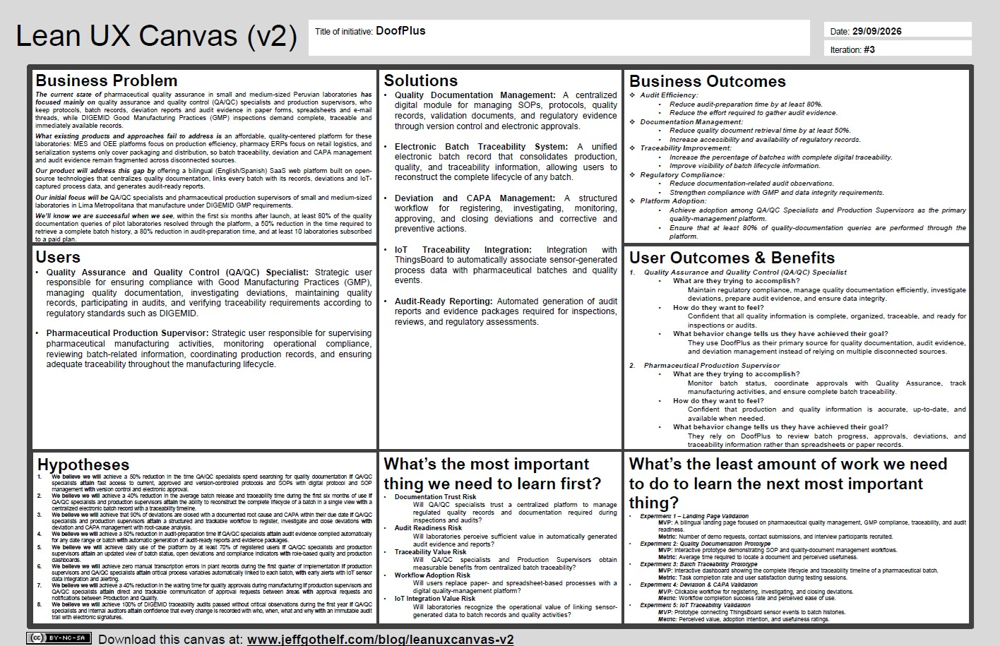

## 1.3. Segmentos objetivo

La identificación de los segmentos objetivo constituye una actividad fundamental para orientar el desarrollo de DoofPlus hacia los profesionales que participan directamente en los procesos de producción y aseguramiento de la calidad dentro de la industria farmacéutica. La definición de estos perfiles permite comprender las necesidades asociadas al monitoreo de los procesos productivos, la trazabilidad de la información y el cumplimiento de los estándares regulatorios, contribuyendo a que la propuesta responda a problemáticas reales del entorno de aplicación.

### Segmento objetivo 1: Especialista de Aseguramiento y Control de Calidad (QA/QC)

Características demográficas:

- **Edad:** Entre 30 y 65 años.
- **Género:** Indistinto.
- **Ocupación:** Profesional responsable de garantizar el cumplimiento de los estándares de calidad, gestionar registros y documentación técnica, supervisar desviaciones y participar en auditorías e inspecciones regulatorias.
- **Nivel educativo:** Químico Farmacéutico, Ingeniería Farmacéutica o carreras afines con especialización en aseguramiento de la calidad, BPM o regulación farmacéutica.
- **Ubicación geográfica:** Lima Metropolitana, Perú.

Información estadística de sustento:

- Solo 4 de cada 10 laboratorios inspeccionados por DIGEMID obtuvieron la certificación de BPM: de 51 laboratorios inspeccionados hasta mayo de 2026, 20 la obtuvieron, 21 no la lograron y 7 desistieron del proceso. Entre los aspectos evaluados figuran los controles de laboratorio y la trazabilidad de productos, actividades a cargo de QA/QC (Gestión, 2026).
- 385 laboratorios extranjeros esperaban su certificación de BPM ante una DIGEMID desbordada por la demanda, lo que evidencia la presión regulatoria sobre la documentación de calidad (Infobae, 2025).
- La OMS establece que los registros de calidad deben ser atribuibles, legibles, contemporáneos, originales y exactos (principios ALCOA) durante todo su ciclo de vida (World Health Organization, 2016).
- Las BPM de la OMS exigen que toda desviación significativa se registre e investigue completamente para determinar su causa raíz y aplicar acciones correctivas y preventivas, tarea que recae en QA/QC (World Health Organization, 2014).
- Las mismas BPM exigen conservar registros de fabricación y distribución que permitan rastrear la historia completa de cada lote en forma comprensible y accesible (World Health Organization, 2014).

### Segmento Objetivo 2: Jefe o Supervisor de Producción Farmacéutica

Características demográficas:

- **Edad:** Entre 25 y 70 años.
- **Género:** Indistinto.
- **Ocupación:** Profesional responsable de planificar, supervisar y controlar las operaciones de fabricación farmacéutica, asegurando el cumplimiento de los parámetros establecidos para la producción.
- **Nivel educativo:** Ingeniería Industrial, Ingeniería Química, Ingeniería Farmacéutica o carreras afines.
- **Ubicación geográfica:** Lima Metropolitana y otras ciudades del Perú con plantas farmacéuticas, como Arequipa.

Información estadística de sustento:

- Las BPM de la OMS exigen que durante la fabricación se registre, manual o automáticamente, que se cumplieron todos los pasos de los procedimientos y que la cantidad y calidad del producto son las esperadas; estos registros los genera y supervisa Producción (World Health Organization, 2014).
- En la encuesta Pharma 4.0 de ISPE (418 profesionales de 45 países), la proporción de organizaciones que aún no iniciaban su transformación digital bajó de 31.2% en 2021 a 15.1% en 2023, y el 58.1% ya contaba con pilotos o acciones sistemáticas en curso (Minero & Kuger, 2024).
- El sector farmacéutico peruano proyectó un crecimiento de 4% para 2025 según la Asociación Nacional de Laboratorios Farmacéuticos (Agencia Andina, 2025), lo que incrementa el volumen de lotes que los supervisores deben controlar y documentar.
- Las BPM evaluadas por DIGEMID incluyen procesos de producción, calidad de materias primas, controles de laboratorio, condiciones de almacenamiento y trazabilidad de productos (Gestión, 2026), aspectos que dependen de los registros que genera Producción.

---

# Capítulo II: Requirements Elicitation & Analysis

## 2.1. Competidores
Para desarrollar una solución efectiva, es importante entender la situación competitiva y las diferentes variantes que se utilizan en los laboratorios farmacéuticos. Este análisis nos ayuda a identificar cómo se gestionan los procesos de calidad actualmente y qué limitaciones presentan las soluciones existentes.

En este periodo, se analizan distintos tipos de competidores con el objetivo de entender sus fortalezas y debilidades, y así posicionar a DoofPlus como una propuesta que responda de manera más efectiva a las necesidades reales del sector.

### 2.1.1. Análisis competitivo
A continuación, se presenta una tabla comparativa sobre los principales competidores, en el que se considera su propuesta de valor, mercado objetivo y características generales. Este análisis permite evidenciar que, mientras las soluciones existentes se orientan a grandes corporaciones o dependen de procesos manuales, DoofPlus se posiciona como una alternativa especializada, accesible y centrada en la automatización del aseguramiento de la calidad mediante integración IoT y trazabilidad digital, especialmente pensada para laboratorios medianos y entidades públicas de la región.

<table>
  <tr>
    <th colspan="6"><b>Competitive Analysis Landscape</b></th>
  </tr>
  <tr>
    <td colspan="2">¿Por qué llevar a cabo este análisis?</td>
    <td colspan="4">¿Cómo se posiciona DoofPlus frente a sus competidores en fortalezas, debilidades, oportunidades y propuesta de valor dentro del mercado de software de gestión de calidad y trazabilidad farmacéutica?</td>
  </tr>
  <tr>
    <td colspan="2">Respuesta del análisis</td>
    <td colspan="4">Es una propuesta que posiciona a DoofPlus como una plataforma SaaS orientada a la gestión de calidad farmacéutica, incorporando integración IoT para automatizar la captura de datos, mejorar la trazabilidad y asegurar el cumplimiento normativo frente a otras soluciones del mercado.</td>
  </tr>
  <tr>
    <td colspan="2"></td>
    <td><br><b>DoofPlus</b></td>
    <td><br><b>TuHub</b></td>
    <td><br><b>LOLFAR (LOLIMSA)</b></td>
    <td><br><b>DrugXafe (Tiga Healthcare)</b></td>
  </tr>
  <tr>
    <td rowspan="3">Perfil</td>
    <td>Overview</td>
    <td>Plataforma SaaS bilingüe de gestión de calidad y trazabilidad de lotes para laboratorios farmacéuticos, con integración de sensores IoT.</td>
    <td>Plataforma MES de gestión de producción que integra IoT industrial, monitoreo de OEE en tiempo real y batch record electrónico (Colombia).</td>
    <td>Software de gestión farmacéutica para farmacias y cadenas: ventas, inventario, logística y control de vencimientos; más de 30 años en el mercado.</td>
    <td>Sistema de track &amp; trace que serializa cada empaque con un código 2D Data Matrix y registra su recorrido del productor al paciente.</td>
  </tr>
  <tr>
    <td>Ventaja competitiva ¿Qué valor ofrece a los clientes?</td>
    <td>Especialización en QA/QC (documentos, desviaciones, CAPA, liberación) con precio accesible y enfoque en BPM de DIGEMID: encontrar cualquier evidencia de un lote en minutos y preparar auditorías sin compilar documentos.</td>
    <td>Captura automática de datos de planta (sensores, PLC, SCADA) y dashboards multi-planta para reducir pérdidas de producción y mejorar la eficiencia (OEE).</td>
    <td>Trayectoria y base instalada en más de 12 países; reduce costos logísticos (10–15%) y evita quiebres de stock y mermas por vencimiento.</td>
    <td>Prevención de falsificaciones y fraude en la cadena de suministro: garantiza que solo medicamentos auténticos lleguen al paciente.</td>
  </tr>
  <tr>
    <td>Mercado objetivo</td>
    <td>Laboratorios farmacéuticos pequeños y medianos de Lima y, luego, de la región andina.</td>
    <td>Manufactura regulada y no regulada (alimentos, farmacéuticos, cosméticos) en Colombia y Latinoamérica.</td>
    <td>Farmacias, boticas, cadenas, clínicas y hospitales de Latinoamérica.</td>
    <td>Fabricantes, importadores, distribuidores y autoridades sanitarias.</td>
  </tr>
  <tr>
    <td rowspan="2">Perfil de marketing</td>
    <td>Estrategias de marketing</td>
    <td>Contenido educativo sobre BPM e integridad de datos, demos desde la Landing Page y presencia en eventos del sector.</td>
    <td>Marketing digital B2B (blog, casos de éxito) y demostraciones comerciales.</td>
    <td>Venta consultiva B2B con implementación y soporte locales.</td>
    <td>Venta B2B y B2G a actores de la cadena de suministro y reguladores.</td>
  </tr>
  <tr>
    <td>Productos &amp; Servicios</td>
    <td>Documentos y SOP, expediente de lote, desviaciones y CAPA, liberación, audit trail, reportes, dashboards e IoT.</td>
    <td>MES, monitoreo OEE, batch record electrónico, IA para operaciones y mantenimiento.</td>
    <td>Módulos de ventas, compras, almacenes, fidelización y facturación para farmacias.</td>
    <td>Serialización, agregación de empaques y reportes de trazabilidad.</td>
  </tr>
  <tr>
    <td rowspan="2">Perfil de producto</td>
    <td>Precios &amp; Costos</td>
    <td>Standard Lab US$199/mes (US$1,990/año); Enterprise US$599/mes (US$5,990/año).</td>
    <td>Suscripción e implementación cotizadas por planta (precios no publicados).</td>
    <td>Licencia, implementación y soporte cotizados por proyecto (precios no publicados).</td>
    <td>Costo por volumen de códigos e implementación (precios no publicados).</td>
  </tr>
  <tr>
    <td>Canales de distribución (Web y/o Móvil)</td>
    <td>Plataforma web responsive (desktop, tablet y mobile).</td>
    <td>Plataforma web en la nube y dispositivos IoT en planta.</td>
    <td>Aplicación de escritorio/web en las estaciones de farmacia.</td>
    <td>Portales web e integración por API.</td>
  </tr>
  <tr>
    <td rowspan="4">Análisis SWOT</td>
    <td>Fortalezas</td>
    <td>Especialización en calidad farmacéutica; bajo costo; bilingüe; integración IoT sin vender hardware.</td>
    <td>Integración IoT madura; batch record electrónico; operación multi-planta.</td>
    <td>Trayectoria; presencia internacional; ahorro logístico comprobado.</td>
    <td>Especialización en serialización y anti-falsificación.</td>
  </tr>
  <tr>
    <td>Debilidades</td>
    <td>Startup sin base instalada; marca poco conocida; requiere validación por el cliente.</td>
    <td>Enfoque en eficiencia productiva, no en QA (CAPA, liberación, auditorías); operación centrada en Colombia.</td>
    <td>Orientado a retail farmacéutico; no cubre manufactura, control de calidad ni IoT.</td>
    <td>Solo cubre empaque y distribución; no monitorea la fabricación ni la gestión de calidad.</td>
  </tr>
  <tr>
    <td>Oportunidades</td>
    <td>Fiscalización más estricta de DIGEMID; crecimiento del sector farmacéutico; digitalización de laboratorios.</td>
    <td>Expansión a Perú impulsada por Industria 4.0.</td>
    <td>Crecimiento de cadenas de farmacias.</td>
    <td>Regulaciones de serialización obligatoria en la región.</td>
  </tr>
  <tr>
    <td>Amenazas</td>
    <td>Resistencia al cambio; ciclos de venta largos; ingreso de grandes proveedores de QMS.</td>
    <td>Competidores especializados en QMS farmacéutico.</td>
    <td>Soluciones SaaS más modernas y económicas.</td>
    <td>Proveedores globales de serialización.</td>
  </tr>
</table>

### 2.1.2. Estrategias y tácticas frente a competidores

Para posicionar a DoofPlus frente a TuHub (MES con IoT), LOLFAR (gestión de farmacias) y DrugXafe (serialización), IngesCompany aplicará las siguientes estrategias y tácticas:

#### Estrategia de costos y accesibilidad (suscripción sin inversión inicial)

Frente a soluciones cotizadas por proyecto con costos de implementación elevados (TuHub, LOLFAR), DoofPlus ofrece precios públicos por suscripción (Standard Lab y Enterprise) sin inversión en servidores ni hardware propio, ya que la captura IoT se integra con ThingsBoard. Táctica: prueba piloto de 30 días para laboratorios que soliciten una demo desde la Landing Page.

#### Enfoque vertical en la calidad farmacéutica

Mientras TuHub se enfoca en la eficiencia productiva (OEE), LOLFAR en la gestión comercial de farmacias y DrugXafe en el empaque y la distribución, DoofPlus cubre el ciclo de calidad del lote: documentación controlada, desviaciones y CAPA, cuarentena y liberación con firma electrónica, y audit trail. Táctica: plantillas de protocolos y reportes alineadas a las BPM de DIGEMID, configurables por cada laboratorio (la validación final corresponde al cliente).

#### Gestión multi-planta y trazabilidad centralizada de lotes

Se ofrece una única cuenta por organización con varias plantas y líneas de producción, de modo que QA/QC y Producción consulten la misma información del lote. Táctica: el plan Enterprise habilita sensores ilimitados y gestión multi-planta para instituciones como el INS.

#### Estrategia comercial B2B dirigida

La prospección se dirige a jefes de aseguramiento de calidad y de producción, demostrando la reducción del tiempo de preparación de auditorías y del riesgo de observaciones de DIGEMID. Tácticas: webinars sobre integridad de datos, casos de uso con laboratorios piloto y alianzas con consultores de BPM.

## 2.2. Entrevistas

Las entrevistas constituyen una herramienta fundamental para obtener información cualitativa directamente de los profesionales involucrados en los procesos de aseguramiento de calidad y producción farmacéutica. A través de conversaciones estructuradas, se busca comprender sus actividades, necesidades, desafíos, comportamientos y experiencias relacionadas con la gestión de documentación, la trazabilidad de lotes y el acceso a la información. La información recopilada permitió identificar problemáticas, oportunidades de mejora y necesidades reales del entorno de aplicación, contribuyendo a definir una propuesta de solución alineada con los requerimientos y expectativas de los segmentos objetivo.

### 2.2.1. Diseño de entrevistas

Teniendo en cuenta la importancia de la información que pueden proporcionar los entrevistados, se presentan las preguntas clave para cada segmento objetivo identificado. Para ello, se consideran dos tipos de preguntas: las personales, orientadas a conocer el perfil profesional y la experiencia de los participantes dentro de la industria farmacéutica, y las específicas, enfocadas en comprender los procesos actuales relacionados con la gestión de calidad, la trazabilidad de lotes, el acceso a la información, la gestión documental y la coordinación entre las áreas de producción y aseguramiento de la calidad. Asimismo, se busca identificar las principales dificultades, necesidades y oportunidades de mejora presentes en sus actividades diarias, con el fin de obtener información relevante para la definición de la propuesta de solución.

#### Segmento Objetivo: Especialista de Aseguramiento y Control de Calidad (QA/QC)

##### Preguntas personales

- ¿Cuál es su nombre?
- ¿Cuál es su edad?
- ¿Que dispositivo y buscador emplea?
- ¿Cuál es su cargo actual dentro de la organización?
- ¿Cuántos años de experiencia tiene trabajando en aseguramiento o control de calidad farmacéutica?

##### Preguntas específicas

- ¿Cómo gestiona actualmente los protocolos, registros y documentación relacionada con la calidad de los productos farmacéuticos?
- ¿Qué tipo de información necesita consultar con mayor frecuencia para realizar sus actividades de aseguramiento o control de calidad?
- ¿Cuáles son las principales dificultades que encuentra al buscar información o documentación relacionada con un lote específico?
- ¿Cómo realiza el seguimiento de desviaciones, incidencias o no conformidades dentro de los procesos de calidad?
- ¿Cuánto tiempo suele dedicar a recopilar información o evidencias para auditorías, inspecciones o revisiones internas?
- ¿Qué problemas ha experimentado relacionados con la trazabilidad de los registros o la disponibilidad de información histórica?
- Si pudiera mejorar una actividad relacionada con la gestión de calidad dentro de su organización, ¿cuál sería y por qué?

#### Segmento Objetivo: Jefe o Supervisor de Producción Farmacéutica

##### Preguntas personales

- ¿Cuál es su nombre?
- ¿Cuál es su edad?
- ¿Que dispositivo y buscador emplea?
- ¿Cuál es su cargo actual dentro de la organización?
- ¿Cuántos años de experiencia tiene supervisando procesos de producción farmacéutica?

##### Preguntas específicas

- ¿Cómo realiza actualmente el seguimiento de los lotes durante las diferentes etapas del proceso de fabricación?
- ¿Qué información considera más importante para supervisar el estado de la producción y tomar decisiones operativas?
- ¿Qué herramientas o sistemas utiliza para consultar información relacionada con la producción?
- Cuando ocurre una incidencia o desviación durante la fabricación, ¿cómo se registra y comunica dicha información?
- ¿Cuáles son las principales dificultades que encuentra al acceder al historial de producción de un lote específico?
- ¿Qué tan sencillo o complejo resulta coordinar el intercambio de información con las áreas de aseguramiento y control de calidad?
- Si pudiera mejorar un aspecto relacionado con el acceso o gestión de la información de producción, ¿qué cambiaría y por qué?

### 2.2.2. Registro de entrevistas

En esta sección se presentan los resultados obtenidos de las entrevistas realizadas a los segmentos objetivo identificados para DoofPlus. Para cada entrevista se incluyen los datos generales del participante, un resumen de las respuestas más relevantes, las observaciones realizadas durante la sesión y las principales conclusiones obtenidas. La información recopilada permite comprender las necesidades, dificultades y experiencias de los profesionales vinculados a los procesos de aseguramiento de calidad y producción farmacéutica, constituyendo una fuente de evidencia para la validación de los supuestos planteados y para la definición de las funcionalidades y características de la solución propuesta.

**Segmento 1: Especialista de Aseguramiento y Control de Calidad (QA/QC)**

| Numero | 1 |
|---------|--------|
| **Campo** | **Información** |
| Nombre | María |
| Apellido | México |
| Edad | 53 |
| Distrito | San Juan de Lurigancho |
| Evidencia |  |
| Link | https://shorturl.at/c0pBO |
| Inicio | 00:00 min |
| Duración | 04:38 min |
| Resumen | María es química farmacéutica y trabaja en el área de Control de Calidad de un laboratorio, donde se encarga de las validaciones, la revisión documental, la verificación de equipos y la evaluación del personal analista. Actualmente, la gestión de la documentación combina procesos manuales y digitales, aunque la empresa busca implementar un software integral que cubra todo el proceso productivo.<br><br>Para asegurar la calidad, se revisan registros, protocolos, resultados y reportes de conformidades y no conformidades. Uno de los principales problemas es la revisión manual de cálculos e informes antes de registrar los resultados en el sistema, lo que genera demoras y representa una oportunidad de automatización.<br><br>Las desviaciones se investigan analizando posibles causas relacionadas con el personal, los equipos o el producto. Además, la empresa mantiene registros actualizados para auditorías e inspecciones y realiza evaluaciones periódicas. María considera que la generación automática de reportes reduciría significativamente la carga operativa. |

| Numero | 2 |
|---------|--------|
| **Campo** | **Información** |
| Nombre | Julia  |
| Apellido | Collasos Zotelo |
| Edad | 64 |
| Distrito | San Miguel |
| Evidencia |  |
| Link | https://shorturl.at/c0pBO |
| Inicio | 04:39 min |
| Duración | 04:59 min |
| Resumen | Julia Collasos Zotelo es química farmacéutica y trabaja en el área de Aseguramiento de la Calidad de un centro de producción de productos biológicos del Instituto Nacional de Salud (INS), donde se encarga de verificar el cumplimiento de las Buenas Prácticas de Manufactura (BPM), supervisar el sistema de calidad y revisar la documentación asociada a los procesos productivos. Asimismo, participa en actividades relacionadas con auditorías, capacitación del personal, programas de limpieza, mantenimiento, calibración y calificación de equipos. Para el desarrollo de sus actividades utiliza herramientas como Microsoft Word, Excel, Google Chrome y sistemas institucionales de gestión documental y control de procesos.<br><br>Para garantizar la calidad de los productos farmacéuticos, se revisan procedimientos, instrucciones de trabajo, protocolos de validación, registros de producción y documentación técnica asociada a materias primas, materiales de empaque y productos terminados. Además, la organización mantiene un sistema de trazabilidad que permite identificar la información relacionada con proveedores, materias primas, operadores, analistas y registros de cada lote producido. Sin embargo, Julia señala que existen dificultades para acceder a determinadas fuentes de información técnica y que, en ocasiones, se presentan errores cuando el personal no sigue adecuadamente los procedimientos establecidos para el registro y seguimiento de la información.<br><br>Las desviaciones y no conformidades son registradas, investigadas mediante análisis de causa raíz y gestionadas a través de acciones correctivas y preventivas supervisadas por equipos multidisciplinarios. Aunque considera que la organización cuenta con un sistema de gestión de calidad estructurado, identifica que una de las principales oportunidades de mejora es fortalecer la capacidad del personal para analizar las causas reales de los problemas y asumir una mayor responsabilidad sobre la calidad de sus procesos. En su opinión, la calidad debe ser un compromiso compartido por todas las áreas de la organización y no únicamente una responsabilidad del departamento de Aseguramiento de la Calidad. |

| Numero | 3 |
|---------|--------|
| **Campo** | **Información** |
| Nombre | Edith |
| Apellido | Espinoza |
| Edad | 31 |
| Distrito | Lima |
| Evidencia |  |
| Link | https://shorturl.at/c0pBO |
| Inicio | 09:37 min |
| Duración | 04:58 min |
| Resumen | Edith Espinoza es técnica de enfermería y cuenta con más de cinco años de experiencia en actividades relacionadas con la atención de pacientes y la gestión de información clínica. Actualmente participa en procesos asociados al control de seguros, activaciones y verificación de datos de pacientes de 0 a 11 años, especialmente en servicios vinculados a vacunas y fármacos pediátricos. Para desarrollar sus labores utiliza herramientas como computadoras, laptops, dispositivos Android y sistemas institucionales de registro, trabajando con documentación tanto física como digital.<br><br>Para garantizar la correcta atención de los pacientes, realiza la validación de información y el seguimiento de historias clínicas, las cuales aún combinan formatos físicos y digitales debido a un proceso gradual de digitalización. Asimismo, señala que una de las principales dificultades se presenta cuando los pacientes cuentan con más de un seguro o poseen información registrada en entidades externas, ya que estos datos no siempre son visibles en el sistema utilizado, lo que puede generar demoras en la verificación y consulta de información.<br><br>Las incidencias relacionadas con medicamentos, como errores en la medicación o la detección de lotes vencidos, son gestionadas mediante reportes que permiten iniciar los procesos correspondientes de devolución, reposición o seguimiento. Aunque reconoce que la organización viene avanzando en la digitalización de sus procesos, considera que una mayor integración de la información y la automatización de los registros contribuirían a mejorar la trazabilidad, reducir errores administrativos y optimizar la gestión de la atención a los pacientes. |

**Segmento 2: Jefe o Supervisor de Producción Farmacéutica**

| Numero | 1 |
|---------|--------|
| **Campo** | **Información** |
| Nombre | Alberto |
| Apellido | Valle Vega |
| Edad | 68 |
| Distrito | Arequipa |
| Evidencia |  |
| Link | https://shorturl.at/c0pBO |
| Inicio | 14:35 min |
| Duración | 04:48 min |
| Resumen | Alberto Valle Vega, químico farmacéutico con cerca de 40 años de experiencia en la industria farmacéutica, describe los procesos de fabricación y empaquetado de productos como jarabes, inyectables, cremas y tabletas. Explica que los componentes de empaque, como frascos, etiquetas, insertos y estuches, deben ser previamente aprobados por el área de control de calidad antes de su uso.<br><br>También señala que la industria ha evolucionado desde controles manuales basados en muestreos hacia procesos más tecnificados, orientados a garantizar la calidad y reducir errores. Antes de iniciar la producción se validan los parámetros de los materiales y, durante el proceso, se realizan muestreos periódicos para verificar el cumplimiento de los estándares establecidos.<br><br>Las desviaciones se gestionan mediante procedimientos documentados. Los problemas recurrentes requieren investigaciones más profundas y, en casos críticos, la detención de la producción y la elaboración de informes de desviación. Asimismo, la coordinación entre producción y control de calidad se basa en procedimientos que definen responsabilidades, frecuencias de muestreo y criterios de aceptación, garantizando la trazabilidad y la calidad de los productos farmacéuticos. |

| Numero | 2 |
|---------|--------|
| **Campo** | **Información** |
| Nombre | Mariela |
| Apellido | Alanya Mercado |
| Edad | 35 |
| Distrito | Lima |
| Evidencia | 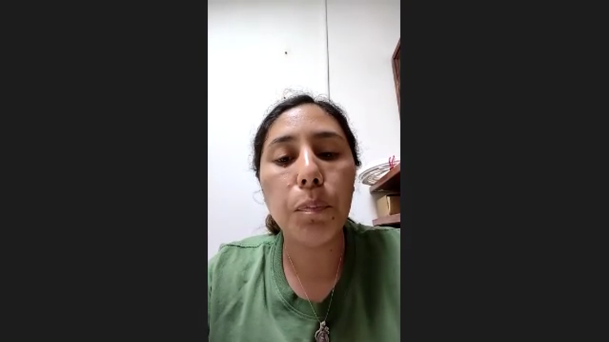 |
| Link | https://shorturl.at/c0pBO |
| Inicio | 19:23 min |
| Duración | 04:59 min |
| Resumen | Mariela Alanya Mercado es química farmacéutica y se desempeña como responsable del laboratorio de Control de Calidad del Centro Nacional de Productos Biológicos del Instituto Nacional de Salud (INS), donde supervisa los análisis y ensayos necesarios para verificar que sueros y antivenenos cumplan con las especificaciones de calidad establecidas. Además, participa en actividades relacionadas con la gestión de recursos, mantenimiento de equipos y adquisición de insumos necesarios para las operaciones del laboratorio.<br><br>Para garantizar la calidad de los productos, realiza el seguimiento de lotes y la revisión de resultados de control de calidad utilizando principalmente hojas de cálculo de Microsoft Excel, formularios físicos y documentación en papel. Asimismo, señala que gran parte de la información se encuentra dispersa entre archivos digitales, registros manuales, correos electrónicos y documentos físicos, dificultando el acceso oportuno a la información y aumentando el riesgo de pérdida o duplicidad de registros.<br><br>Las incidencias y desviaciones identificadas durante la producción son comunicadas a las áreas correspondientes para su evaluación y tratamiento. La coordinación entre Control de Calidad, Producción y otras áreas se realiza mediante correos electrónicos, documentación física y comunicación directa. Mariela considera que la principal oportunidad de mejora consiste en implementar una plataforma centralizada que permita gestionar documentación técnica, registros de lotes e información de seguimiento, fortaleciendo la trazabilidad, reduciendo la dependencia de procesos manuales y facilitando el acceso seguro a la información. |

| Numero | 3 |
|---------|--------|
| **Campo** | **Información** |
| Nombre | Rick |
| Apellido | Correidos |
| Edad | 25 |
| Distrito | Lima |
| Evidencia |  |
| Link | https://shorturl.at/c0pBO |
| Inicio | 24:26 min |
| Duración | 03:58 min |
| Resumen | Rick Correidos se desempeña como Supervisor de Producción Farmacéutica y cuenta con más de tres años de experiencia supervisando procesos de fabricación. Entre sus principales responsabilidades se encuentran el seguimiento de los lotes durante las diferentes etapas de producción, la verificación del cumplimiento de los parámetros establecidos y la coordinación con las áreas de calidad para asegurar la correcta ejecución de los procesos productivos. Para desarrollar sus actividades utiliza computadoras de escritorio y laptops, apoyándose principalmente en herramientas como Microsoft Excel, correos electrónicos y sistemas internos de gestión documental.<br><br>Para realizar el seguimiento de la producción, utiliza registros de fabricación, formularios físicos y hojas de cálculo donde se documentan los parámetros operativos, controles realizados y estados de cada lote. Asimismo, considera que la información más importante para la toma de decisiones incluye el estado de los lotes, los resultados de control de calidad, las desviaciones reportadas, la disponibilidad de materiales y el cumplimiento de las especificaciones de producción. Sin embargo, señala que una de las principales dificultades se presenta al consultar el historial de un lote, ya que la información suele encontrarse distribuida entre documentos físicos, correos electrónicos, registros archivados y diversas fuentes de información.<br><br>Cuando ocurre una incidencia o desviación durante la fabricación, esta es registrada y comunicada al área de Calidad para su evaluación e investigación. La coordinación entre Producción y Calidad es constante, aunque en ocasiones puede resultar lenta debido a la dependencia de documentación física, correos electrónicos y validaciones manuales. En su opinión, una de las principales oportunidades de mejora consiste en implementar una plataforma centralizada que integre la información de producción, calidad y trazabilidad de los lotes, permitiendo acceder rápidamente a los registros, fortalecer la comunicación entre áreas y facilitar las actividades de seguimiento, auditoría y toma de decisiones. |

### 2.2.3. Análisis de entrevistas

En esta sección se presenta el análisis detallado de la información recolectada. Para cada segmento, se explican primero los hallazgos estadísticos objetivos y subjetivos, seguidos de la evidencia gráfica correspondiente.

##### Segmento 1: Especialista de Aseguramiento y Control de Calidad (QA/QC)

**Análisis de Características Objetivas y Subjetivas:** El análisis de las entrevistas evidencia que las áreas de Aseguramiento y Control de Calidad dentro de las organizaciones farmacéuticas evaluadas mantienen una fuerte dependencia de procesos documentales para garantizar el cumplimiento normativo y la trazabilidad de las operaciones. El 67% de los entrevistados (María y Julia) trabaja directamente en Control o Aseguramiento de la Calidad farmacéutica; la tercera entrevistada (Edith) valida registros de pacientes y gestiona incidencias de medicamentos y lotes vencidos en un servicio de salud, por lo que aporta la perspectiva de quien consume la información de los lotes. En conjunto, el 100% realiza revisión documental y de registros de calidad.

Respecto a la gestión de información, el 100% manifestó utilizar esquemas mixtos que combinan documentación física con sistemas digitales para registrar, consultar y controlar información técnica relacionada con procedimientos, protocolos, registros de producción, resultados analíticos y actividades de calidad. Sin embargo, estos procesos continúan requiriendo revisiones manuales, verificaciones documentales y consolidación de información antes de su registro o aprobación definitiva, generando mayores tiempos operativos. Asimismo, se identificó que aproximadamente el 67% de los entrevistados presenta dificultades asociadas a la búsqueda, acceso o integración de información proveniente de diferentes fuentes, lo que afecta la eficiencia de determinadas actividades de control y seguimiento.

Desde la perspectiva subjetiva, el 100% de los entrevistados manifestó una valoración positiva hacia la incorporación de soluciones digitales que permitan automatizar tareas operativas y fortalecer la trazabilidad de la información. Adicionalmente, alrededor del 67% señaló que la automatización de actividades como la generación de reportes, la consolidación de registros y la consulta de información histórica contribuiría significativamente a reducir la carga operativa y minimizar errores asociados a procesos manuales. En general, los entrevistados coinciden en que una plataforma centralizada facilitaría el acceso a la información, optimizaría la gestión documental y fortalecería los procesos de calidad dentro de sus organizaciones.

***Gráficos***

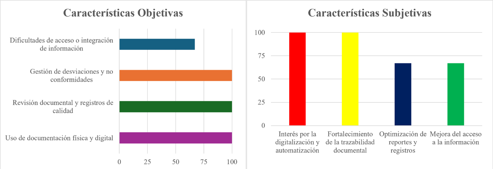

##### Segmento 2: Jefe o Supervisor de Producción Farmacéutica

**Análisis de Características Objetivas y Subjetivas:** El análisis de las entrevistas evidencia que las áreas de Producción Farmacéutica mantienen una elevada dependencia de registros físicos, hojas de cálculo y mecanismos manuales para realizar el seguimiento de los lotes durante las diferentes etapas de fabricación. El 67% de los entrevistados (Alberto y Rick) supervisa directamente procesos de fabricación; la tercera entrevistada (Mariela), responsable de Control de Calidad en el INS, da seguimiento a los lotes de producción y coordina con Producción, por lo que el 100% realiza monitoreo de lotes y coordinación entre áreas.

Respecto al seguimiento de los lotes, el 100% manifestó utilizar esquemas basados en formularios físicos, registros de producción, hojas de cálculo y documentación complementaria para registrar estados, parámetros operativos y actividades realizadas durante la fabricación. Asimismo, el 100% señaló que información crítica como los resultados de control de calidad, las desviaciones registradas, la disponibilidad de materiales y el cumplimiento de los parámetros de producción son elementos fundamentales para la toma de decisiones. Sin embargo, se identificó que aproximadamente el 67% de los entrevistados experimenta dificultades para acceder al historial completo de un lote debido a que la información suele encontrarse distribuida entre diferentes fuentes, incluyendo documentos físicos, correos electrónicos, registros archivados y archivos digitales independientes.

Desde la perspectiva subjetiva, el 100% de los entrevistados manifestó interés en la implementación de una plataforma centralizada que integre la información de producción, calidad y trazabilidad. Asimismo, todos coinciden en que la reducción de registros manuales, la mejora en la comunicación entre áreas y la disponibilidad inmediata de información histórica facilitarían significativamente las actividades de seguimiento, auditoría y toma de decisiones. En general, los participantes consideran que la centralización de la información permitiría optimizar la gestión operativa y fortalecer la trazabilidad de los procesos productivos.

***Gráficos***


##### Análisis Comparativo

**Contrastación de Segmentos:**  Al comparar ambos segmentos se observa una coincidencia significativa en torno a la necesidad de mejorar la trazabilidad y centralizar la información relacionada con los lotes farmacéuticos. El 100% de los entrevistados, independientemente de su área de trabajo, manifestó utilizar esquemas mixtos que combinan documentación física y herramientas digitales, así como una valoración positiva hacia la incorporación de soluciones tecnológicas orientadas a reducir la dependencia de procesos manuales.

No obstante, se identifican diferencias en el enfoque de sus necesidades. Los especialistas de Aseguramiento y Control de Calidad priorizan la gestión documental, la validación de registros, el seguimiento de desviaciones, la preparación de auditorías y la generación de evidencias regulatorias. Por su parte, los Supervisores de Producción se enfocan principalmente en el monitoreo de los lotes, el control de las operaciones productivas, la gestión de incidencias y el acceso rápido a información que facilite la toma de decisiones operativas.

Estas diferencias evidencian la necesidad de una plataforma que integre la información generada por ambas áreas dentro de un único entorno, permitiendo a Producción y Calidad trabajar sobre los mismos datos, fortalecer la trazabilidad de los lotes y mejorar la coordinación entre los diferentes actores involucrados en el proceso farmacéutico.

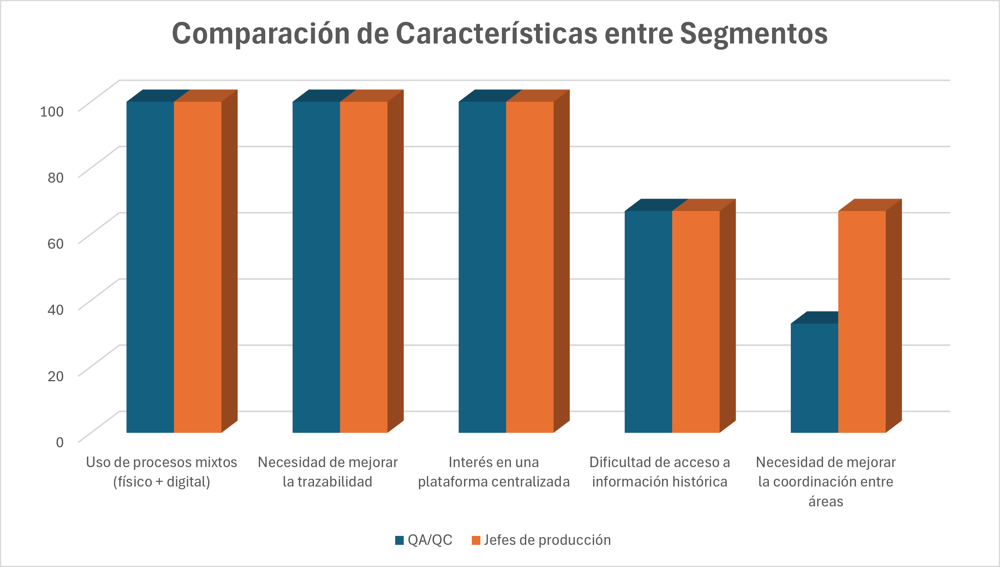

#### Conclusiones y Definición de Arquetipos

Basado en el análisis estadístico, se definen los siguientes perfiles para los User Personas:

1.  **User Persona Especialista de Control de Calidad:**

**Rasgo clave:** Busca garantizar el cumplimiento de los estándares de calidad y los requisitos regulatorios mediante una gestión eficiente de protocolos, documentación, desviaciones y evidencias asociadas a cada lote farmacéutico.

**Sustento:** La totalidad de los entrevistados de este segmento manifestó realizar actividades relacionadas con la validación documental, la revisión de registros, el seguimiento de desviaciones y la preparación de información para auditorías e inspecciones. Asimismo, identificaron la automatización de tareas operativas y la centralización de la información como factores clave para mejorar la eficiencia de sus actividades y fortalecer la trazabilidad de los procesos.

2.  **Jefe de Producción Farmacéutica:**

**Rasgo clave:** Busca supervisar eficientemente los procesos de fabricación mediante el acceso oportuno a información de producción, estados de los lotes e incidencias operativas, facilitando la toma de decisiones y la coordinación con las áreas de calidad.

**Sustento:** Los entrevistados pertenecientes a este segmento señalaron que gran parte de su trabajo depende de la consulta constante de registros de producción, parámetros operativos y resultados de calidad. Asimismo, identificaron que la dispersión de la información entre diferentes fuentes dificulta el seguimiento de los lotes y genera retrasos en la coordinación con otras áreas. Por ello, consideran prioritario contar con una plataforma centralizada que facilite la consulta histórica, fortalezca la trazabilidad y reduzca la dependencia de procesos manuales.

## 2.3. Needfinding

La etapa de Needfinding tiene como objetivo identificar y comprender las necesidades, problemas, motivaciones y oportunidades presentes en los segmentos objetivo de DoofPlus a partir de la información obtenida durante las entrevistas realizadas. Mediante el análisis de las experiencias y actividades de los profesionales de aseguramiento de calidad y producción farmacéutica, se busca reconocer los principales desafíos relacionados con la gestión documental, la trazabilidad de lotes, el acceso a la información y el cumplimiento regulatorio. Los hallazgos obtenidos en esta fase permiten transformar los datos recopilados en conocimientos relevantes para el proyecto, facilitando la identificación de necesidades reales de los usuarios y sirviendo como base para la definición de funcionalidades, requisitos y decisiones de diseño orientadas a generar una solución alineada con su contexto de trabajo.

### 2.3.1. User Personas

A partir del análisis de las entrevistas y la información recopilada sobre los procesos de aseguramiento de calidad y producción farmacéutica, se identificaron los principales perfiles de usuarios que interactuarían con la solución propuesta. Estos perfiles representan los segmentos clave para DoofPlus, ya que participan directamente en actividades relacionadas con la gestión de documentación de calidad, la trazabilidad de lotes, el seguimiento de incidencias y el cumplimiento de los requisitos regulatorios establecidos por el sector farmacéutico. La construcción de los User Persona permite comprender mejor sus necesidades, motivaciones, desafíos y hábitos de trabajo, proporcionando información valiosa para definir funcionalidades, priorizar requerimientos y diseñar una experiencia de usuario alineada con las problemáticas y expectativas de cada segmento objetivo.

**1) Segmento 1: Especialista de Aseguramiento y Control de Calidad (QA/QC)**

Para este segmento se elaboró el User Persona María México, tomando como referencia el perfil de los profesionales responsables de las actividades de aseguramiento y control de calidad dentro de laboratorios farmacéuticos. Se consideraron factores como su experiencia en validaciones, revisión documental, verificación de equipos y evaluación de personal analista, así como su participación en la gestión de protocolos, registros y auditorías regulatorias. Sus principales frustraciones se relacionan con la dependencia de procesos manuales para revisar cálculos, informes y documentación antes de registrar los resultados en los sistemas de la organización, lo que incrementa el tiempo invertido en tareas operativas y dificulta la preparación de evidencias para inspecciones y auditorías. Asimismo, se tomó en cuenta su necesidad de disponer de una plataforma que centralice la información de calidad, facilite la trazabilidad de los lotes, automatice la generación de reportes y reduzca la carga administrativa asociada a la gestión documental, permitiéndole dedicar más tiempo a actividades de supervisión y mejora continua de los procesos de calidad.


**2) Segmento 2: Jefe o Supervisor de Producción Farmacéutica**

Para este segmento se elaboró el User Persona Alberto Valle Vega. Se consideraron factores como su amplia experiencia en la industria farmacéutica, su responsabilidad en la supervisión de los procesos de fabricación y su participación en la coordinación con las áreas de aseguramiento y control de calidad. Sus principales motivaciones están orientadas a garantizar que la producción se desarrolle conforme a los procedimientos establecidos, manteniendo la calidad, la trazabilidad y el cumplimiento de los estándares regulatorios durante todas las etapas de fabricación. Entre sus principales dificultades se encuentra el acceso oportuno a información consolidada sobre los lotes en producción, así como la gestión y comunicación de incidencias que requieren seguimiento y documentación formal. Asimismo, se tomó en cuenta su necesidad de disponer de herramientas que faciliten la consulta del historial de producción, mejoren la coordinación entre las diferentes áreas involucradas y permitan acceder a información confiable para la toma de decisiones operativas, contribuyendo a una gestión más eficiente y a la reducción de errores durante el proceso productivo.

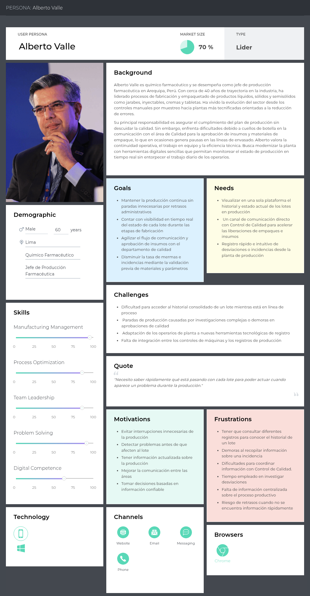

### 2.3.2. User Task Matrix

En esta sección se presenta el User Task Matrix, que concentra las tareas que los User Persona realizan para cumplir sus objetivos en su día a día, independientemente de la existencia de una solución de software. Para este análisis se consideran los dos segmentos objetivo identificados: el Especialista de Aseguramiento y Control de Calidad (QA/QC), representado por María México, y el Jefe de Producción Farmacéutica, representado por Alberto Valle. Se evalúa la frecuencia y la importancia de cada tarea para cada segmento con el fin de identificar dónde aportar mayor valor.

<table border="1" cellpadding="8" cellspacing="0" style="border-collapse:collapse; width:100%; font-family:Arial, sans-serif; text-align:center;">
  <thead>
    <tr style="background-color:#eef3f7;">
      <th rowspan="2">Tarea (Task)</th>
      <th colspan="2">Especialista QA/QC (María México)</th>
      <th colspan="2">Jefe de Producción (Alberto Valle)</th>
    </tr>
    <tr style="background-color:#eef3f7;">
      <th>Frecuencia</th>
      <th>Importancia</th>
      <th>Frecuencia</th>
      <th>Importancia</th>
    </tr>
  </thead>
  <tbody>
    <tr>
      <td style="text-align:left;">Consultar el historial y trazabilidad de un lote</td>
      <td>Often</td><td>High</td>
      <td>Often</td><td>High</td>
    </tr>
    <tr>
      <td style="text-align:left;">Registrar y dar seguimiento a desviaciones e incidencias</td>
      <td>Occasionally</td><td>High</td>
      <td>Occasionally</td><td>High</td>
    </tr>
    <tr>
      <td style="text-align:left;">Revisar y validar cálculos analíticos e informes de calidad</td>
      <td>Often</td><td>High</td>
      <td>Rarely</td><td>Low</td>
    </tr>
    <tr>
      <td style="text-align:left;">Gestionar protocolos, registros y documentación de calidad</td>
      <td>Often</td><td>High</td>
      <td>Occasionally</td><td>Medium</td>
    </tr>
    <tr>
      <td style="text-align:left;">Recopilar evidencias para auditorías e inspecciones</td>
      <td>Occasionally</td><td>High</td>
      <td>Rarely</td><td>Medium</td>
    </tr>
    <tr>
      <td style="text-align:left;">Supervisar el estado de los lotes durante la fabricación</td>
      <td>Rarely</td><td>Low</td>
      <td>Often</td><td>High</td>
    </tr>
    <tr>
      <td style="text-align:left;">Coordinar la aprobación de insumos y materiales con Calidad</td>
      <td>Rarely</td><td>Medium</td>
      <td>Often</td><td>High</td>
    </tr>
  </tbody>
</table>

**Análisis del Task Matrix:**
Se observa que las tareas **"Consultar el historial y trazabilidad de un lote"** y **"Registrar y dar seguimiento a desviaciones e incidencias"** presentan una Importancia **High** para ambos segmentos, confirmando que la trazabilidad centralizada y la gestión de desviaciones son las necesidades más críticas y compartidas del negocio. Las principales diferencias radican en que María México concentra su actividad diaria en tareas documentales de aseguramiento —como revisar cálculos analíticos, gestionar protocolos y recopilar evidencias para auditorías (todas con Importancia High para ella)—, mientras que Alberto Valle prioriza la supervisión operativa de la fabricación y la coordinación de aprobaciones de insumos con el área de Calidad (Often / High). Esta complementariedad evidencia que ambos perfiles dependen de información oportuna sobre los mismos lotes, pero desde perspectivas distintas, lo que valida la necesidad de una plataforma que centralice dicha información y facilite la comunicación entre las áreas de Producción y Calidad.


### 2.3.3. User Journey Mapping

**Segmento 1 – Especialista de Aseguramiento y Control de Calidad (María México)**

El User Journey Map de María ilustra su recorrido integral (end-to-end) en el proceso de validación documental y liberación de lotes de producción. Este diagrama documenta su flujo de trabajo paso a paso: desde la recepción de expedientes de planta en formato físico, pasando por la verificación de cálculos analíticos, hasta la transcripción de datos y la búsqueda de antecedentes frente a auditorías inopinadas.

En el escenario actual (As-Is), María se desenvuelve en un entorno altamente dependiente del papel que limita su eficiencia. Su rutina le exige auditar registros manuales, rehacer cálculos con calculadora para evitar errores operativos y digitar extensamente información hacia sistemas desconectados. Estas tareas repetitivas no solo duplican su carga laboral, sino que ralentizan la liberación del producto y generan picos de estrés cuando debe rastrear evidencias físicas en los archivos para los inspectores.

El análisis de su mapa evidencia estos quiebres operativos y emocionales, justificando la necesidad de nuestra solución tecnológica para digitalizar la captura de datos en el origen, automatizar los cálculos de calidad y centralizar el historial de los lotes en una base de datos accesible al instante.

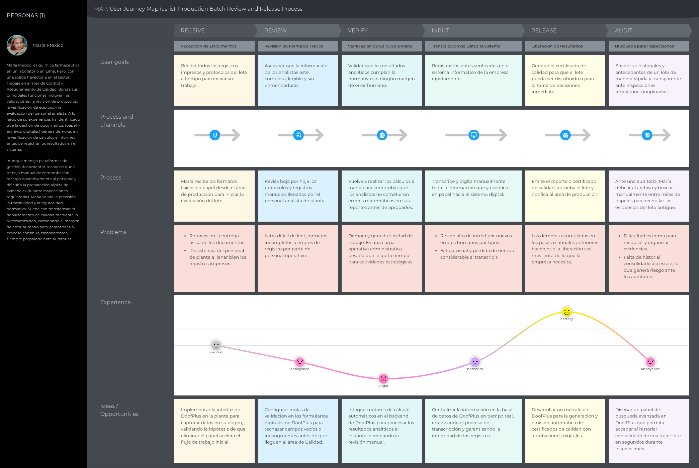

**Segmento 2 – Jefe de Producción Farmacéutica (Alberto Valle)**

El User Journey Map de Alberto detalla el ciclo operativo que experimenta al liderar la fabricación diaria en la planta. El recorrido abarca desde la revisión de la planificación del turno y el arranque de las máquinas, hasta la solicitud de validaciones de calidad, la gestión de incidencias operativas y el cierre de la orden de producción.

Bajo la situación actual (As-Is), el principal obstáculo en la experiencia de Alberto es la falta de visibilidad y la comunicación fragmentada. Al depender de formatos impresos y esperas presenciales para lograr la aprobación de insumos por parte de Calidad, la línea de envasado sufre paradas innecesarias. Sumado a esto, registrar desviaciones operativas a mano dificulta la trazabilidad y retrasa la toma de decisiones.

Este mapa expone cómo la desconexión interdepartamental impacta negativamente en la continuidad de la producción, generando frustración en su perfil de liderazgo. A partir de la identificación de estos puntos de dolor, se establecen las bases para diseñar un sistema que ofrezca comunicación directa, validaciones ágiles y un tablero de control integrado para optimizar los tiempos de la fábrica.


### 2.3.4. Empathy Mapping
Para la elaboración de los Empathy Maps, el equipo partió del conocimiento y observaciones recolectadas durante el análisis de los User Persona. Se colocó al centro de cada mapa al usuario correspondiente (María México y Alberto Valle Vega) y se respondieron las preguntas claves sobre su entorno, emociones, comportamientos y necesidades.

**1) Segmento 1: Especialista de Aseguramiento y Control de Calidad (QA/QC)**

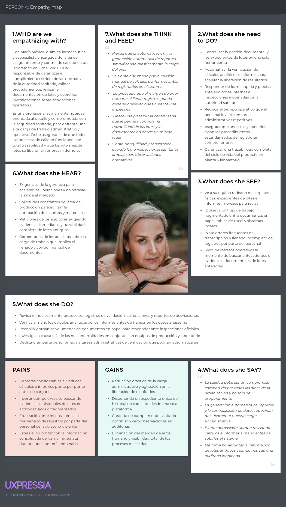

En este mapa se analizó a María México, química farmacéutica encargada del área de aseguramiento y control de calidad en un laboratorio farmacéutico. Se identificó que piensa constantemente en la necesidad de automatizar procesos e informes para liberar la alta carga administrativa del departamento, preocupándose por el riesgo de errores humanos al momento de revisar registros manualmente. Escucha la exigencia de la gerencia para agilizar la entrega de documentación y de las autoridades de salud requerir trazabilidad inmediata. Observa el entorno cargado de expedientes físicos, tablas dispersas y la recurrencia de errores de llenado por parte del personal. María expresa la necesidad de reducir la carga operativa y actúa revisando minuciosamente cálculos a mano e investigando desviaciones operativas junto a su equipo. Su dolor principal es el tiempo invertido en revisiones manuales y la dificultad para recopilar evidencias en auditorías inopinadas, mientras que su ganancia esperada es disponer de generación automática de reportes, un expediente de lotes centralizado y tranquilidad en el cumplimiento normativo.

**2) Segmento 2: Jefe o Supervisor de Producción Farmacéutica**

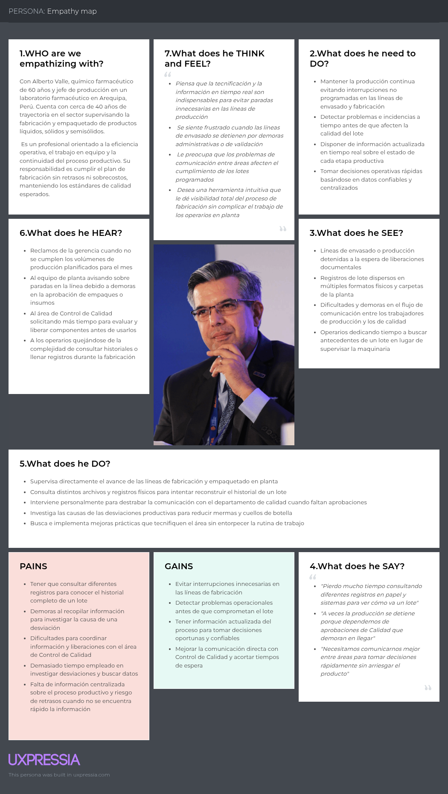

En este mapa se analizó a Alberto Valle, jefe de producción farmacéutica con amplia experiencia en la supervisión de líneas de fabricación. Él piensa en la importancia de integrar información en tiempo real para evitar interrupciones innecesarias en las líneas de envasado. Escucha los reclamos cuando se retrasan las metas de fabricación y los avisos de planta sobre paradas de línea por demoras en las aprobaciones del área de calidad. Observa la dispersión de los registros de lote en papel y las dificultades en la comunicación entre el personal de planta y los departamentos de apoyo. Alberto suele expresar la urgencia de tecnificar la planta y actúa supervisando directamente los avances en línea e investigando las causas de las mermas o desviaciones. Su dolor principal es tener que consultar diferentes registros fragmentados y las demoras al coordinar liberaciones de insumos con Control de Calidad, mientras que su ganancia esperada es garantizar la continuidad productiva, detectar problemas de forma preventiva y tomar decisiones oportunas basadas en datos confiables.


## 2.4. Big Picture Event Storming

Para comprender el dominio del negocio de DoofPlus de punta a punta, el equipo realizó una sesión colaborativa de Big Picture EventStorming en Miro, siguiendo la guía paso a paso indicada en el statement (https://bit.ly/bpes-guide). El alcance de la sesión fue el ciclo de vida completo de un lote farmacéutico dentro de un laboratorio cliente: desde que la organización se registra en la plataforma hasta que el lote se libera y sus evidencias se presentan en una auditoría. Los integrantes del equipo trabajaron con la información de las entrevistas (sección 2.2) y los artefactos de needfinding (sección 2.3) como base.

Tablero de Miro: https://miro.com/app/board/uXjVHl-67N8=/

Antes de generar eventos se cumplieron los pasos 1 a 3 de la guía: se preparó el tablero con una franja de tiempo de izquierda a derecha, se acordó la agenda y se presentó la notación:

| Elemento | Color | Uso en la sesión |
| --- | --- | --- |
| Domain event | Naranja | Hecho relevante del negocio, redactado en pasado (por ejemplo, "Lote cerrado"). |
| Actor | Amarillo (pequeño) | Persona o rol que provoca o atiende el evento. |
| External system | Azul | Sistema u organización externa que interviene (Niubiz, ThingsBoard, Lector RFID, DIGEMID). |
| Problema u oportunidad (hotspot) | Rosado | Dificultad detectada en la situación actual. |
| Pivotal event | Línea roja | Evento que cambia de fase el proceso. |

**Step 4 – Generating Domain Events**

Cada integrante escribió en post-its naranjas, sin orden y en tiempo pasado, los hechos que ocurren en un laboratorio cuando se fabrica y controla un lote. Se obtuvieron 67 eventos que cubren la administración de la plataforma, la gestión documental, la producción, el monitoreo de equipos, el control de calidad, las desviaciones y la auditoría.

Frame en Miro: https://miro.com/app/board/uXjVHl-67N8=/?moveToWidget=3458764685732289571

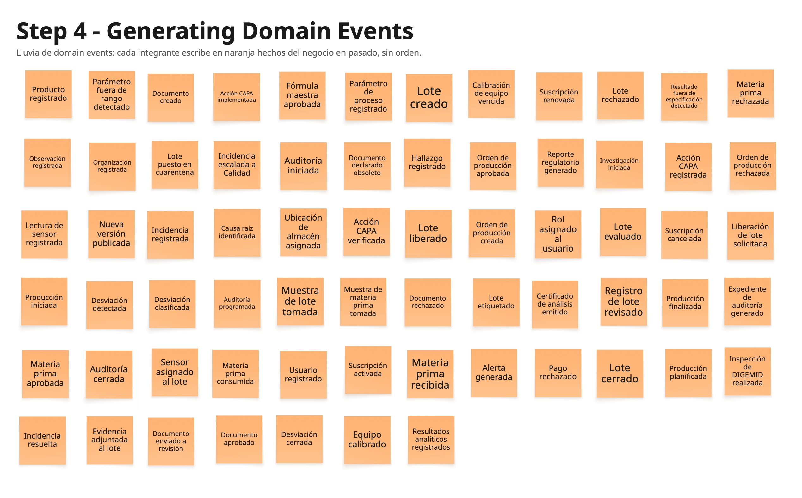

**Step 5 – Sorting Domain Events**

Los eventos se ordenaron cronológicamente de izquierda a derecha. Los resultados alternativos de un mismo momento (por ejemplo, "Materia prima aprobada" o "Materia prima rechazada") se ubicaron en vertical, y los flujos que ocurren en paralelo se separaron en siete swimlanes: Plataforma y administración, Gestión documental, Producción y almacén, Monitoreo de equipos (IoT), Control de calidad y liberación, Desviaciones y CAPA, y Auditoría y cumplimiento. Al ordenar se eliminaron los eventos duplicados.

Frame en Miro: https://miro.com/app/board/uXjVHl-67N8=/?moveToWidget=3458764685732347233

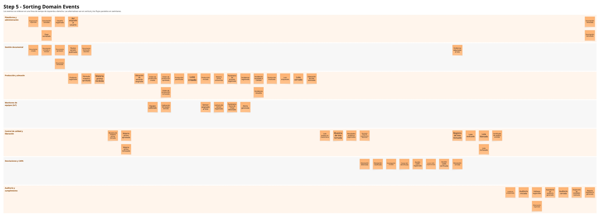

**Step 6 – Adding Actors and External Systems**

Sobre la línea de tiempo se agregaron los actores que provocan cada grupo de eventos (Administrador del laboratorio, Especialista QA/QC y Jefe de Producción) y los sistemas externos con los que interactúa el proceso: Niubiz para el cobro de suscripciones, el Lector RFID en la recepción de insumos, los sensores IoT conectados a ThingsBoard y DIGEMID como entidad que realiza la inspección.

Frame en Miro: https://miro.com/app/board/uXjVHl-67N8=/?moveToWidget=3458764685732347919

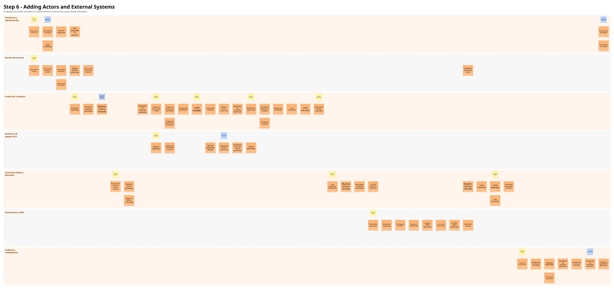

**Step 7 – Storytelling**

Un integrante narró la historia completa de inicio a fin mientras el resto validaba el orden y el significado de cada evento. Durante la narración se registraron en rosado los problemas que hoy enfrentan los laboratorios, tomados de las entrevistas, y se conectaron con flechas los eventos que disparan a otros (por ejemplo, "Parámetro fuera de rango detectado" dispara "Alerta generada", que genera una "Incidencia registrada").

| Problema detectado | Evidencia en las entrevistas |
| --- | --- |
| Recepción de insumos registrada en papel | Mariela, que también gestiona la adquisición de insumos, y Rick registran la información en formularios físicos y hojas de cálculo. |
| Producción espera la aprobación de insumos | Alberto explica que los materiales deben ser aprobados por Calidad antes de usarse y Rick señala que la coordinación es lenta por las validaciones manuales. |
| Calibraciones controladas en hojas de cálculo | Julia participa en la calibración y calificación de equipos y trabaja con Word y Excel. |
| Parámetros transcritos a mano | Rick documenta parámetros operativos en registros físicos. |
| Historial del lote disperso en papel, Excel y correos | Mariela y Rick señalan que reconstruir el historial de un lote es la principal dificultad. |
| Cálculos analíticos revisados a mano | María revisa cálculos e informes manualmente antes de registrarlos. |
| Análisis de causa raíz débil | Julia identifica la falta de análisis de causas reales como oportunidad de mejora. |
| Reunir evidencias para una auditoría toma días | María mantiene registros para auditorías y considera que la generación automática de reportes reduciría su carga; Julia participa en las auditorías. |

Frame en Miro: https://miro.com/app/board/uXjVHl-67N8=/?moveToWidget=3458764685732393843

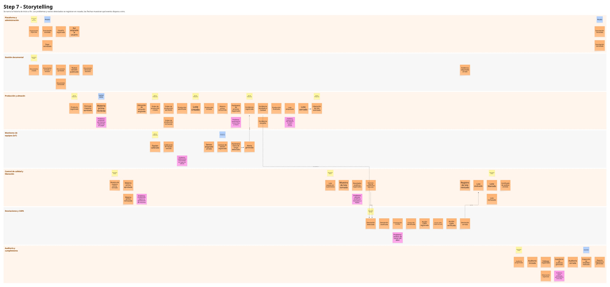

## 2.5. Ubiquitous Language

En este proyecto, cuyo objetivo principal es mejorar la trazabilidad, la gestión documental y la eficiencia en los procesos de calidad de laboratorios y plantas farmacéuticas mediante la plataforma DoofPlus, se ha definido el siguiente **lenguaje ubicuo (ubiquitous language)** para asegurar claridad y consistencia entre desarrolladores, usuarios (QA/QC, Jefes de Producción) y stakeholders:

| Term (Término) | Definition (Definición) |
|---|---|
| Batch (Lote) | Cantidad definida de un producto farmacéutico elaborado en un mismo ciclo de fabricación, caracterizada por su homogeneidad. |
| Batch Record (Expediente de Lote) | Conjunto consolidado de documentos físicos o digitales que proporcionan el historial completo de la producción, controles y distribución de un lote específico. |
| Master Formula (Fórmula maestra) | Documento aprobado que define los componentes y cantidades de un producto; cada lote se fabrica según una versión aprobada de la fórmula. |
| Production Order (Orden de producción) | Autorización para fabricar una cantidad planificada de un producto según su fórmula maestra; origina uno o más lotes. |
| Raw Material (Materia Prima / Insumo) | Toda sustancia, activa o inactiva, que es empleada e incorporada durante el proceso de formulación o fabricación de un producto farmacéutico. Se recibe por lote de proveedor y queda en cuarentena hasta su aprobación. |
| Production Parameter (Parámetro de Producción) | Variable operativa asociada a una etapa de fabricación cuya información puede registrarse y vincularse al historial de trazabilidad de un lote farmacéutico. |
| Incident (Incidencia) | Evento anómalo que Producción registra durante la fabricación; si es crítico detiene el lote (On Hold) y puede escalarse a Calidad como desviación. |
| Traceability (Trazabilidad) | Capacidad de rastrear y reconstruir el historial completo, la aplicación o la ubicación de un lote farmacéutico a lo largo de toda su cadena de producción. |
| Good Manufacturing Practices / GMP (Buenas Prácticas de Manufactura / BPM) | Conjunto de normativas y lineamientos regulatorios (como los exigidos por DIGEMID) que aseguran que los productos se fabriquen y controlen de forma consistente. |
| Quality Assurance / QA (Aseguramiento de Calidad) | Conjunto de acciones planificadas y sistemáticas necesarias para garantizar que un producto farmacéutico se fabrique cumpliendo los estándares de calidad exigidos. |
| Quality Control / QC (Control de Calidad) | Área encargada de ejecutar pruebas, validaciones y muestreos operativos para verificar que los productos o insumos cumplen con especificaciones técnicas precisas. |
| Standard Operating Procedure / SOP (Procedimiento operativo estándar) | Documento controlado que describe paso a paso cómo ejecutar una actividad; solo la versión aprobada vigente puede aplicarse. |
| Analytical Protocol (Protocolo Analítico) | Documento técnico normado que describe detalladamente los métodos, equipos y criterios de aceptación utilizados para realizar las pruebas de control de un producto. |
| Quarantine (Cuarentena) | Estado en que un insumo o un lote no puede usarse ni distribuirse hasta que Calidad emita su dictamen. |
| Out of Specification / OOS (Resultado fuera de especificación) | Resultado analítico que no cumple el rango de aceptación del protocolo; obliga a registrar una desviación. |
| Deviation (Desviación) | Cualquier alteración, no conformidad o evento imprevisto que se aleje de los procedimientos, protocolos o parámetros establecidos durante el proceso de fabricación. |
| Root Cause Analysis / RCA (Análisis de causa raíz) | Investigación estructurada (por ejemplo, 5 porqués o Ishikawa) que identifica el origen de una desviación; sin causa raíz no se puede cerrar la desviación. |
| CAPA (Acción correctiva y preventiva) | Acción con responsable y fecha límite que corrige una desviación y evita su recurrencia; se verifica su eficacia antes de cerrarla. |
| Batch Release (Liberación de Lote) | Aprobación formal otorgada por el área de calidad que certifica que un lote ha sido fabricado según las normativas y parámetros, permitiendo su fase de distribución comercial. |
| Certificate of Analysis (Certificado de análisis) | Documento firmado que acredita los resultados analíticos de un lote liberado. |
| Audit (Auditoría) | Revisión sistemática e independiente, ya sea interna o realizada por entidades regulatorias, para evaluar el estricto cumplimiento de las normativas y reportes de calidad. |
| Finding / Observation (Hallazgo / Observación) | Incumplimiento (hallazgo) o recomendación de mejora (observación) registrado durante una auditoría. |
| Audit Trail (Registro de auditoría) | Registro inalterable de quién, cuándo, qué y por qué cambió en cada registro de calidad. |
| Electronic Signature (Firma electrónica) | Confirmación de identidad del usuario con su contraseña al aprobar, revisar o liberar un registro; incluye nombre, fecha, hora y significado. |
| Calibration (Calibración) | Verificación periódica de un equipo o sensor contra un patrón; si vence, el equipo queda no apto para producción. |
| Sensor Reading (Lectura de sensor) | Valor de una variable crítica (temperatura, humedad, presión, pH) enviado por un sensor y asociado al lote en curso. |
| Alert (Alerta) | Aviso generado cuando una lectura sale del rango permitido; puede derivar en una incidencia. |
| Subscription Plan (Plan de suscripción) | Modalidad comercial de DoofPlus (Standard Lab o Enterprise) que define el precio y los límites de usuarios y sensores. |

**Beneficios esperados del Ubiquitous Language:**
- Facilita la comunicación directa sin ambigüedades entre desarrolladores de software, especialistas de QA/QC, Jefes de Producción y otros stakeholders.
- Mejora la comprensión profunda del core de negocio farmacéutico (domain) para la implementación de reglas de validación en la plataforma DoofPlus.
- Evita errores de interpretación conceptual en el diseño de los expedientes digitales y flujos de aprobación.
- Asegura consistencia y coherencia entre la documentación técnica, las interfaces de usuario del sistema (dashboards) y el código fuente.


---

# Capítulo III: Requirements Specification
En este capítulo se presentan los requisitos especificados de DoofPlus, acorde al análisis de la problemática, los segmentos objetivo y el alcance obtenido durante el desarrollo. La especificación cubre tres productos de la solución: la landing page pública, la aplicación web frontend y los servicios backend RESTful implementados con una arquitectura basada en bounded contexts.


## 3.1. User Stories

Las User Stories se obtuvieron a partir de las necesidades identificadas en las entrevistas, los User Personas, el User Task Matrix y el Big Picture EventStorming del capítulo II. Se organizan en 11 epics que agrupan 59 User Stories y 11 Technical Stories, presentadas en un único cuadro con una fila por epic o historia:

- **Landing Page (EP01):** historias redactadas con el rol de visitante o de visitante de un segmento (especialista QA/QC o jefe de producción), que cubren las secciones del sitio estático y su vínculo con la Web Application.
- **Web Application (EP02 a EP11):** historias de los roles de especialista QA/QC, jefe o supervisor de producción y administrador del laboratorio, agrupadas por capacidades del negocio: identidad y accesos, documentación de calidad, trazabilidad de lotes, desviaciones y CAPA, integración IoT, cumplimiento y auditoría, dashboards, operaciones de laboratorio, comunicación entre áreas y suscripciones.
- **Technical Stories (TS01 a TS11):** redactadas con el rol Developer. TS01 corresponde a la implementación de la Landing Page y las demás a los endpoints del RESTful API de cada epic, con escenarios de request y response.

Los criterios de aceptación siguen la estructura de Gherkin (Dado que / Cuando / Entonces), se redactan en tiempo presente y en tercera persona, no hacen referencia a detalles de la interfaz de usuario y son comprobables.

| **Epic / Story ID** | **Título** | **Descripción** | **Criterios de Aceptación** | **Relacionado con (Epic ID)** |
| --- | --- | --- | --- | --- |
| **EP01** | **Landing Page & Public Experience** | Agrupa las funcionalidades del sitio web estático (Landing Page) que comunican la propuesta de valor a los visitantes de cada segmento y los dirigen a la Web Application. | – | – |
| US01 | Visualización de la propuesta de valor | Como visitante especialista QA/QC o jefe de producción, quiero conocer la propuesta de valor de DoofPlus para evaluar si responde a las necesidades de mi laboratorio. | **Escenario 1: Visualización de la propuesta de valor**<br>Dado que el visitante accede a la Landing Page<br>Cuando se carga la sección principal (Home)<br>Entonces visualiza el título, la descripción de la propuesta de valor y la opción para comenzar a usar DoofPlus.<br>**Escenario 2: Visualización en dispositivo móvil**<br>Dado que el visitante accede desde un smartphone<br>Cuando se carga la sección principal<br>Entonces la propuesta de valor y la opción para comenzar a usar DoofPlus se muestran completas y adaptadas al dispositivo. | EP01 |
| US02 | Visualización de servicios y características | Como visitante, quiero conocer los servicios y características de DoofPlus para comprender cómo mejora la trazabilidad y la gestión de calidad. | **Escenario 1: Consulta de servicios**<br>Dado que el visitante navega a la sección de servicios<br>Cuando la sección se muestra<br>Entonces visualiza los servicios Real-Time IoT Monitoring, Automated BPM Compliance, Immutable Traceability y Digital Batch Management con su descripción.<br>**Escenario 2: Detalle de una característica**<br>Dado que el visitante se encuentra en la sección de características<br>Cuando elige una característica<br>Entonces se muestra su descripción completa. | EP01 |
| US03 | Visualización de planes y precios | Como visitante responsable de compras de un laboratorio, quiero consultar los planes y precios disponibles para identificar la alternativa más adecuada para mi organización. | **Escenario 1: Consulta de precios mensuales**<br>Dado que el visitante accede a la sección de planes<br>Cuando la sección se muestra<br>Entonces visualiza los planes Standard Lab (US$199/mes) y Enterprise (US$599/mes) con sus características.<br>**Escenario 2: Consulta de precios anuales**<br>Dado que el visitante revisa los planes<br>Cuando elige la modalidad de pago anual<br>Entonces se muestran los precios anuales (US$1,990 y US$5,990) con el ahorro correspondiente. | EP01 |
| US04 | Formulario de contacto | Como visitante interesado, quiero dejar mi correo electrónico para recibir información y solicitar una demostración de DoofPlus. | **Escenario 1: Envío exitoso**<br>Dado que el visitante ingresa un correo electrónico válido<br>Cuando envía la solicitud<br>Entonces el sistema registra la solicitud y confirma su recepción al visitante.<br>**Escenario 2: Correo inválido**<br>Dado que el visitante ingresa un correo con formato inválido o no ingresa ningún correo<br>Cuando intenta enviar la solicitud<br>Entonces la solicitud no se registra y se informa el motivo del error. | EP01 |
| US05 | Preguntas frecuentes | Como visitante, quiero consultar preguntas frecuentes para resolver dudas comunes sobre la plataforma. | **Escenario 1: Consulta de una respuesta**<br>Dado que el visitante accede a la sección de preguntas frecuentes<br>Cuando selecciona una pregunta<br>Entonces se muestra la respuesta correspondiente.<br>**Escenario 2: Duda no resuelta**<br>Dado que el visitante no encuentra respuesta a su duda<br>Cuando termina de revisar las preguntas<br>Entonces se le ofrece la opción de contactar al equipo de DoofPlus. | EP01 |
| US44 | Navegación por secciones | Como visitante, quiero acceder rápidamente a cada sección de la Landing Page para encontrar la información que necesito. | **Escenario 1: Acceso a una sección específica**<br>Dado que el visitante se encuentra en cualquier parte de la Landing Page<br>Cuando accede a una sección específica<br>Entonces se presenta el contenido de esa sección.<br>**Escenario 2: Acceso desde un smartphone**<br>Dado que el visitante accede desde un smartphone<br>Cuando accede a una sección específica<br>Entonces se presenta el contenido de esa sección adaptado al dispositivo. | EP01 |
| US45 | Visualización del equipo y de la startup | Como visitante, quiero conocer a IngesCompany y a su equipo para generar confianza en la solución. | **Escenario 1: Consulta del equipo**<br>Dado que el visitante accede a la sección About Us<br>Cuando se muestra el equipo<br>Entonces visualiza la foto, el nombre, el rol y la descripción de cada integrante.<br>**Escenario 2: Consulta de la startup**<br>Dado que el visitante revisa la sección About Us<br>Cuando la sección se muestra<br>Entonces visualiza la descripción de IngesCompany y los pilares del servicio. | EP01 |
| US46 | Cambio de idioma | Como visitante, quiero cambiar el idioma de la Landing Page entre inglés y español para comprender el contenido en mi idioma de preferencia. | **Escenario 1: Cambio a español**<br>Dado que la Landing Page se muestra en inglés<br>Cuando el visitante elige el idioma español<br>Entonces todo el contenido textual se muestra en español latinoamericano (es-419).<br>**Escenario 2: Idioma por defecto**<br>Dado que el visitante ingresa por primera vez<br>Cuando se carga la Landing Page<br>Entonces el contenido se muestra en inglés (en-US). | EP01 |
| US47 | Consulta de términos y política de privacidad | Como visitante, quiero consultar los términos y condiciones y la política de privacidad para conocer las condiciones del servicio y el tratamiento de mis datos. | **Escenario 1: Acceso a términos y condiciones**<br>Dado que el visitante se encuentra en cualquier sección<br>Cuando accede a los términos y condiciones desde el footer<br>Entonces visualiza el documento vigente con su fecha de actualización.<br>**Escenario 2: Acceso a política de privacidad**<br>Dado que el visitante se encuentra en cualquier sección<br>Cuando accede a la política de privacidad desde el footer<br>Entonces visualiza la política conforme a la Ley N.° 29733 de Protección de Datos Personales. | EP01 |
| US48 | Acceso por segmento a la Web Application | Como visitante especialista QA/QC o jefe de producción, quiero acceder desde la Landing Page a la vista de la Web Application de mi segmento para comenzar a usar la plataforma. | **Escenario 1: Acceso del segmento QA/QC**<br>Dado que el visitante pertenece al segmento QA/QC<br>Cuando elige acceder a la Web Application como especialista QA/QC<br>Entonces es dirigido al inicio de sesión del entorno de calidad de la Web Application.<br>**Escenario 2: Acceso del segmento Producción**<br>Dado que el visitante pertenece al segmento Producción<br>Cuando elige acceder a la Web Application como jefe de producción<br>Entonces es dirigido al inicio de sesión del entorno de producción de la Web Application. | EP01 |
| US49 | Visualización del video promocional | Como visitante, quiero ver un video sobre DoofPlus para entender rápidamente su funcionamiento. | **Escenario 1: Reproducción del video**<br>Dado que el video About-the-Product está publicado en YouTube<br>Cuando el visitante accede a la sección correspondiente<br>Entonces puede reproducir el video incrustado.<br>**Escenario 2: Video no disponible**<br>Dado que el servicio de video no responde<br>Cuando el visitante accede a la sección<br>Entonces se informa que el video no está disponible y se indica dónde consultarlo en YouTube. | EP01 |
| TS01 | Implementación de Landing Page responsive y accesible | Como Developer, quiero implementar la Landing Page con HTML5, CSS3 y JavaScript aplicando responsive web design y a11y para garantizar una experiencia adecuada en distintos dispositivos. | **Escenario 1: Adaptación a mobile**<br>Dado que la Landing Page está desplegada<br>Cuando se accede con un ancho de pantalla de 375 px<br>Entonces los elementos se reorganizan en una sola columna sin desplazamiento horizontal.<br>**Escenario 2: Adaptación a desktop**<br>Dado que la Landing Page está desplegada<br>Cuando se accede con un ancho de pantalla de 1440 px<br>Entonces el contenido se distribuye en la grilla de 12 columnas del Web Style Guide.<br>**Escenario 3: Atributos de accesibilidad**<br>Dado que un lector de pantalla recorre la Landing Page<br>Cuando lee imágenes y controles<br>Entonces cada imagen tiene texto alternativo y cada control interactivo tiene atributos ARIA. | EP01 |
| **EP02** | **Identity & Access Management** | Gestiona el registro de la organización, el alta de usuarios, la autenticación con segundo factor, los roles y las firmas electrónicas. | – | – |
| US06 | Inicio de sesión con segundo factor | Como usuario registrado, quiero iniciar sesión con mi contraseña y un código 2FA para acceder de forma segura a las funcionalidades de mi rol. | **Escenario 1: Credenciales válidas**<br>Dado que el usuario está registrado y activo<br>Cuando ingresa su correo, su contraseña y un código 2FA válido<br>Entonces accede al entorno correspondiente a su rol.<br>**Escenario 2: Credenciales inválidas**<br>Dado que el usuario ingresa una contraseña o un código 2FA incorrecto<br>Cuando intenta iniciar sesión<br>Entonces el acceso se rechaza con un mensaje genérico y, tras cinco intentos fallidos, la cuenta se bloquea durante 15 minutos. | EP02 |
| US07 | Gestión de roles | Como administrador del laboratorio, quiero asignar roles a los usuarios para controlar el acceso a funcionalidades específicas. | **Escenario 1: Asignación de rol**<br>Dado que el administrador selecciona a un usuario activo<br>Cuando le asigna el rol QA Specialist<br>Entonces los permisos del usuario se actualizan y el cambio se registra en el audit trail.<br>**Escenario 2: Acción no autorizada**<br>Dado que un usuario tiene el rol Production Supervisor<br>Cuando intenta aprobar un documento de calidad<br>Entonces el sistema deniega la acción por falta de permisos. | EP02 |
| US08 | Firmas electrónicas | Como especialista de calidad, quiero firmar electrónicamente las acciones críticas para validarlas conforme a los requisitos regulatorios. | **Escenario 1: Firma válida**<br>Dado que un registro requiere aprobación<br>Cuando el especialista confirma su identidad con su contraseña<br>Entonces se registra la firma con nombre, fecha, hora y significado (por ejemplo, Approved).<br>**Escenario 2: Firma rechazada**<br>Dado que el especialista ingresa una contraseña incorrecta al firmar<br>Cuando confirma la acción<br>Entonces la firma no se registra y el registro mantiene su estado anterior. | EP02 |
| US50 | Registro de organización | Como administrador de un laboratorio, quiero registrar mi organización en DoofPlus para habilitar el acceso de mi equipo. | **Escenario 1: Registro exitoso**<br>Dado que el administrador ingresa razón social, un RUC válido y un correo corporativo<br>Cuando confirma el registro<br>Entonces se crean la organización y su cuenta de administrador.<br>**Escenario 2: RUC duplicado**<br>Dado que el RUC ya está registrado<br>Cuando el administrador intenta registrar la organización<br>Entonces el registro se rechaza indicando que la organización ya existe. | EP02 |
| US55 | Alta de usuarios del equipo | Como administrador del laboratorio, quiero dar de alta a los usuarios de mi equipo para que cada uno acceda con su propia cuenta y rol. | **Escenario 1: Alta exitosa**<br>Dado que la organización tiene una suscripción activa con usuarios disponibles en su plan<br>Cuando el administrador registra el nombre, el correo corporativo y el rol de un nuevo usuario<br>Entonces se crea la cuenta en estado Invited y se envía una invitación para activarla con contraseña y 2FA.<br>**Escenario 2: Correo duplicado**<br>Dado que el correo ya pertenece a un usuario de la organización<br>Cuando el administrador intenta registrarlo<br>Entonces el alta se rechaza indicando que el usuario ya existe.<br>**Escenario 3: Límite del plan**<br>Dado que la organización alcanzó el límite de usuarios de su plan<br>Cuando el administrador intenta registrar otro usuario<br>Entonces el alta se impide y se sugiere actualizar al plan Enterprise. | EP02 |
| TS02 | Autenticación JWT en el RESTful API | Como Developer, quiero implementar autenticación basada en JWT en el RESTful API para proteger los recursos del sistema. | **Escenario 1: Token generado**<br>Dado que el endpoint POST /api/v1/authentication/sign-in está disponible<br>Cuando se envía un request con credenciales y código 2FA válidos<br>Entonces el API responde 200 OK con un token JWT y su fecha de expiración.<br>**Escenario 2: Recurso protegido sin token**<br>Dado que un endpoint requiere autenticación<br>Cuando se envía un request sin token o con un token expirado<br>Entonces el API responde 401 Unauthorized. | EP02 |
| **EP03** | **Quality Documentation Management** | Gestiona protocolos, procedimientos operativos estándar (SOP), sus versiones y su aprobación. | – | – |
| US09 | Gestión de protocolos de calidad | Como especialista QA/QC, quiero registrar protocolos digitales para estandarizar los procesos y cumplir las BPM. | **Escenario 1: Registro de protocolo**<br>Dado que el especialista cuenta con los datos del protocolo<br>Cuando registra el protocolo<br>Entonces el protocolo queda en estado Draft con un código único.<br>**Escenario 2: Datos obligatorios incompletos**<br>Dado que falta el código o el título del protocolo<br>Cuando intenta registrarlo<br>Entonces el protocolo no se registra y se indican los datos obligatorios faltantes. | EP03 |
| US10 | Repositorio de SOP | Como especialista QA/QC, quiero consultar los procedimientos operativos estándar vigentes para aplicar siempre la versión aprobada. | **Escenario 1: Búsqueda de SOP**<br>Dado que existen SOP aprobados<br>Cuando el especialista busca por código o nombre<br>Entonces se muestra solo la versión vigente de cada SOP.<br>**Escenario 2: Sin resultados**<br>Dado que el término no coincide con ningún SOP<br>Cuando realiza la búsqueda<br>Entonces se informa que no se encontraron resultados. | EP03 |
| US11 | Automatización de cálculos de calidad | Como especialista QA/QC, quiero que el sistema calcule automáticamente los resultados analíticos para reducir errores manuales. | **Escenario 1: Cálculo automático**<br>Dado que se registran las variables de un ensayo<br>Cuando el especialista solicita el cálculo<br>Entonces el sistema obtiene el resultado según la fórmula del protocolo y lo compara con la especificación.<br>**Escenario 2: Resultado fuera de especificación**<br>Dado que el resultado calculado está fuera del rango especificado<br>Cuando se registra el resultado<br>Entonces se marca como OOS (Out of Specification) y se solicita registrar una desviación. | EP03 |
| US12 | Control de versiones documentales | Como especialista QA/QC, quiero mantener el historial de versiones de cada documento para garantizar su integridad. | **Escenario 1: Nueva versión**<br>Dado que un documento aprobado se modifica<br>Cuando se guardan los cambios con su motivo<br>Entonces se crea una nueva versión (por ejemplo, v1.1) y la anterior queda como obsoleta.<br>**Escenario 2: Consulta del historial**<br>Dado que un documento tiene varias versiones<br>Cuando el especialista consulta su historial<br>Entonces visualiza autor, fecha y motivo de cada versión. | EP03 |
| US13 | Aprobación documental | Como jefe de aseguramiento de calidad, quiero aprobar documentos mediante firma electrónica para asegurar la trazabilidad regulatoria. | **Escenario 1: Aprobación**<br>Dado que un documento está In Review<br>Cuando el responsable lo aprueba con su firma electrónica<br>Entonces el estado cambia a Approved y se registra la firma.<br>**Escenario 2: Rechazo**<br>Dado que el responsable encuentra observaciones<br>Cuando rechaza el documento indicando el motivo<br>Entonces el documento vuelve a Draft y se notifica al autor. | EP03 |
| TS10 | API de documentación de calidad | Como Developer, quiero exponer endpoints REST para gestionar protocolos, SOP y sus versiones. | **Escenario 1: Creación de documento**<br>Dado que el endpoint POST /api/v1/quality-documents está disponible<br>Cuando se envía un request con datos válidos<br>Entonces el API responde 201 Created con el recurso y su versión 1.0.<br>**Escenario 2: Documento inexistente**<br>Dado que el endpoint GET /api/v1/quality-documents/{id} está disponible<br>Cuando se envía un id inexistente<br>Entonces el API responde 404 Not Found. | EP03 |
| **EP04** | **Batch Traceability Management** | Gestiona el registro, los estados y la trazabilidad completa de los lotes farmacéuticos. | – | – |
| US14 | Registro de lotes | Como supervisor de producción, quiero registrar lotes para iniciar su trazabilidad digital. | **Escenario 1: Creación de lote**<br>Dado que existe un producto con fórmula maestra aprobada<br>Cuando el supervisor registra el lote con su número y cantidad planificada<br>Entonces el lote se crea en estado Planned y se habilita su línea de tiempo.<br>**Escenario 2: Número duplicado**<br>Dado que el número de lote ya existe<br>Cuando el supervisor intenta registrarlo<br>Entonces el registro se rechaza indicando la duplicidad. | EP04 |
| US15 | Consulta del historial de lotes | Como especialista QA/QC, quiero consultar el historial completo de un lote para revisar sus registros y eventos asociados. | **Escenario 1: Línea de tiempo**<br>Dado que el lote tiene eventos registrados<br>Cuando el especialista consulta el lote<br>Entonces visualiza todos los eventos en orden cronológico con su responsable y fecha.<br>**Escenario 2: Lote inexistente**<br>Dado que el número de lote no existe<br>Cuando el especialista lo consulta<br>Entonces se informa que no se encontró el lote. | EP04 |
| US16 | Gestión de estados de lote | Como supervisor de producción, quiero actualizar el estado de los lotes durante su ciclo de vida para reflejar su avance real. | **Escenario 1: Cierre del lote**<br>Dado que el lote finalizó su fabricación<br>Cuando el supervisor registra el cierre con la cantidad fabricada<br>Entonces el lote pasa a Closed y se habilita la solicitud de liberación a Calidad.<br>**Escenario 2: Transición no permitida**<br>Dado que el lote está en ReleaseRequested<br>Cuando el supervisor intenta marcarlo como Released<br>Entonces el cambio se impide porque la liberación la decide Calidad. | EP04 |
| US17 | Asociación de materias primas | Como supervisor de producción, quiero asociar las materias primas utilizadas a un lote para mantener su trazabilidad completa. | **Escenario 1: Vinculación**<br>Dado que la materia prima está aprobada por Calidad<br>Cuando el supervisor registra su código y la cantidad usada<br>Entonces queda vinculada al historial del lote.<br>**Escenario 2: Materia prima no aprobada**<br>Dado que la materia prima está en cuarentena o rechazada<br>Cuando el supervisor intenta vincularla<br>Entonces la vinculación se impide indicando el motivo. | EP04 |
| US58 | Recepción de materias primas | Como supervisor de producción, quiero registrar la recepción de materias primas con su lote de proveedor para que queden en cuarentena hasta su aprobación por Calidad. | **Escenario 1: Recepción**<br>Dado que llega un insumo con etiqueta RFID<br>Cuando el supervisor registra la recepción<br>Entonces el insumo queda en Quarantine y se envía la solicitud de aprobación a Calidad.<br>**Escenario 2: Ubicación en almacén**<br>Dado que el insumo fue recibido<br>Cuando el supervisor le asigna una ubicación de almacén<br>Entonces la ubicación queda registrada en su historial. | EP04 |
| US57 | Gestión de órdenes de producción | Como jefe de producción, quiero crear y aprobar órdenes de producción para planificar la fabricación de los lotes. | **Escenario 1: Aprobación**<br>Dado que existe un producto con fórmula maestra aprobada<br>Cuando el jefe crea la orden con la cantidad planificada y la aprueba<br>Entonces la orden pasa a Approved y queda disponible para crear lotes.<br>**Escenario 2: Rechazo sin motivo**<br>Dado que una orden está Created<br>Cuando el jefe intenta rechazarla sin indicar el motivo<br>Entonces el rechazo se impide hasta registrar el motivo. | EP04 |
| US56 | Registro y escalamiento de incidencias | Como supervisor de producción, quiero registrar las incidencias de un lote y escalarlas a Calidad para que se investiguen sin detener la producción más de lo necesario. | **Escenario 1: Incidencia crítica**<br>Dado que un lote está In Progress<br>Cuando el supervisor registra una incidencia de severidad Critical<br>Entonces el lote pasa a On Hold y la incidencia queda en su línea de tiempo.<br>**Escenario 2: Escalamiento a Calidad**<br>Dado que una incidencia está abierta<br>Cuando el supervisor la escala a Calidad<br>Entonces se registra una desviación vinculada al lote y Calidad recibe una notificación. | EP04 |
| TS03 | API de trazabilidad de lotes | Como Developer, quiero exponer endpoints REST para registrar y consultar lotes y su línea de tiempo. | **Escenario 1: Consulta de lote**<br>Dado que existe el lote solicitado<br>Cuando se envía GET /api/v1/production-batches/{batchId}<br>Entonces el API responde 200 OK con los datos del lote y su línea de tiempo.<br>**Escenario 2: Número duplicado**<br>Dado que existe un lote con el mismo número<br>Cuando se envía POST /api/v1/production-batches con ese número<br>Entonces el API responde 409 Conflict con un mensaje descriptivo. | EP04 |
| **EP05** | **Quality Events & Deviations** | Gestiona desviaciones, análisis de causa raíz y acciones correctivas y preventivas (CAPA). | – | – |
| US18 | Registro de desviaciones | Como especialista QA/QC, quiero registrar desviaciones para realizar su seguimiento y análisis. | **Escenario 1: Registro**<br>Dado que se detecta una anomalía en un lote<br>Cuando el especialista registra la desviación con descripción, severidad y lote afectado<br>Entonces se genera un código único en estado Open.<br>**Escenario 2: Sin lote asociado**<br>Dado que no se indica el lote afectado<br>Cuando intenta registrar la desviación<br>Entonces se solicita completar la información obligatoria. | EP05 |
| US19 | Análisis de causa raíz | Como especialista QA/QC, quiero documentar el análisis de causa raíz (RCA) para identificar el origen de las desviaciones. | **Escenario 1: Documentación del RCA**<br>Dado que una desviación está Under Investigation<br>Cuando el especialista registra el método y la causa raíz<br>Entonces los hallazgos quedan vinculados a la desviación.<br>**Escenario 2: Cierre sin causa raíz**<br>Dado que la desviación no tiene causa raíz registrada<br>Cuando se intenta cerrarla<br>Entonces el cierre se impide. | EP05 |
| US20 | Gestión CAPA | Como especialista QA/QC, quiero registrar acciones correctivas y preventivas derivadas de una desviación para evitar su recurrencia. | **Escenario 1: Creación de acción**<br>Dado que se identificó la causa raíz<br>Cuando el especialista registra una acción con responsable y fecha límite<br>Entonces se crea la acción CAPA en estado Open.<br>**Escenario 2: Fecha límite inválida**<br>Dado que la fecha límite es anterior a la fecha actual<br>Cuando registra la acción<br>Entonces la acción se rechaza. | EP05 |
| US21 | Seguimiento de acciones CAPA | Como especialista QA/QC, quiero monitorear el avance de las acciones CAPA abiertas para asegurar su cumplimiento. | **Escenario 1: Avance**<br>Dado que existen acciones abiertas<br>Cuando el especialista consulta el seguimiento<br>Entonces visualiza estado, responsable y porcentaje de avance de cada acción.<br>**Escenario 2: Acción vencida**<br>Dado que una acción supera su fecha límite sin cerrarse<br>Cuando se consulta el seguimiento<br>Entonces la acción se identifica como Overdue y se notifica al responsable. | EP05 |
| US22 | Notificaciones de desviación crítica | Como especialista QA/QC, quiero recibir alertas cuando se registre una desviación crítica para actuar de inmediato. | **Escenario 1: Alerta inmediata**<br>Dado que se registra una desviación de severidad Critical<br>Cuando se guarda la desviación<br>Entonces los responsables de Calidad reciben una notificación in-app y por correo.<br>**Escenario 2: Desviación menor**<br>Dado que la severidad es Minor<br>Cuando se guarda la desviación<br>Entonces no se envía alerta inmediata y la desviación se incluye en el resumen diario. | EP05 |
| TS11 | API de desviaciones y CAPA | Como Developer, quiero exponer endpoints REST para gestionar desviaciones, causas raíz y acciones CAPA. | **Escenario 1: Registro de desviación**<br>Dado que el endpoint POST /api/v1/deviations está disponible<br>Cuando se envía un request válido<br>Entonces el API responde 201 Created con el código y el estado Open.<br>**Escenario 2: Cierre inválido**<br>Dado que la desviación no tiene causa raíz<br>Cuando se envía PATCH /api/v1/deviations/{id}/close<br>Entonces el API responde 422 Unprocessable Entity. | EP05 |
| **EP06** | **IoT Traceability Integration** | Integra los datos de sensores (vía ThingsBoard) y equipos para fortalecer la trazabilidad de los lotes. | – | – |
| US23 | Registro de dispositivos IoT | Como administrador del laboratorio, quiero registrar los sensores IoT conectados para controlar su inventario. | **Escenario 1: Alta de sensor**<br>Dado que se instala un sensor<br>Cuando el administrador registra su identificador de ThingsBoard, tipo y equipo<br>Entonces el sensor queda activo.<br>**Escenario 2: Identificador duplicado**<br>Dado que el identificador ya existe<br>Cuando intenta registrarlo<br>Entonces el registro se rechaza. | EP06 |
| US24 | Asociación de sensores a un lote | Como supervisor de producción, quiero asociar los sensores de un equipo a un lote en fabricación para vincular sus lecturas. | **Escenario 1: Vinculación**<br>Dado que el lote está In Progress<br>Cuando el supervisor asocia el equipo y sus sensores<br>Entonces las lecturas posteriores se registran en el historial del lote.<br>**Escenario 2: Sensor ocupado**<br>Dado que el sensor está asociado a otro lote en curso<br>Cuando se intenta asociarlo<br>Entonces la asociación se impide. | EP06 |
| US25 | Captura automática de evidencias | Como supervisor de producción, quiero que las variables críticas se registren automáticamente para evitar la transcripción manual. | **Escenario 1: Lectura dentro de rango**<br>Dado que el sensor está asociado a un lote<br>Cuando envía una lectura dentro del rango<br>Entonces se registra con fecha y hora sin intervención humana.<br>**Escenario 2: Lectura fuera de rango**<br>Dado que una lectura supera el límite configurado<br>Cuando se recibe la lectura<br>Entonces se genera una alerta y se sugiere registrar una desviación. | EP06 |
| US26 | Consulta de registros IoT | Como especialista QA/QC, quiero consultar los datos IoT asociados a un lote para respaldar su liberación. | **Escenario 1: Evolución de variables**<br>Dado que el lote tiene lecturas registradas<br>Cuando el especialista consulta sus métricas<br>Entonces visualiza la evolución de temperatura, humedad y presión frente a sus límites.<br>**Escenario 2: Sin lecturas**<br>Dado que el lote no tiene lecturas<br>Cuando las consulta<br>Entonces se informa que no existen datos IoT asociados. | EP06 |
| TS04 | API de ingesta IoT | Como Developer, quiero implementar un endpoint que reciba la telemetría enviada por ThingsBoard. | **Escenario 1: Lectura aceptada**<br>Dado que ThingsBoard envía un payload válido con su API key<br>Cuando se recibe POST /api/v1/telemetry<br>Entonces el API responde 202 Accepted y almacena la lectura.<br>**Escenario 2: API key inválida**<br>Dado que el payload no incluye una API key válida<br>Cuando se recibe el request<br>Entonces el API responde 401 Unauthorized y descarta la lectura. | EP06 |
| **EP07** | **Compliance & Audit** | Gestiona el audit trail, la revisión y liberación de lotes, los reportes regulatorios y la preparación de auditorías. | – | – |
| US27 | Audit trail | Como especialista QA/QC, quiero consultar todas las modificaciones realizadas sobre los registros para demostrar la integridad de los datos. | **Escenario 1: Consulta**<br>Dado que un usuario modificó un registro<br>Cuando el especialista consulta el audit trail<br>Entonces observa quién, cuándo y qué cambió (valor anterior y nuevo) y el motivo.<br>**Escenario 2: Inmutabilidad**<br>Dado que existe una entrada en el audit trail<br>Cuando cualquier usuario intenta modificarla o eliminarla<br>Entonces la operación se impide. | EP07 |
| US28 | Generación automática de reportes | Como especialista QA/QC, quiero generar reportes regulatorios automáticamente para reducir el tiempo de preparación. | **Escenario 1: Generación**<br>Dado que existen registros en el periodo<br>Cuando el especialista solicita el reporte mensual<br>Entonces se genera un PDF estandarizado.<br>**Escenario 2: Periodo sin datos**<br>Dado que no existen registros en el periodo<br>Cuando solicita el reporte<br>Entonces se informa que no hay datos para el periodo. | EP07 |
| US29 | Preparación de auditorías | Como especialista QA/QC, quiero consolidar la documentación requerida para una auditoría para responder a tiempo a los inspectores. | **Escenario 1: Paquete de evidencias**<br>Dado que se programó una auditoría<br>Cuando el especialista selecciona el rango de fechas y los lotes<br>Entonces se genera un paquete descargable con todas las evidencias.<br>**Escenario 2: Evidencia faltante**<br>Dado que un lote seleccionado no tiene certificado de liberación<br>Cuando genera el paquete<br>Entonces se informa la evidencia faltante. | EP07 |
| US30 | Acceso de auditor a evidencias | Como auditor interno, quiero acceder en modo lectura a las evidencias de los lotes para verificar el cumplimiento. | **Escenario 1: Lectura**<br>Dado que el auditor tiene permisos de lectura<br>Cuando consulta un lote<br>Entonces visualiza certificados, firmas y registros sin poder modificarlos.<br>**Escenario 2: Intento de edición**<br>Dado que el auditor tiene permisos de lectura<br>Cuando intenta modificar un registro<br>Entonces la acción se deniega y se registra en el audit trail. | EP07 |
| US59 | Registro de auditorías y hallazgos | Como especialista QA/QC, quiero programar auditorías y registrar sus hallazgos para dar seguimiento a su cierre. | **Escenario 1: Registro de hallazgo**<br>Dado que una auditoría está In Progress<br>Cuando el especialista registra un hallazgo u observación<br>Entonces queda vinculado a la auditoría con su tipo y descripción.<br>**Escenario 2: Cierre con hallazgos pendientes**<br>Dado que la auditoría tiene hallazgos sin atender<br>Cuando el especialista intenta cerrarla<br>Entonces el cierre se impide indicando los hallazgos pendientes. | EP07 |
| US54 | Revisión y liberación de lotes | Como especialista QA/QC, quiero poner en cuarentena, evaluar y liberar o rechazar los lotes cerrados para que solo se distribuyan productos conformes. | **Escenario 1: Liberación**<br>Dado que un lote está en cuarentena con todos sus resultados conformes<br>Cuando el especialista lo aprueba con su firma electrónica<br>Entonces se emite el certificado de liberación y el lote pasa a Released.<br>**Escenario 2: Resultado no conforme**<br>Dado que el lote tiene un resultado OOS sin desviación cerrada<br>Cuando el especialista intenta liberarlo<br>Entonces la liberación se impide indicando el resultado pendiente. | EP07 |
| TS05 | API de auditoría | Como Developer, quiero exponer endpoints para consultar los eventos del audit trail. | **Escenario 1: Consulta por rango**<br>Dado que existen eventos registrados<br>Cuando se envía GET /api/v1/audit-trail-entries?from=&to=<br>Entonces el API responde 200 OK con los eventos del rango ordenados por fecha.<br>**Escenario 2: Rango inválido**<br>Dado que la fecha inicial es posterior a la final<br>Cuando se envía el request<br>Entonces el API responde 400 Bad Request. | EP07 |
| **EP08** | **Dashboard & Analytics** | Proporciona indicadores de calidad, producción y trazabilidad para la toma de decisiones. | – | – |
| US31 | Dashboard de calidad | Como especialista QA/QC, quiero visualizar indicadores de calidad para priorizar mis actividades. | **Escenario 1: Indicadores**<br>Dado que existen lotes y desviaciones registrados<br>Cuando el especialista consulta los indicadores de calidad<br>Entonces visualiza lotes pendientes de revisión, desviaciones abiertas y la tasa de lotes aprobados frente a rechazados.<br>**Escenario 2: Filtro por periodo**<br>Dado que el especialista consulta los indicadores de calidad<br>Cuando elige un rango de fechas<br>Entonces los indicadores se recalculan para ese periodo. | EP08 |
| US32 | Dashboard de producción | Como supervisor de producción, quiero visualizar el estado de los lotes en curso para tomar decisiones oportunas. | **Escenario 1: Estado de lotes**<br>Dado que existen lotes en curso<br>Cuando el supervisor consulta el estado de la producción<br>Entonces visualiza los lotes In Progress, On Hold y Closed actualizados.<br>**Escenario 2: Lote detenido**<br>Dado que un lote pasa a On Hold<br>Cuando el supervisor consulta el estado de la producción<br>Entonces el lote se identifica como detenido junto con el motivo de la detención. | EP08 |
| US33 | Indicadores de trazabilidad | Como jefe de calidad, quiero monitorear el porcentaje de lotes con trazabilidad completa para anticipar observaciones de auditoría. | **Escenario 1: Porcentaje de trazabilidad**<br>Dado que existen lotes cerrados<br>Cuando consulta el indicador<br>Entonces visualiza el porcentaje de lotes con todos sus registros obligatorios.<br>**Escenario 2: Lote incompleto**<br>Dado que un lote carece de registros obligatorios<br>Cuando consulta su detalle<br>Entonces visualiza los registros faltantes. | EP08 |
| US34 | Indicadores de desviaciones | Como jefe de calidad, quiero identificar tendencias de desviaciones para prevenir su recurrencia. | **Escenario 1: Tendencias**<br>Dado que existen desviaciones cerradas<br>Cuando consulta el indicador<br>Entonces las desviaciones se agrupan por causa raíz y por mes.<br>**Escenario 2: Recurrencia**<br>Dado que una causa raíz se repite tres o más veces en un trimestre<br>Cuando consulta el indicador<br>Entonces la causa se marca como recurrente. | EP08 |
| TS06 | API de KPIs | Como Developer, quiero exponer métricas consolidadas para los dashboards. | **Escenario 1: Consulta de KPIs**<br>Dado que el usuario está autenticado con rol de Calidad<br>Cuando se envía GET /api/v1/kpis/quality?from=&to=<br>Entonces el API responde 200 OK con los indicadores agregados.<br>**Escenario 2: Sin permisos**<br>Dado que el usuario no tiene un rol autorizado<br>Cuando se envía el request<br>Entonces el API responde 403 Forbidden. | EP08 |
| **EP09** | **Laboratory Operations** | Gestiona productos, fórmulas maestras, equipos, calibraciones y mantenimientos. | – | – |
| US35 | Catálogo de productos | Como jefe de producción, quiero administrar los productos farmacéuticos para fabricarlos en nuevos lotes. | **Escenario 1: Alta de producto**<br>Dado que se lanza un nuevo producto<br>Cuando el jefe registra sus datos maestros<br>Entonces el producto queda disponible para nuevos lotes.<br>**Escenario 2: Código duplicado**<br>Dado que el código ya existe<br>Cuando intenta registrarlo<br>Entonces el registro se rechaza. | EP09 |
| US36 | Gestión de fórmulas maestras | Como jefe de producción, quiero registrar las fórmulas maestras aprobadas para que cada lote se fabrique según la especificación autorizada. | **Escenario 1: Registro de fórmula**<br>Dado que se aprobó una nueva fórmula<br>Cuando se registra con sus componentes y cantidades<br>Entonces queda protegida contra cambios sin una nueva versión aprobada.<br>**Escenario 2: Componentes inválidos**<br>Dado que la fórmula no tiene componentes o tiene cantidades no positivas<br>Cuando se intenta registrar<br>Entonces la fórmula se rechaza. | EP09 |
| US37 | Gestión de equipos | Como supervisor de producción, quiero registrar los equipos utilizados en la fabricación para controlar su estado. | **Escenario 1: Alta de equipo**<br>Dado que llega un nuevo equipo<br>Cuando el supervisor registra marca, modelo, serie y ubicación<br>Entonces el equipo se añade al inventario.<br>**Escenario 2: Serie duplicada**<br>Dado que el número de serie ya existe<br>Cuando intenta registrarlo<br>Entonces el registro se rechaza. | EP09 |
| US38 | Gestión de calibraciones | Como supervisor de producción, quiero controlar la calibración de equipos y sensores para asegurar mediciones válidas. | **Escenario 1: Vencimiento**<br>Dado que la calibración de un equipo vence<br>Cuando llega la fecha límite<br>Entonces el equipo se marca Not fit for use.<br>**Escenario 2: Uso de equipo no apto**<br>Dado que el equipo está Not fit for use<br>Cuando se intenta asociarlo a un lote<br>Entonces la asociación se impide. | EP09 |
| US39 | Mantenimiento preventivo | Como supervisor de producción, quiero registrar los mantenimientos preventivos para evitar paradas no planificadas. | **Escenario 1: Registro**<br>Dado que se realizó un mantenimiento<br>Cuando el supervisor lo registra<br>Entonces se actualiza la fecha del próximo mantenimiento.<br>**Escenario 2: Mantenimiento vencido**<br>Dado que se superó la fecha del próximo mantenimiento<br>Cuando se revisa el equipo<br>Entonces se notifica al supervisor. | EP09 |
| TS07 | API de operaciones de laboratorio | Como Developer, quiero implementar endpoints REST para productos, fórmulas y equipos. | **Escenario 1: Alta de equipo**<br>Dado que el endpoint POST /api/v1/equipment está disponible<br>Cuando se envía un request válido<br>Entonces el API responde 201 Created.<br>**Escenario 2: Equipo en uso**<br>Dado que el equipo está asociado a un lote en curso<br>Cuando se envía DELETE /api/v1/equipment/{id}<br>Entonces el API responde 409 Conflict. | EP09 |
| **EP10** | **Communication & Collaboration** | Facilita la coordinación entre Producción y Calidad mediante solicitudes, tareas y notificaciones. | – | – |
| US40 | Bandeja de tareas | Como usuario, quiero visualizar mis tareas pendientes para atenderlas oportunamente. | **Escenario 1: Tareas pendientes**<br>Dado que el usuario tiene acciones asignadas<br>Cuando consulta su bandeja<br>Entonces visualiza las acciones ordenadas por prioridad y fecha.<br>**Escenario 2: Sin tareas**<br>Dado que el usuario no tiene acciones pendientes<br>Cuando consulta su bandeja<br>Entonces se informa que no hay tareas pendientes. | EP10 |
| US41 | Notificaciones entre áreas | Como especialista de calidad, quiero recibir las solicitudes de Producción para atenderlas a tiempo. | **Escenario 1: Recepción**<br>Dado que Producción envía un lote a revisión<br>Cuando se registra la solicitud<br>Entonces Calidad recibe una notificación in-app y por correo.<br>**Escenario 2: Preferencias**<br>Dado que el usuario desactivó las notificaciones por correo<br>Cuando se registra una solicitud<br>Entonces solo recibe la notificación in-app. | EP10 |
| US42 | Solicitudes de aprobación | Como supervisor de producción, quiero solicitar aprobaciones a Calidad (por ejemplo, liberación de insumos) para continuar la fabricación sin demoras. | **Escenario 1: Solicitud**<br>Dado que un paso del proceso requiere aprobación de Calidad<br>Cuando el supervisor la solicita<br>Entonces el paso queda bloqueado hasta la respuesta de Calidad.<br>**Escenario 2: Rechazo**<br>Dado que Calidad rechaza la solicitud con un motivo<br>Cuando se registra la respuesta<br>Entonces el supervisor es notificado y el paso permanece bloqueado. | EP10 |
| US43 | Seguimiento de tareas | Como usuario, quiero monitorear el estado de las tareas que asigné para asegurar su cumplimiento. | **Escenario 1: Estado**<br>Dado que el usuario asignó tareas<br>Cuando consulta su seguimiento<br>Entonces visualiza si cada tarea está Pending, In Progress o Completed.<br>**Escenario 2: Tarea vencida**<br>Dado que una tarea supera su fecha límite<br>Cuando consulta su seguimiento<br>Entonces la tarea se marca como vencida y se notifica al responsable. | EP10 |
| TS08 | Servicio de notificaciones en tiempo real | Como Developer, quiero implementar notificaciones en tiempo real con WebSocket (STOMP sobre Spring WebSocket) para distribuir eventos sin recargar la Web Application. | **Escenario 1: Envío en tiempo real**<br>Dado que un cliente está suscrito al tópico de notificaciones de su organización<br>Cuando ocurre un evento relevante<br>Entonces el cliente recibe el payload en menos de 2 segundos.<br>**Escenario 2: Reconexión**<br>Dado que la conexión del cliente se interrumpe<br>Cuando se restablece<br>Entonces el cliente recibe las notificaciones pendientes. | EP10 |
| **EP11** | **Subscriptions & Payments** | Gestiona los planes, pagos, renovaciones y cancelaciones del modelo de suscripción. | – | – |
| US51 | Selección de plan | Como administrador del laboratorio, quiero elegir un plan de suscripción para habilitar las funcionalidades de mi organización. | **Escenario 1: Selección**<br>Dado que la organización está registrada<br>Cuando el administrador elige Standard Lab o Enterprise<br>Entonces se crea la suscripción en estado Pending con los límites del plan.<br>**Escenario 2: Límite del plan**<br>Dado que la organización tiene Standard Lab con 5 sensores registrados<br>Cuando intenta registrar un sexto sensor<br>Entonces se sugiere actualizar al plan Enterprise. | EP11 |
| US52 | Pago de suscripción | Como administrador del laboratorio, quiero pagar la suscripción con tarjeta para activar el servicio. | **Escenario 1: Pago aprobado**<br>Dado que Niubiz autoriza el cargo<br>Cuando se confirma el pago<br>Entonces la suscripción pasa a Active y se registra el comprobante.<br>**Escenario 2: Pago rechazado**<br>Dado que Niubiz rechaza el cargo<br>Cuando se procesa el pago<br>Entonces la suscripción permanece Pending y se informa el motivo. | EP11 |
| US53 | Renovación y cancelación | Como administrador del laboratorio, quiero renovar o cancelar la suscripción para controlar mis costos. | **Escenario 1: Renovación automática**<br>Dado que el periodo vence y existe un medio de pago válido<br>Cuando llega la fecha de renovación<br>Entonces la suscripción se renueva por un nuevo periodo.<br>**Escenario 2: Cancelación**<br>Dado que la suscripción está activa<br>Cuando el administrador la cancela<br>Entonces el acceso se mantiene hasta el fin del periodo pagado. | EP11 |
| TS09 | API de suscripciones y pagos | Como Developer, quiero implementar endpoints de suscripciones integrados con la API de Niubiz. | **Escenario 1: Pago registrado**<br>Dado que existe una suscripción Pending<br>Cuando se envía POST /api/v1/subscriptions/{id}/payments con un token de tarjeta válido<br>Entonces el API responde 201 Created con el estado del pago.<br>**Escenario 2: Pasarela no disponible**<br>Dado que Niubiz no responde<br>Cuando se envía el request<br>Entonces el API responde 503 Service Unavailable y no registra el pago. | EP11 |

## 3.2. Impact Mapping

El Impact Mapping de DoofPlus conecta los objetivos estratégicos del negocio con los actores involucrados, los impactos esperados, los entregables digitales y sus respectivas User Stories. La solución busca optimizar los tiempos de liberación de lotes y erradicar los errores de transcripción manual en la planta, garantizando el estricto cumplimiento de las normativas de calidad farmacéutica (BPM) mediante trazabilidad centralizada, monitoreo automatizado vía dispositivos IoT, gestión digital de desviaciones y un registro de auditoría inalterable (Audit Trail).

El mapa se elaboró en UXPressia a partir de las fichas de User Persona de la sección 2.3.1 y considera cuatro business goals SMART:

| Business goal | Actor / Persona | Impacts | Deliverables | User Stories |
| --- | --- | --- | --- | --- |
| Reducir en 40% el tiempo promedio de liberación y trazabilidad de los lotes durante los primeros 6 meses de uso de la plataforma. | María México (QA/QC) | Aprobar lotes y estandarizar protocolos con aprobaciones electrónicas; delegar al sistema el cálculo de los resultados analíticos; revisar el historial completo de cada lote y liberarlo sin esperar expedientes en papel. | Módulo de Gestión de Protocolos; Motor de Cálculo Analítico Automatizado; Sistema de Trazabilidad Centralizada de Lotes. | US09, US12, US13, US11, US15, US54 |
| | Alberto Valle (Producción) | Iniciar y gestionar órdenes de fabricación digitalmente; formular productos con las especificaciones autorizadas. | Sistema de Trazabilidad Centralizada de Lotes; Gestor de Fórmulas Maestras. | US14, US16, US17, US56, US57, US58, US35, US36 |
| Disminuir a 0% las incidencias por errores de transcripción manual en los registros de planta durante el primer trimestre de implementación. | María México (QA/QC) | Documentar anomalías en tiempo real para bloquear de inmediato los productos defectuosos. | Gestor Digital de Desviaciones y Eventos. | US18, US19, US20 |
| | Alberto Valle (Producción) | Supervisar la maquinaria con lecturas automáticas, sin anotaciones a mano; tomar decisiones operativas con métricas consolidadas. | Módulo de Integración y Telemetría IoT; Dashboard de Indicadores de Cumplimiento. | US24, US25, US32 |
| Alcanzar el 100% de cumplimiento sin observaciones críticas en las auditorías de trazabilidad de DIGEMID durante el primer año. | María México (QA/QC) | Respaldar ante los inspectores cada cambio con un registro cronológico inalterable; garantizar que solo el personal calificado autorice procesos críticos. | Registro de Auditoría Inalterable (Audit Trail); Sistema de Control de Accesos y Firmas Electrónicas. | US27, US29, US59, US08 |
| | Alberto Valle (Producción) | Asegurar que las mediciones de los sensores sean válidas demostrando su calibración vigente. | Gestor de Calibración de Dispositivos IoT. | US38 |
| Alcanzar 10 laboratorios suscritos a un plan pagado en los primeros 6 meses después del lanzamiento. | María México (visitante del segmento QA/QC) | Evaluar DoofPlus y recomendar su contratación en su laboratorio. | Landing Page con propuesta de valor, planes y solicitud de demo. | US01, US03, US04, US48 |

Los tres primeros business goals corresponden a las hipótesis 2, 6 y 8 de la sección 1.2.2.3, y el cuarto, a los Business Outcome Assumptions de la sección 1.2.2.2.

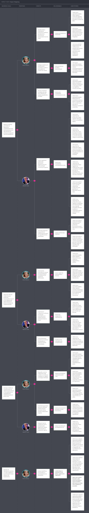

## 3.3. Product Backlog

El Product Backlog de DoofPlus consolida las 59 User Stories y las 11 Technical Stories de la sección 3.1, con su estimación en Story Points, y las ordena según el valor que aportan al negocio con los siguientes criterios:

1. **Landing Page primero:** sus historias se ubican al inicio porque el sitio estático es el primer punto de contacto con los laboratorios y, según el statement, se considera desde el primer sprint.
2. **Valor de las historias de la Web Application:** se mide con el User Task Matrix de la sección 2.3.2. Cada tarea recibe un puntaje igual a la suma, para ambos User Personas, de su frecuencia (Often = 3, Occasionally = 2, Rarely = 1) multiplicada por su importancia (High = 3, Medium = 2, Low = 1), y las historias que apoyan cada tarea se ordenan de mayor a menor puntaje. Cada grupo termina con la Technical Story del API que lo soporta.
3. **Dependencias:** cuando una historia exige otra en sus criterios de aceptación, la requerida se ubica antes. Por ejemplo, US14 requiere un producto con fórmula maestra aprobada, por lo que US35, US36 y la orden de producción (US57) la preceden.
4. **Identidad y suscripciones al final:** las historias de autenticación y roles no se colocan al inicio, como indica el statement. Las de suscripción y pago cierran el backlog porque la estrategia comercial de la sección 2.1.2 ofrece una prueba piloto de 30 días, de modo que el cobro se activa cuando el laboratorio ya usa el flujo de calidad.

| Tarea del User Task Matrix | Especialista QA/QC | Jefe de Producción | Puntaje | Historias |
| --- | --- | --- | :---: | --- |
| Consultar el historial y trazabilidad de un lote | Often / High (9) | Often / High (9) | 18 | US35, US36, US57, US14, US15, US16, US58, US17, TS03 |
| Gestionar protocolos, registros y documentación de calidad | Often / High (9) | Occasionally / Medium (4) | 13 | US09, US10, US12, US13, TS10 |
| Registrar y dar seguimiento a desviaciones e incidencias | Occasionally / High (6) | Occasionally / High (6) | 12 | US56, US18, US19, US20, US21, US22, TS11 |
| Coordinar la aprobación de insumos y materiales con Calidad | Rarely / Medium (2) | Often / High (9) | 11 | US42, US41, US40, US43, TS08 |
| Revisar y validar cálculos analíticos e informes de calidad | Often / High (9) | Rarely / Low (1) | 10 | US11, US54 |
| Supervisar el estado de los lotes durante la fabricación | Rarely / Low (1) | Often / High (9) | 10 | US32, US31, TS06, US23, US24, US25, US26, TS04, US37, US38, US39, TS07 |
| Recopilar evidencias para auditorías e inspecciones | Occasionally / High (6) | Rarely / Medium (2) | 8 | US27, US28, US29, US30, US59, TS05, US33, US34 |

Entre las dos tareas con puntaje 10, la liberación del lote (US54) precede a la supervisión porque cierra el ciclo de vida del lote que mide el primer business goal de la sección 3.2.

| **# Orden** | **User Story Id** | **Título** | **Descripción** | **Story Points (1 / 2 / 3 / 5 / 8)** |
| --- | --- | --- | --- | --- |
| 1 | US01 | Visualización de la propuesta de valor | Como visitante especialista QA/QC o jefe de producción, quiero conocer la propuesta de valor de DoofPlus para evaluar si responde a las necesidades de mi laboratorio. | 2 |
| 2 | US02 | Visualización de servicios y características | Como visitante, quiero conocer los servicios y características de DoofPlus para comprender cómo mejora la trazabilidad y la gestión de calidad. | 2 |
| 3 | US44 | Navegación por secciones | Como visitante, quiero acceder rápidamente a cada sección de la Landing Page para encontrar la información que necesito. | 3 |
| 4 | US03 | Visualización de planes y precios | Como visitante responsable de compras de un laboratorio, quiero consultar los planes y precios disponibles para identificar la alternativa más adecuada para mi organización. | 2 |
| 5 | US45 | Visualización del equipo y de la startup | Como visitante, quiero conocer a IngesCompany y a su equipo para generar confianza en la solución. | 1 |
| 6 | US04 | Formulario de contacto | Como visitante interesado, quiero dejar mi correo electrónico para recibir información y solicitar una demostración de DoofPlus. | 1 |
| 7 | US46 | Cambio de idioma | Como visitante, quiero cambiar el idioma de la Landing Page entre inglés y español para comprender el contenido en mi idioma de preferencia. | 5 |
| 8 | TS01 | Implementación de Landing Page responsive y accesible | Como Developer, quiero implementar la Landing Page con HTML5, CSS3 y JavaScript aplicando responsive web design y a11y para garantizar una experiencia adecuada en distintos dispositivos. | 3 |
| 9 | US48 | Acceso por segmento a la Web Application | Como visitante especialista QA/QC o jefe de producción, quiero acceder desde la Landing Page a la vista de la Web Application de mi segmento para comenzar a usar la plataforma. | 2 |
| 10 | US47 | Consulta de términos y política de privacidad | Como visitante, quiero consultar los términos y condiciones y la política de privacidad para conocer las condiciones del servicio y el tratamiento de mis datos. | 1 |
| 11 | US49 | Visualización del video promocional | Como visitante, quiero ver un video sobre DoofPlus para entender rápidamente su funcionamiento. | 2 |
| 12 | US05 | Preguntas frecuentes | Como visitante, quiero consultar preguntas frecuentes para resolver dudas comunes sobre la plataforma. | 1 |
| 13 | US35 | Catálogo de productos | Como jefe de producción, quiero administrar los productos farmacéuticos para fabricarlos en nuevos lotes. | 3 |
| 14 | US36 | Gestión de fórmulas maestras | Como jefe de producción, quiero registrar las fórmulas maestras aprobadas para que cada lote se fabrique según la especificación autorizada. | 5 |
| 15 | US57 | Gestión de órdenes de producción | Como jefe de producción, quiero crear y aprobar órdenes de producción para planificar la fabricación de los lotes. | 3 |
| 16 | US14 | Registro de lotes | Como supervisor de producción, quiero registrar lotes para iniciar su trazabilidad digital. | 3 |
| 17 | US15 | Consulta del historial de lotes | Como especialista QA/QC, quiero consultar el historial completo de un lote para revisar sus registros y eventos asociados. | 5 |
| 18 | US16 | Gestión de estados de lote | Como supervisor de producción, quiero actualizar el estado de los lotes durante su ciclo de vida para reflejar su avance real. | 2 |
| 19 | US58 | Recepción de materias primas | Como supervisor de producción, quiero registrar la recepción de materias primas con su lote de proveedor para que queden en cuarentena hasta su aprobación por Calidad. | 3 |
| 20 | US17 | Asociación de materias primas | Como supervisor de producción, quiero asociar las materias primas utilizadas a un lote para mantener su trazabilidad completa. | 3 |
| 21 | TS03 | API de trazabilidad de lotes | Como Developer, quiero exponer endpoints REST para registrar y consultar lotes y su línea de tiempo. | 5 |
| 22 | US09 | Gestión de protocolos de calidad | Como especialista QA/QC, quiero registrar protocolos digitales para estandarizar los procesos y cumplir las BPM. | 5 |
| 23 | US10 | Repositorio de SOP | Como especialista QA/QC, quiero consultar los procedimientos operativos estándar vigentes para aplicar siempre la versión aprobada. | 3 |
| 24 | US12 | Control de versiones documentales | Como especialista QA/QC, quiero mantener el historial de versiones de cada documento para garantizar su integridad. | 5 |
| 25 | US13 | Aprobación documental | Como jefe de aseguramiento de calidad, quiero aprobar documentos mediante firma electrónica para asegurar la trazabilidad regulatoria. | 3 |
| 26 | TS10 | API de documentación de calidad | Como Developer, quiero exponer endpoints REST para gestionar protocolos, SOP y sus versiones. | 5 |
| 27 | US56 | Registro y escalamiento de incidencias | Como supervisor de producción, quiero registrar las incidencias de un lote y escalarlas a Calidad para que se investiguen sin detener la producción más de lo necesario. | 3 |
| 28 | US18 | Registro de desviaciones | Como especialista QA/QC, quiero registrar desviaciones para realizar su seguimiento y análisis. | 3 |
| 29 | US19 | Análisis de causa raíz | Como especialista QA/QC, quiero documentar el análisis de causa raíz (RCA) para identificar el origen de las desviaciones. | 5 |
| 30 | US20 | Gestión CAPA | Como especialista QA/QC, quiero registrar acciones correctivas y preventivas derivadas de una desviación para evitar su recurrencia. | 5 |
| 31 | US21 | Seguimiento de acciones CAPA | Como especialista QA/QC, quiero monitorear el avance de las acciones CAPA abiertas para asegurar su cumplimiento. | 3 |
| 32 | US22 | Notificaciones de desviación crítica | Como especialista QA/QC, quiero recibir alertas cuando se registre una desviación crítica para actuar de inmediato. | 2 |
| 33 | TS11 | API de desviaciones y CAPA | Como Developer, quiero exponer endpoints REST para gestionar desviaciones, causas raíz y acciones CAPA. | 5 |
| 34 | US42 | Solicitudes de aprobación | Como supervisor de producción, quiero solicitar aprobaciones a Calidad (por ejemplo, liberación de insumos) para continuar la fabricación sin demoras. | 2 |
| 35 | US41 | Notificaciones entre áreas | Como especialista de calidad, quiero recibir las solicitudes de Producción para atenderlas a tiempo. | 3 |
| 36 | US40 | Bandeja de tareas | Como usuario, quiero visualizar mis tareas pendientes para atenderlas oportunamente. | 3 |
| 37 | US43 | Seguimiento de tareas | Como usuario, quiero monitorear el estado de las tareas que asigné para asegurar su cumplimiento. | 3 |
| 38 | TS08 | Servicio de notificaciones en tiempo real | Como Developer, quiero implementar notificaciones en tiempo real con WebSocket (STOMP sobre Spring WebSocket) para distribuir eventos sin recargar la Web Application. | 5 |
| 39 | US11 | Automatización de cálculos de calidad | Como especialista QA/QC, quiero que el sistema calcule automáticamente los resultados analíticos para reducir errores manuales. | 5 |
| 40 | US54 | Revisión y liberación de lotes | Como especialista QA/QC, quiero poner en cuarentena, evaluar y liberar o rechazar los lotes cerrados para que solo se distribuyan productos conformes. | 5 |
| 41 | US32 | Dashboard de producción | Como supervisor de producción, quiero visualizar el estado de los lotes en curso para tomar decisiones oportunas. | 3 |
| 42 | US31 | Dashboard de calidad | Como especialista QA/QC, quiero visualizar indicadores de calidad para priorizar mis actividades. | 3 |
| 43 | TS06 | API de KPIs | Como Developer, quiero exponer métricas consolidadas para los dashboards. | 5 |
| 44 | US23 | Registro de dispositivos IoT | Como administrador del laboratorio, quiero registrar los sensores IoT conectados para controlar su inventario. | 3 |
| 45 | US24 | Asociación de sensores a un lote | Como supervisor de producción, quiero asociar los sensores de un equipo a un lote en fabricación para vincular sus lecturas. | 3 |
| 46 | US25 | Captura automática de evidencias | Como supervisor de producción, quiero que las variables críticas se registren automáticamente para evitar la transcripción manual. | 5 |
| 47 | US26 | Consulta de registros IoT | Como especialista QA/QC, quiero consultar los datos IoT asociados a un lote para respaldar su liberación. | 3 |
| 48 | TS04 | API de ingesta IoT | Como Developer, quiero implementar un endpoint que reciba la telemetría enviada por ThingsBoard. | 5 |
| 49 | US37 | Gestión de equipos | Como supervisor de producción, quiero registrar los equipos utilizados en la fabricación para controlar su estado. | 3 |
| 50 | US38 | Gestión de calibraciones | Como supervisor de producción, quiero controlar la calibración de equipos y sensores para asegurar mediciones válidas. | 3 |
| 51 | US39 | Mantenimiento preventivo | Como supervisor de producción, quiero registrar los mantenimientos preventivos para evitar paradas no planificadas. | 3 |
| 52 | TS07 | API de operaciones de laboratorio | Como Developer, quiero implementar endpoints REST para productos, fórmulas y equipos. | 5 |
| 53 | US27 | Audit trail | Como especialista QA/QC, quiero consultar todas las modificaciones realizadas sobre los registros para demostrar la integridad de los datos. | 5 |
| 54 | US28 | Generación automática de reportes | Como especialista QA/QC, quiero generar reportes regulatorios automáticamente para reducir el tiempo de preparación. | 5 |
| 55 | US29 | Preparación de auditorías | Como especialista QA/QC, quiero consolidar la documentación requerida para una auditoría para responder a tiempo a los inspectores. | 5 |
| 56 | US30 | Acceso de auditor a evidencias | Como auditor interno, quiero acceder en modo lectura a las evidencias de los lotes para verificar el cumplimiento. | 3 |
| 57 | US59 | Registro de auditorías y hallazgos | Como especialista QA/QC, quiero programar auditorías y registrar sus hallazgos para dar seguimiento a su cierre. | 3 |
| 58 | TS05 | API de auditoría | Como Developer, quiero exponer endpoints para consultar los eventos del audit trail. | 3 |
| 59 | US33 | Indicadores de trazabilidad | Como jefe de calidad, quiero monitorear el porcentaje de lotes con trazabilidad completa para anticipar observaciones de auditoría. | 3 |
| 60 | US34 | Indicadores de desviaciones | Como jefe de calidad, quiero identificar tendencias de desviaciones para prevenir su recurrencia. | 3 |
| 61 | US06 | Inicio de sesión con segundo factor | Como usuario registrado, quiero iniciar sesión con mi contraseña y un código 2FA para acceder de forma segura a las funcionalidades de mi rol. | 2 |
| 62 | US07 | Gestión de roles | Como administrador del laboratorio, quiero asignar roles a los usuarios para controlar el acceso a funcionalidades específicas. | 3 |
| 63 | US08 | Firmas electrónicas | Como especialista de calidad, quiero firmar electrónicamente las acciones críticas para validarlas conforme a los requisitos regulatorios. | 5 |
| 64 | US50 | Registro de organización | Como administrador de un laboratorio, quiero registrar mi organización en DoofPlus para habilitar el acceso de mi equipo. | 3 |
| 65 | US55 | Alta de usuarios del equipo | Como administrador del laboratorio, quiero dar de alta a los usuarios de mi equipo para que cada uno acceda con su propia cuenta y rol. | 3 |
| 66 | TS02 | Autenticación JWT en el RESTful API | Como Developer, quiero implementar autenticación basada en JWT en el RESTful API para proteger los recursos del sistema. | 3 |
| 67 | US51 | Selección de plan | Como administrador del laboratorio, quiero elegir un plan de suscripción para habilitar las funcionalidades de mi organización. | 3 |
| 68 | US52 | Pago de suscripción | Como administrador del laboratorio, quiero pagar la suscripción con tarjeta para activar el servicio. | 5 |
| 69 | US53 | Renovación y cancelación | Como administrador del laboratorio, quiero renovar o cancelar la suscripción para controlar mis costos. | 3 |
| 70 | TS09 | API de suscripciones y pagos | Como Developer, quiero implementar endpoints de suscripciones integrados con la API de Niubiz. | 5 |

<br>

**Evidencia de Product Backlog en Jira:**

A continuación, se muestra la gestión del backlog en la herramienta Jira Software, evidenciando la priorización y estimación de las historias.

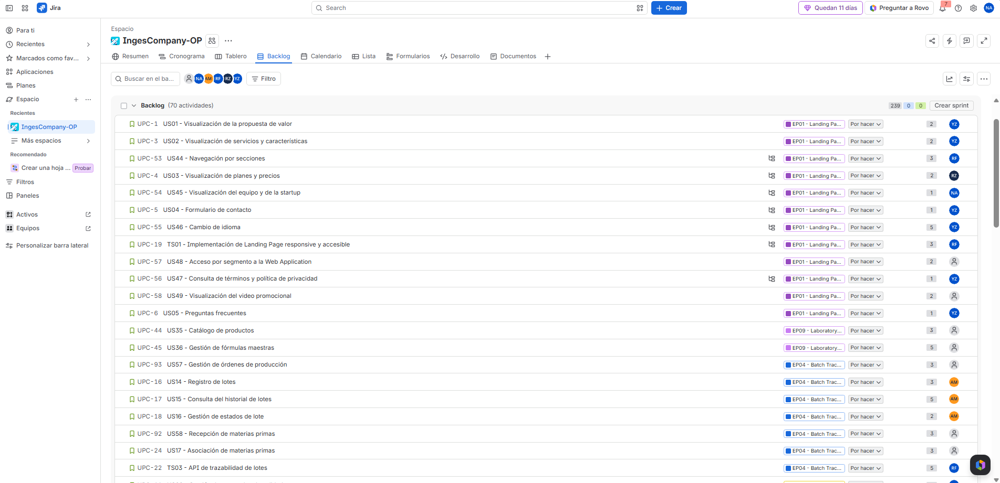
*Figura: Captura del Product Backlog en Jira Software.*

**Enlace al Product Backlog en Jira:** [click aquí](https://doofplus.atlassian.net/jira/software/projects/UPC/boards/3/backlog)


---

# Capítulo IV: Product Design

En este capítulo se detallan las decisiones de diseño del producto para su plataforma DoofPlus, junto con la Landing Page. Se establecen guías de estilo visuales, arquitectura de la información (AI) y criterios que aseguran que la experiencia de usuario (UX) sea intuitiva y profesional, donde alineamos a las exigencias en las máquinas de la industria farmacéutica y entidades regulatorias para la calidad de los fármacos como la DIGEMID.

## 4.1. Style Guidelines

En esta sección se establecen las bases visuales y de comunicación para DoofPlus, centralizando los recursos que serán de uso común para todo el equipo de desarrollo y diseño. El objetivo es garantizar una presentación consistente, inclusiva y enfocada a través de todos los puntos de contacto del producto, facilitando la mantenibilidad y escalabilidad del código y del diseño a lo largo del ciclo de vida del proyecto.

### 4.1.1. General Style Guidelines

Para asegurar una interfaz coherente y alineada con los estándares que exige la industria farmacéutica, el sistema de diseño de DoofPlus toma como base **Material Design**, el lenguaje de diseño indicado para el proyecto. En la Web Application se implementa con **Angular CLI** usando un tema basado en **Material Design**, y en la Landing Page con ***HTML5*** y ***CSS3*** respetando los mismos tokens de color, tipografía y espaciado.

#### Branding:
El logotico escogido para DoofPlus comunica de forma directa y sintética la propuesta de valor del sistema: la integración de la automatización industrial con la rigurosidad del control farmacéutico. Para la sección de Branding, el análisis de los componentes de dicho logotipo se desglosa de la siguiente manera:

<p align="center">
  
</p>

- **Maquinaria y cinta transportadora:** la silueta industrial con cápsulas en la cinta representa el núcleo operativo de la plataforma: la manufactura y la conexión IoT en la línea de producción.
- **Escudo de verificación:** representa el aseguramiento de la calidad y transmite protección de los datos y cumplimiento de las BPM exigidas por DIGEMID.
- **Construcción tipográfica y cromática:** el nombre DoofPlus usa una fuente sans-serif sólida; “Doof” en azul pizarra oscuro (#0F172A) evoca la base tecnológica y “Plus” en verde marino (#0D9488) conecta con la salud y la validación de procesos.

#### Typography
La tipografía de DoofPlus es Inter, una fuente sans-serif moderna y legible con pesos de Thin a Black y sus versiones itálicas. Su diseño garantiza una lectura clara de datos numéricos críticos, tablas de lotes y gráficos de telemetría tanto en monitores como en dispositivos móviles. La jerarquía tipográfica es la siguiente:

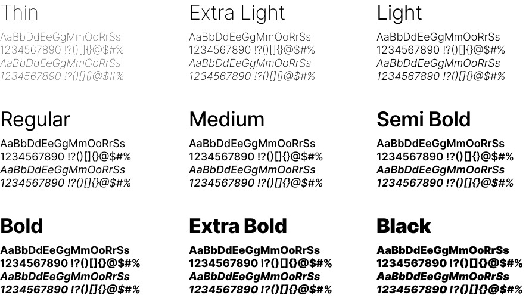

| **Elemento** | **Tamaño (desktop)** | **Peso** | **Uso** |
| --- | --- | --- | --- |
| H1 – Section heading | 3rem (48 px) | Extra Bold / Black | Títulos principales |
| H2 – Sub-heading | 2rem (32 px) | Bold / Semi Bold | Subtítulos de sección |
| H3 / H4 | 1.25–1.5rem (20–24 px) | Medium | Títulos de componentes y tarjetas |
| Body / td | 1rem (16 px), interlineado 1.5 | Regular | Texto y tablas de datos |
| Botones y etiquetas de estado | 0.875rem (14 px) | Medium / Semi Bold | Acciones y estados |

#### Colors
La paleta de colores de DoofPlus está diseñada para evocar pulcritud clínica, seguridad tecnológica y control absoluto sobre los procesos. Se distribuye en tres categorías:

| **Token** | **Valor** | **Categoría** | **Uso** |
| --- | --- | --- | --- |
| --primary-color | #0D9488 (verde marino) | Principal | Llamadas a la acción, enlaces y elementos activos |
| --accent-color | #0F766E (verde azulado oscuro) | Principal | Estados hover y énfasis |
| --secondary-color | #0F172A (azul pizarra oscuro) | Principal | Texto principal, header y footer |
| --tertiary-color | #64748B (gris pizarra) | Soporte | Texto secundario y bordes |
| --bg-light | #F8FAFC | Soporte | Fondos de secciones y dashboard |
| --bg-highlight | #F0FDFA | Soporte | Fondos destacados |
| --card-bg | #FFFFFF | Soporte | Tarjetas y tablas |
| --success-color | #4CAF50 | Funcional | Confirmaciones y lotes aprobados |
| --error-color | #F44336 | Funcional | Errores, rechazos y desviaciones críticas |
| --warning-color | #FFC107 | Funcional | Advertencias y alertas |


#### Spacing

El espaciado se rige por la cuadrícula de 8 puntos de Material Design, que asegura un ritmo vertical constante y facilita la lectura rápida de reportes técnicos:

- **Padding de secciones:** 40 a 48 px en áreas de trabajo y dashboards.
- **Espacio entre elementos:** 16 a 24 px entre tarjetas de métricas y controles de filtro.
- **Interlineado:** 1.5 en párrafos y 1.2 en celdas de tablas de datos.

#### Tono de Comunicación

La voz y el tono de DoofPlus están diseñados para reflejar la misma fiabilidad e inmutabilidad que su arquitectura de software, conectando directamente con Supervisores de Producción, Especialistas QA/QC y auditores externos.

- ***Tono:*** Formal, corporativo y analítico. Proyecta dominio absoluto sobre las normativas de calidad (BPM, Data Integrity), manteniendo el rigor que exige la industria farmacéutica.
- ***Actitud:*** Resolutiva y proactiva. La comunicación se enfoca en la eficiencia operativa (“Trazabilidad automatizada”, “Monitoreo en tiempo real”) y en la alerta temprana de desviaciones.
- ***Lenguaje:*** Técnico y preciso. Se utiliza terminología propia del dominio farmacéutico y tecnológico (telemetría, IoT, Cuarentena, Fórmulas Maestras, Audit Trail, DIGEMID) asumiendo que el usuario es un profesional capacitado en estas áreas.
- ***Voz:*** Experta e inquebrantable. Posiciona a DoofPlus como el puente definitivo entre la maquinaria industrial y el cumplimiento normativo, siendo una fuente de verdad única y segura para las auditorías.

### 4.1.2. Web Style Guidelines

Las directrices de estilo web de DoofPlus explican e ilustran las decisiones sobre los estándares visuales y de interacción para las interfaces web responsivas de la plataforma. Nuestro objetivo es crear una experiencia visual que refleje la misión del sistema: digitalizar el control de calidad farmacéutico y la telemetría industrial mediante un diseño limpio, riguroso y altamente funcional, minimizando la carga cognitiva en la planta de producción.

1. Layout
- Sistema de Grid: Utilizamos un diseño de cuadrícula fluida de 12 columnas para garantizar que el contenido de DoofPlus se adapte perfectamente a cualquier resolución de pantalla. Este enfoque permite que los dashboards de telemetría, las tablas de trazabilidad de lotes y los planes de suscripción se ajusten dinámicamente, manteniendo la jerarquía visual requerida en un entorno industrial.
- Headers y Footers (encabezados y pies de página): El encabezado es fijo en la parte superior, proporcionando acceso constante a la navegación principal, alertas de desviaciones críticas y a las acciones de sesión. El pie de página centraliza los enlaces normativos, políticas de privacidad, términos de servicio, copyright y contacto de soporte.
- Cards y Data Tables: Las tarjetas (Cards) estructuran la información de los módulos del sistema (IoT, Compliance, Auditorías) en la Landing Page. Para la aplicación web, el componente central son las Tablas de Datos (Data Tables), diseñadas con bordes sutiles y alternancia de color (Zebra striping) para facilitar la lectura de expedientes de lotes y registros inmutables (Audit Trail) sin fatiga visual.

2. Responsive Design
- Desktop: Orientado al Jefe de Producción y al Administrador. La navegación principal es visible en una barra lateral o superior. El contenido aprovecha múltiples columnas para desplegar gráficos unificados de rendimiento y tablas complejas de fórmulas maestras en monitores de estaciones de trabajo.
- Tablet: Orientado al Especialista QA/QC en la línea de producción. La cuadrícula se adapta a un diseño compacto. Los botones, selectores de estado y campos táctiles se ajustan a un área mínima de 48x48 píxeles para facilitar la interacción de operarios que utilicen guantes de nitrilo o equipos de protección.
- Mobile: Optimizado para la lectura rápida y atención de emergencias. El diseño colapsa a una sola columna y la navegación se agrupa en un menú hamburguesa. Los elementos interactivos priorizan la visualización de notificaciones de urgencia.

3. Interaction Design
- Botones: las llamadas a la acción (CTA) usan el color primario (#0D9488) con texto blanco; las acciones secundarias usan botones outlined. Los estados hover, focus (con contorno visible para teclado), active y disabled están definidos para asegurar la accesibilidad. Las acciones destructivas o de rechazo de lotes usan el color de error y piden confirmación.
- Formularios y Validaciones: Los formularios de captura de datos integran validación en tiempo real. Utilizan contornos verdes para datos correctos y mensajes de error descriptivos en rojo debajo de los campos obligatorios incompletos, lo que garantiza una integridad de los datos antes del envío a la base de datos.

4. Images and Icons
- Imágenes: En la Landing Page se utilizan fotografías de alta calidad, optimizadas en formato WebP, que evocan el entorno de manufactura: líneas de producción automatizadas, laboratorios esterilizados y operarios utilizando tablets. Refuerzan el mensaje de tecnología aplicada al cumplimiento BPM.
- Íconos: Se emplea la biblioteca Material Symbols para un estilo lineal y minimalista. Estos íconos ofrecen una guía visual rápida para representar servicios críticos: un microchip o antena para la telemetría, un escudo con un símbolo de check para el cumplimiento regulatorio y cápsulas o maquinaria para la gestión de producción.

5. Repositorio Central
- Organización: el proyecto de la Web Application (Vue 3 + Vite) se organiza por bounded context: src/iam, src/manufacturing, src/quality, src/iot, src/subscriptions y src/organizations, cada uno con sus carpetas model, services, components y pages. Los recursos estáticos se ubican en src/assets (images, icons), los estilos globales y design tokens en src/assets/styles, los componentes reutilizables en src/shared/components y las traducciones en src/locales (en.json y es.json).
- Versionado: Se utiliza Git gestionado desde GitHub como sistema de control de versiones central. El equipo aplica GitFlow y Conventional Commits para gestionar los cambios en el código, lo que ayuda a garantizar que el entorno de desarrollo mantenga una integración continua y una versión estable del producto en todo momento. Además, se aplica Semantic Versioning para darle un orden a las versiones.


## 4.2. Information Architecture

La arquitectura de la información de DoofPlus establece las decisiones que dirigen la organización del contenido en las experiencias web, lo que está orientado a que tanto los visitantes del sector comercial como los usuarios operativos, que forman parte de los segmentos objetivos, se adapten con facilidad a la funcionalidad del producto y puedan encontrar lo que necesitan sin esfuerzo.

### 4.2.1. Organization Systems

Para estructurar los grupos de información de la plataforma se aplican los siguientes sistemas de organización y esquemas de categorización:

- **Organización jerárquica (visual hierarchy):** en la Landing Page el contenido va de mayor a menor impacto: propuesta de valor (Home), servicios, características, beneficios, equipo, planes y contacto.
- **Organización secuencial (step-by-step):** en la Web Application para flujos regulados, como la liberación de un lote (cuarentena → evaluación de resultados → firma electrónica → certificado).
- **Organización matricial:** en los dashboards, que cruzan lotes, variables de equipos e indicadores de cumplimiento.
- **Categorización cronológica:** en el audit trail, la línea de tiempo del lote y la telemetría IoT, ordenados por fecha y hora.
- **Categorización por tópicos:** en el repositorio documental (protocolos, SOP, especificaciones) y en la navegación por módulos.
- **Categorización por audiencia:** en la Landing Page (llamadas a la acción para QA/QC y para Producción) y en la Web Application (entornos de calidad y de producción según el rol).

### 4.2.2. Labeling Systems

Para asegurar la simplicidad y evitar la confusión de los visitantes y usuarios, la representación de los datos se realiza mediante etiquetas que utilizan el mínimo número de palabras posibles, lo que representa la terminología técnica de la industria farmacéutica:

- Landing Page: Se emplean asociaciones de uso estándar como "Features" (para módulos técnicos), "Pricing" (para los planes) y "Request Demo" (para el contacto comercial).
- Web Application: Las etiquetas operativas evitan ambigüedades. Se utiliza "Lotes" (agrupando el historial de fabricación), "Cuarentena" (asociado a la evaluación de calidad), "Desviaciones" (asociado a alertas IoT y errores) y "Audit Trail" (asociado al registro inmutable de auditoría).

### 4.2.3. SEO Tags and Meta Tags

Para el posicionamiento y la indexación correcta de las principales páginas de la experiencia web, se asignan los siguientes valores mínimos exigidos:

Valores para la Landing Page (sitio estático indexable):

| **Página** | **Title** | **Meta description** | **Meta keywords** | **Author** |
| --- | --- | --- | --- | --- |
| Landing Page (index.html) | DoofPlus \| Pharmaceutical Quality & Batch Traceability Platform | SaaS platform that centralizes quality documentation, batch traceability, deviations and IoT data for pharmaceutical laboratories (GMP/DIGEMID). | pharmaceutical quality management, batch traceability, GMP, DIGEMID, CAPA, audit trail, IoT | IngesCompany |

Valores para las vistas principales de la Web Application. Al ser una SPA, el título y la descripción se actualizan en cada cambio de ruta (meta de Vue Router); keywords y author se definen una vez en index.html con los mismos valores de la Landing Page:

| **Vista de la Web Application** | **Title** | **Meta description** |
| --- | --- | --- |
| Sign in | Sign in \| DoofPlus | Secure access to DoofPlus with two-factor authentication. |
| Quality dashboard | Quality Dashboard \| DoofPlus | Pending batches, open deviations and quality indicators. |
| Production dashboard | Production Console \| DoofPlus | Active production orders, batch status and alerts. |
| Batch detail | Batch {batchNumber} \| DoofPlus | Complete traceability timeline of a pharmaceutical batch. |
| Deviations & CAPA | Deviations & CAPA \| DoofPlus | Register, investigate and close deviations with CAPA. |

### 4.2.4. Searching Systems

Para que los usuarios no se pierdan en el volumen de información generado por la producción y la telemetría, la Web Application ofrece:

- **Búsqueda global:** barra en el encabezado para consultar por identificador exacto (número de lote, código de documento o de sensor).
- **Filtros combinados:** por estado del lote (In Progress, Quarantine, Released, Rejected), rango de fechas de fabricación, severidad de la desviación (Minor, Major, Critical) y tipo de documento.
- **Presentación de resultados:** tabla de datos (PrimeVue DataTable) paginada y ordenable que resalta la coincidencia y muestra el estado actual de cada registro; si no hay resultados se muestra un mensaje con sugerencias.

### 4.2.5. Navigation Systems

Las acciones y técnicas que guían a los usuarios son:

1. ***Landing Page:***
- **Navegación por anclas:** barra superior fija con enlaces a cada sección y desplazamiento suave; en mobile, menú desplegable.
- **Llamadas a la acción por segmento:** cada segmento tiene una llamada a la acción que lo redirige a la vista de ingreso de su entorno en la Web Application.

2. ***Web Application:***
- **Navegación global:** barra lateral (sidebar) con los módulos del entorno (Dashboard, Batches, Documents, Deviations & CAPA, Monitoring, Reports).
- **avegación contextual:** breadcrumbs para ubicar al usuario dentro de un expediente y regresar a vistas generales.

3. **Navegación por teclado y accesibilidad:** orden de tabulación lógico, foco visible y atributos ARIA en menús y diálogos.

## 4.3. Landing Page UI Design

La propuesta de UI de la Landing Page traduce las decisiones anteriores: la jerarquía visual ordena el contenido desde la propuesta de valor hasta el contacto; las etiquetas (Features, Benefits, About Us, Plans) siguen el Labeling System; la barra fija con anclas implementa el Navigation System; y el Design System (Material Design, Inter, paleta verde marino y azul pizarra) se aplica de forma consistente con la Web Application.

### 4.3.1. Landing Page Wireframe

El wireframe de nuestra página de inicio sirve como un mapa visual que define la estructura y el flujo de la información, alineado con los principios de rigurosidad y claridad que exige el sector farmacéutico. Este esquema asegura una disposición lógica de los componentes, facilitando la navegación y destacando la propuesta de valor de **DoofPlus.** Las secciones del wireframe están diseñadas para contar una historia completa y persuasiva:

**Nav y Hero:**

Esta sección inicial incluye el logotipo de DoofPlus junto con una presentación breve que introduce al visitante en la propuesta de valor de la plataforma: 'The Future of Pharmaceutical Quality Management' (El futuro de la gestión de calidad farmacéutica). La barra de navegación permite un acceso rápido a secciones clave como Features, Benefits y About Us, mientras que el área principal ofrece una visión concisa del producto, acompañada de un claro llamado a la acción: 'Request a Demo' (Solicitar Demo). Un elemento visual atractivo refuerza el mensaje de innovación tecnológica, precisión y cumplimiento regulatorio que distingue a DoofPlus.


**Services (What We Offer):**

Aquí se detallan los servicios principales de DoofPlus: Real-Time IoT Monitoring, Automated BPM Compliance, Immutable Traceability y Digital Batch Management. Cada servicio se presenta con un icono representativo y una breve descripción, haciendo que nuestra oferta sea fácil de entender y visualmente accesible.


**Acerca de la aplicación (About the Platform):**

Esta sección presenta lo que hace única a DoofPlus: una plataforma para laboratorios farmacéuticos que automatiza el control de calidad mediante integración IoT, elimina errores manuales y garantiza la trazabilidad inmutable. Destacamos beneficios clave como captura automática de telemetría, alertas en tiempo real y cumplimiento nativo con normativas DIGEMID.

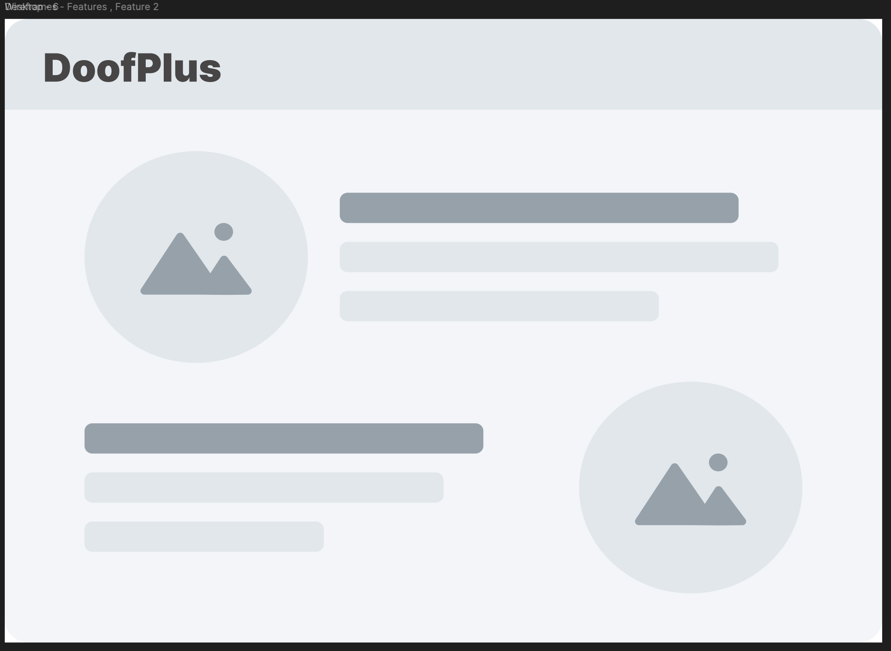

**Sobre el Equipo (Our Team):**

En esta sección, se humaniza la marca al presentar al equipo detrás de DoofPlus (Inges Company). Con fotos y descripciones de los miembros, mostramos a las personas dedicadas a este proyecto, construyendo confianza y una conexión personal con los visitantes.


**Precios (Plans):**

La sección de Precios ofrece una visión clara de los planes disponibles. Presentamos el Standard Lab Plan y el Enterprise Plan, con una comparativa de características para ayudar a los usuarios a elegir la opción que mejor se adapte a sus necesidades, ya sea para un laboratorio mediano o para una institución de salud pública. Un selector entre tarifas mensuales y anuales, junto con la indicación del ahorro asociado, facilita una elección más informada.


**Footer:**

El pie de página es un elemento crucial para la usabilidad. Contiene enlaces a información de contacto (correo electrónico, teléfono y ubicación). Esto proporciona un acceso rápido a la información sin saturar la interfaz, ofreciendo un cierre limpio y funcional a la página.


Este wireframe sienta las bases para un diseño visual que no solo se ve bien, sino que también guía al usuario de manera intuitiva a través de nuestra propuesta de valor, reforzando la confianza y la conexión que DoofPlus promete.

### 4.3.2. Landing Page Mock-up

Esta sección presenta y explica los Mock-ups del Landing Page, tanto en su versión para Desktop Web Browser como Mobile Web Browser. En la propuesta y la explicación se evidencia la aplicación de los principios, elementos de diseño, diseño inclusivo y arquitectura de información, así como el Design System establecido para los productos digitales.

**Hero de la aplicación**

El hero de nuestra plataforma **DoofPlus** presenta un fondo moderno e institucional que evoca precisión tecnológica y cumplimiento normativo, con un título claro: 'The Future of Pharmaceutical Quality Management'. Una breve descripción capta nuestra esencia para el control de calidad, y un botón de llamado a la acción sólido y centrado ('Request a Demo') invita a los usuarios a dar el primer paso hacia la digitalización de sus procesos. Una barra de navegación en la parte superior con el logotipo de DoofPlus permite acceder de forma fluida a todas las secciones de la página, proporcionando una experiencia de usuario intuitiva.


**What We Offer**

En la sección 'What we offer', presentamos nuestras principales áreas de servicio a través de tarjetas limpias. Cada tarjeta cuenta con un título y una descripción enfocada, como 'Real-Time IoT Monitoring', 'Automated BPM Compliance', 'Immutable Traceability' y 'Digital Batch Management'. Esto permite a los usuarios entender rápidamente el alcance de nuestra plataforma para resolver los problemas de documentación de calidad farmacéutica.

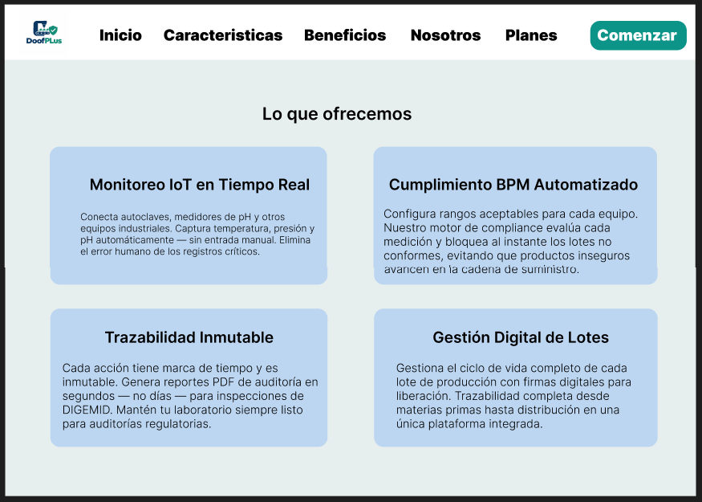

**Features**

La sección de "Features" muestra las funcionalidades clave de DoofPlus. El diseño tipo acordeón interactivo permite a los usuarios expandir cada característica (como la integración de sensores IoT o alertas instantáneas por desviación) para leer su descripción completa, mientras que el recuadro visual de la izquierda balancea el contenido. Este formato combina información técnica detallada con un diseño dinámico.


**Benefits**

En 'Benefits', destacamos las ventajas tangibles de utilizar DoofPlus. A través de un diseño de tarjetas (cards) sobre fondo claro con íconos representativos, comunicamos de manera directa cómo nuestra plataforma reduce el tiempo de preparación para auditorías en un 80%, elimina el error humano en los registros y proporciona una infraestructura SaaS escalable.

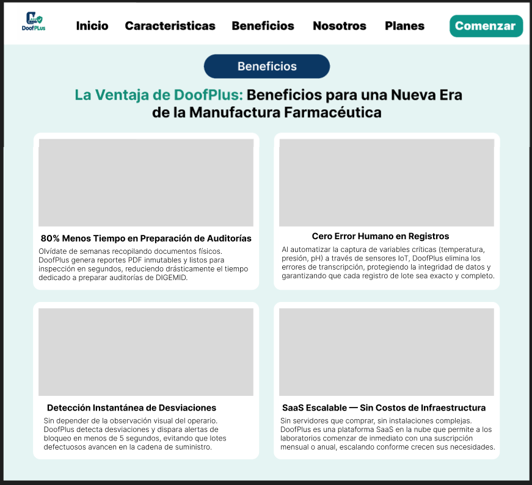

**About Us**

La sección 'About Us' presenta a **Inges Company**, la startup detrás de DoofPlus. Aquí compartimos nuestra visión de transformar digitalmente procesos especializados, detallando cómo nuestra solución permite centralizar información para el ciclo de vida farmacéutico y asegurar las BPM. El diseño separa claramente la misión de la empresa de una lista puntual con los pilares del servicio (IoT, Trazabilidad, Cumplimiento).

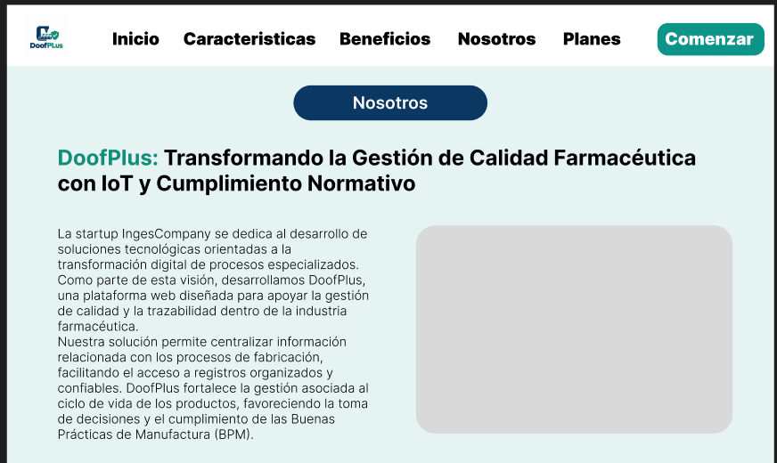

**Our Team**

La sección "Our Team" presenta a los ingenieros de software detrás de Inges Company: Marcelo Angulo, Yhoshua Cobades, Ricardo Flores, Nestor Rojas y Rodolfo Zavaleta. Las tarjetas de perfil muestran una foto, el nombre, el rol de Software Engineer y una biografía detallada para cada miembro. El diseño de tarjetas alineadas en cuadrícula brinda un aspecto organizado, humanizando el desarrollo del software.


**Plans**

En la sección de "Plans", ofrecemos los detalles de nuestros planes de suscripción. Las tarjetas de "Standard Lab" y "Enterprise" incluyen descripciones precisas para los segmentos objetivos, precios mensuales/anuales, y listas completas de características. El Plan Enterprise destaca visualmente con el color Verde Marino principal como fondo sólido para distinguirlo, y se incorpora un toggle para facilitar la vista de precios anuales.


**Footer**

El "Footer" de nuestra landing page actúa como cierre funcional de la navegación. Contiene el logotipo en su versión blanca y el nombre de DoofPlus, enlaces de contacto y acceso a recursos. Finalmente, se observa la declaración oficial "Copyright © 2026 Inges Company", asegurando la propiedad del producto en una interfaz ordenada con los colores oscuros corporativos.

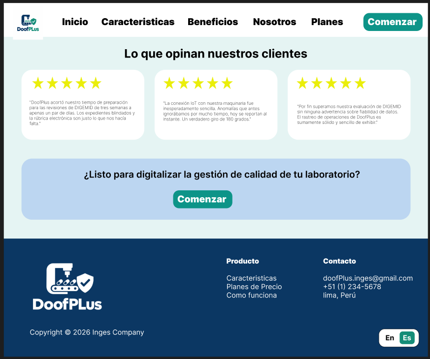

## 4.4. Web Applications UX/UI Design

La presente sección describe el diseño de experiencia de usuario (UX) e interfaz de usuario (UI) desarrollado para la plataforma web DoofPlus. La propuesta fue diseñada para apoyar la gestión integral de calidad farmacéutica bajo entornos regulados GxP, facilitando la administración documental, la trazabilidad de procesos productivos, la gestión de desviaciones y el monitoreo operativo de laboratorios y líneas de manufactura.

El diseño considera principios de usabilidad, accesibilidad, consistencia visual y eficiencia operativa, asegurando que los diferentes perfiles de usuario puedan ejecutar actividades críticas relacionadas con el cumplimiento normativo, la liberación de lotes y la auditoría regulatoria.

### 4.4.1. Web Applications Wireframes

En esta sección se presentan los wireframes diseñados para la aplicación web de DoofPlus. Cada pantalla fue desarrollada para gestionar procesos de calidad farmacéutica, producción regulada GxP, trazabilidad de lotes, control documental y cumplimiento normativo mediante firmas electrónicas y registros auditables.

A continuación, se muestran las representaciones esquemáticas de baja fidelidad que describen la estructura, distribución de componentes y funcionalidades principales de cada módulo de la plataforma.

- **Landing Page - DoofPlus**

Pantalla de presentación de la plataforma que comunica la propuesta de valor de DoofPlus y permite acceder al portal especializado para gestión de calidad y producción farmacéutica bajo normativas GxP.


- **Regulatory Identification - DoofPlus**

Pantalla de autenticación regulatoria que solicita las credenciales corporativas y la firma electrónica necesarias para acceder a funcionalidades sujetas a cumplimiento FDA 21 CFR Part 11 y normativas GxP.


- **Environment Selection Portal - DoofPlus**

Interfaz que permite seleccionar el entorno de trabajo autorizado, diferenciando entre el segmento de calidad (QA/QC) y el entorno de producción farmacéutica.


- **QA & Lab Console Dashboard - DoofPlus**

Panel principal para usuarios de calidad que centraliza la supervisión de lotes pendientes, ensayos analíticos, desviaciones abiertas y actividades del laboratorio.


- **Document Management & Master SOPs - DoofPlus**

Repositorio documental diseñado para gestionar procedimientos operativos estándar (SOPs), registros electrónicos, certificados de análisis y documentación regulatoria controlada.


- **Quality Protocols & Validation Management - DoofPlus**

Módulo destinado a la administración de protocolos de validación, cualificación de equipos y seguimiento de actividades relacionadas con IQ, OQ y PQ.


- **Critical Deviations & CAPA Actions Control - DoofPlus**

Pantalla de seguimiento de desviaciones críticas, análisis de impacto GMP y control de acciones correctivas y preventivas (CAPA).


- **Process Audit Master Plan - DoofPlus**

Módulo para planificar, ejecutar y monitorear auditorías internas, inspecciones regulatorias y hallazgos asociados al cumplimiento GMP.

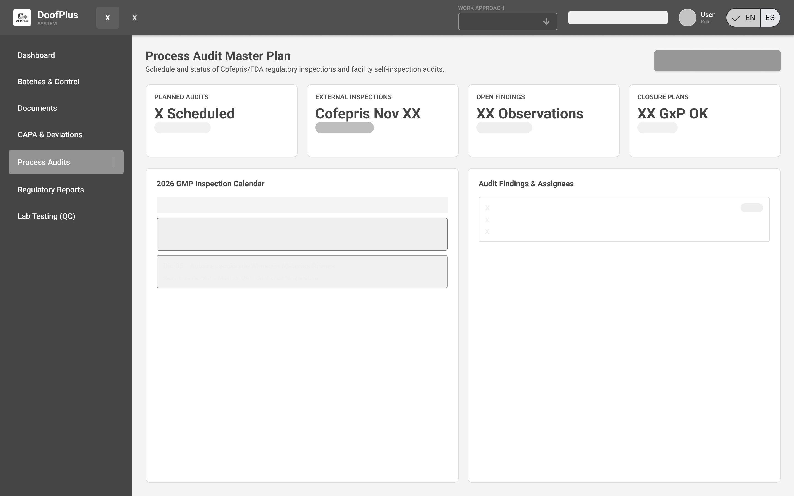

- **GxP Regulatory Reports & Metrics - DoofPlus**

Panel de análisis que permite generar reportes regulatorios, revisar métricas de desempeño y exportar información validada para auditorías e inspecciones.


- **Analytical Testing & Microbiology Control (QC) - DoofPlus**

Pantalla de control de ensayos analíticos y microbiológicos que permite gestionar muestras, equipos de laboratorio y resultados fuera de especificación (OOS).

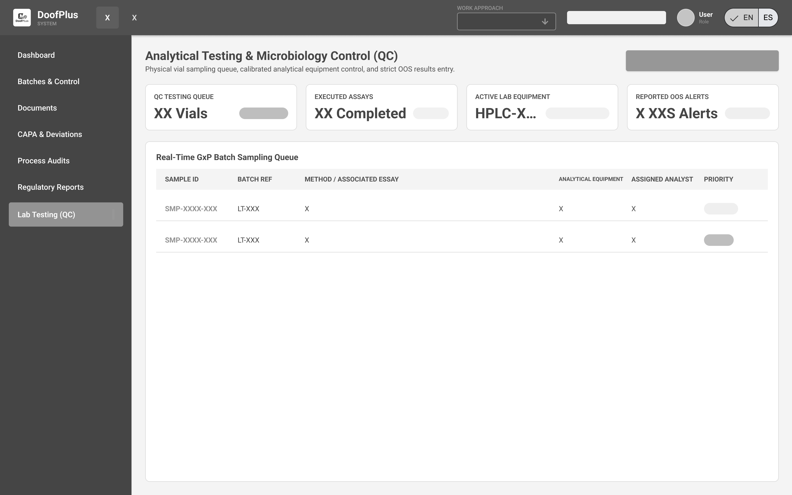

- **Analytical Results Entry & Validation - DoofPlus**

Interfaz destinada al registro y validación de resultados analíticos, integrando verificación de especificaciones y aprobación mediante firma electrónica.


- **Pharmaceutical Batch History & Traceability - DoofPlus**

Módulo de consulta histórica que permite rastrear lotes farmacéuticos, consultar estados regulatorios y acceder a certificados de análisis.


- **Cross-Traceability & Audit Center - DoofPlus**

Centro de trazabilidad que integra genealogía de lotes, registros de laboratorio, documentación asociada y auditoría completa de eventos regulatorios.


- **GxP Production Control Console - DoofPlus**

Panel principal del entorno de producción que permite supervisar órdenes activas, progreso de eBR y estado de los procesos de manufactura.


- **GxP Batch Execution & Management Console - DoofPlus**

Interfaz para la gestión operativa de lotes de fabricación, incluyendo seguimiento de etapas de producción, firmas electrónicas y responsables asignados.


- **GxP Incident Registration & Deviation Management - DoofPlus**

Módulo de registro de incidencias que permite documentar eventos de desviación, adjuntar evidencias y gestionar acciones de contención.


- **GxP Profile & Regulatory Credentials - DoofPlus**

Pantalla de perfil regulatorio donde los usuarios administran credenciales, firmas electrónicas y permisos asociados a los distintos contextos del sistema.

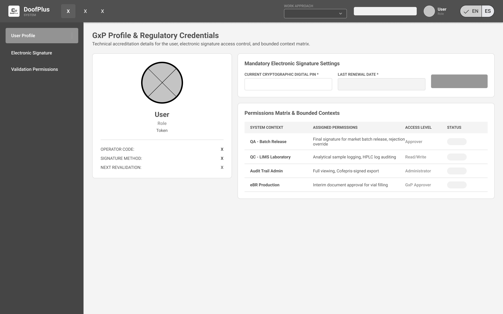

- **General Settings & GxP Policies - DoofPlus**

Módulo de configuración orientado a la administración de políticas GxP, parámetros de seguridad, auditorías internas y canales de notificación regulatoria.


### 4.4.2. Web Applications Wireflow Diagrams

Los Wireflow Diagrams se utilizan para representar visualmente la navegación y las interacciones que realizan los usuarios dentro de una aplicación para alcanzar un objetivo determinado. Estos diagramas combinan wireframes y flujos de usuario, permitiendo visualizar las diferentes pantallas involucradas en cada proceso y la secuencia de acciones necesarias para completar una tarea.

Para DoofPlus se desarrollaron distintos Wireflow Diagrams basados en los principales objetivos de los usuarios dentro de un entorno farmacéutico regulado por normas GxP. Cada diagrama describe el flujo que siguen los usuarios para gestionar procesos de producción, control de calidad, documentación regulatoria, trazabilidad y cumplimiento normativo.

#### Segmento 1 – Especialista de Aseguramiento y Control de Calidad (QA/QC)

**User Goal QA-1:** Ingresar a DoofPlus y acceder al entorno de calidad.

Como especialista QA/QC, quiero ingresar con mis credenciales y seleccionar el entorno de calidad para revisar mis pendientes.

Flujo: Landing Page → Regulatory Identification → Environment Selection Portal → QA & Lab Console.


**User Goal QA-2:** Gestionar documentación y protocolos de validación.

Como especialista QA/QC, quiero gestionar SOP y protocolos de validación para mantener documentos controlados y vigentes.

Flujo: QA & Lab Console → Document Management & Master SOPs → Quality Protocols & Validation → GxP Regulatory Reports & Metrics.


**User Goal QA-3:** Registrar una desviación y gestionar su CAPA.

Como especialista QA/QC, quiero registrar desviaciones y sus acciones CAPA para controlar los riesgos de calidad.

Flujo: QA & Lab Console → Critical Deviations & CAPA → Incident Registration & Deviation → GxP Regulatory Reports & Metrics.


**User Goal QA-4:** Planificar una auditoría y reunir sus evidencias.

Como especialista QA/QC, quiero programar auditorías y reunir la documentación de soporte para responder a los inspectores.

Flujo: QA & Lab Console → Process Audit Master Plan → Document Management & Master SOPs → GxP Regulatory Reports & Metrics.


**User Goal QA-5:** Registrar y validar resultados analíticos.

Como especialista QA/QC, quiero registrar y validar resultados de ensayos para respaldar la liberación de los lotes.

Flujo: QA & Lab Console → Analytical & Microbiology Testing → Analytical Results Entry & Validation → Batch History & Traceability.


**User Goal QA-6:** Consultar la trazabilidad completa de un lote.

Como especialista QA/QC, quiero consultar la genealogía y el audit trail de un lote para verificar la integridad de sus registros.

Flujo: QA & Lab Console → Batch History & Traceability → Cross-Traceability & Audit Center.


#### Segmento 2 – Jefe o Supervisor de Producción Farmacéutica

**User Goal PR-1:** Ingresar a DoofPlus y acceder al entorno de producción.

Como jefe de producción, quiero ingresar con mis credenciales y seleccionar el entorno de producción para supervisar las órdenes activas.

Flujo: Landing Page → Regulatory Identification → Environment Selection Portal → GxP Production Control Console.


**User Goal PR-2:** Gestionar la ejecución de un lote y consultar su historial.

Como jefe de producción, quiero actualizar las etapas de un lote y revisar su historial para mantener su trazabilidad.

Flujo: GxP Production Control Console → Batch Execution & Management → Batch History & Traceability.


**User Goal PR-3:** Monitorear equipos y condiciones ambientales.

Como jefe de producción, quiero supervisar las variables de los equipos y del ambiente para asegurar que la fabricación cumpla las BPM.

Flujo: GxP Production Control Console → Environmental & Equipment Monitoring → Batch Execution & Management.


**User Goal PR-4:** Registrar una incidencia de producción.

Como jefe de producción, quiero registrar incidencias y escalarlas a Calidad para que se gestionen como desviaciones.

Flujo: GxP Production Control Console → Incident Registration & Deviation → Critical Deviations & CAPA.


**User Goal PR-5:** Consultar la trazabilidad de un lote para investigar un evento.

Como jefe de producción, quiero revisar los materiales y eventos de un lote para investigar una situación excepcional.

Flujo: GxP Production Control Console → Batch History & Traceability → Cross-Traceability & Audit Center.


**User Goal PR-6:** Consultar reportes y métricas de producción.

Como jefe de producción, quiero consultar reportes y métricas para evaluar el desempeño de las líneas.

Flujo: GxP Production Control Console → GxP Regulatory Reports & Metrics.

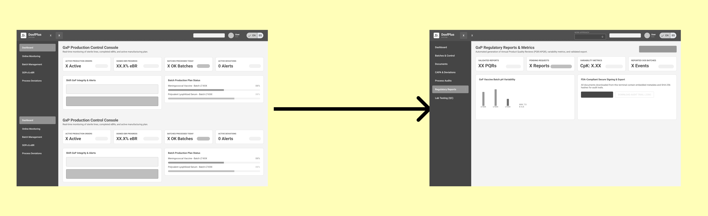

### 4.4.3. Web Applications Mock-ups

En esta sección se presentan los mock-ups desarrollados para la aplicación web de DoofPlus. Estas representaciones de alta fidelidad muestran la apariencia final de la plataforma, incorporando la identidad visual del producto, componentes interactivos y elementos orientados al cumplimiento regulatorio farmacéutico bajo estándares GMP y FDA 21 CFR Part 11.

Los mock-ups fueron diseñados considerando los procesos críticos de aseguramiento y control de calidad, manufactura farmacéutica, trazabilidad de lotes y gestión documental, garantizando una experiencia de usuario intuitiva y alineada con los requisitos de integridad de datos, auditoría y firmas electrónicas.

- **Landing Page - DoofPlus**

Pantalla de presentación de la plataforma que comunica la propuesta de valor de DoofPlus y permite acceder al portal especializado para gestión de calidad y producción farmacéutica bajo normativas GxP.


- **Regulatory Identification - DoofPlus**

Pantalla de autenticación regulatoria que solicita las credenciales corporativas y la firma electrónica necesarias para acceder a funcionalidades sujetas a cumplimiento FDA 21 CFR Part 11 y normativas GxP.

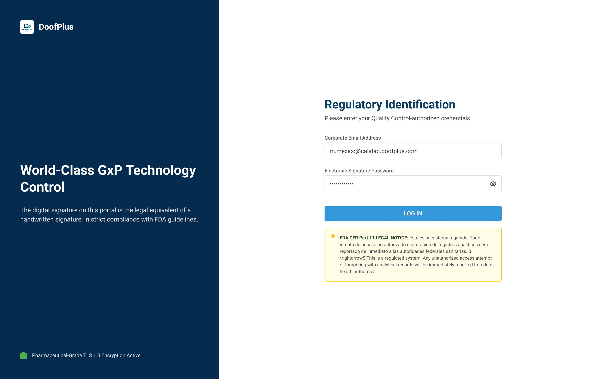

- **Environment Selection Portal - DoofPlus**

Interfaz que permite seleccionar el entorno de trabajo autorizado, diferenciando entre el segmento de calidad (QA/QC) y el entorno de producción farmacéutica.


- **QA & Lab Console Dashboard - DoofPlus**

Panel principal para usuarios de calidad que centraliza la supervisión de lotes pendientes, ensayos analíticos, desviaciones abiertas y actividades del laboratorio.


- **Document Management & Master SOPs - DoofPlus**

Repositorio documental diseñado para gestionar procedimientos operativos estándar (SOPs), registros electrónicos, certificados de análisis y documentación regulatoria controlada.


- **Quality Protocols & Validation Management - DoofPlus**

Módulo destinado a la administración de protocolos de validación, cualificación de equipos y seguimiento de actividades relacionadas con IQ, OQ y PQ.


- **Critical Deviations & CAPA Actions Control - DoofPlus**

Pantalla de seguimiento de desviaciones críticas, análisis de impacto GMP y control de acciones correctivas y preventivas (CAPA).

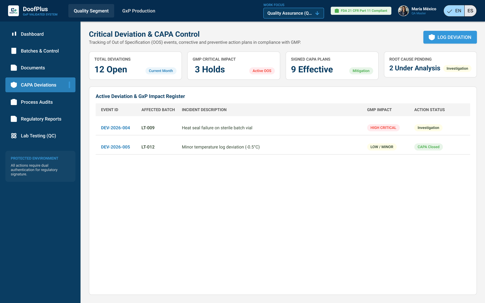

- **Process Audit Master Plan - DoofPlus**

Módulo para planificar, ejecutar y monitorear auditorías internas, inspecciones regulatorias y hallazgos asociados al cumplimiento GMP.


- **GxP Regulatory Reports & Metrics - DoofPlus**

Panel de análisis que permite generar reportes regulatorios, revisar métricas de desempeño y exportar información validada para auditorías e inspecciones.


- **Analytical Testing & Microbiology Control (QC) - DoofPlus**

Pantalla de control de ensayos analíticos y microbiológicos que permite gestionar muestras, equipos de laboratorio y resultados fuera de especificación (OOS).


- **Analytical Results Entry & Validation - DoofPlus**

Interfaz destinada al registro y validación de resultados analíticos, integrando verificación de especificaciones y aprobación mediante firma electrónica.

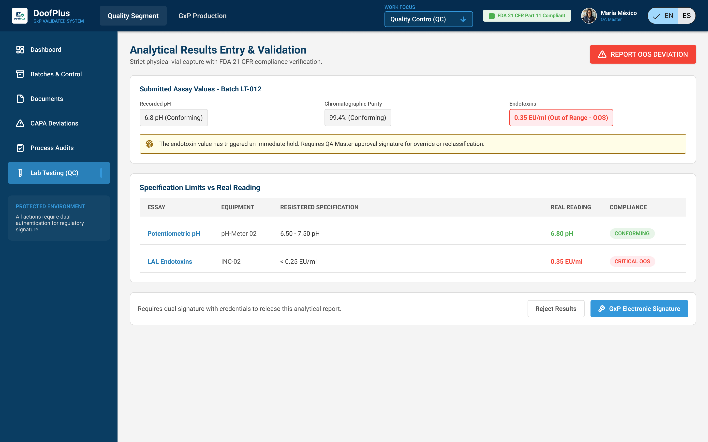

- **Pharmaceutical Batch History & Traceability - DoofPlus**

Módulo de consulta histórica que permite rastrear lotes farmacéuticos, consultar estados regulatorios y acceder a certificados de análisis.


- **Cross-Traceability & Audit Center - DoofPlus**

Centro de trazabilidad que integra genealogía de lotes, registros de laboratorio, documentación asociada y auditoría completa de eventos regulatorios.


- **GxP Production Control Console - DoofPlus**

Panel principal del entorno de producción que permite supervisar órdenes activas, progreso de eBR y estado de los procesos de manufactura.


- **GxP Batch Execution & Management Console - DoofPlus**

Interfaz para la gestión operativa de lotes de fabricación, incluyendo seguimiento de etapas de producción, firmas electrónicas y responsables asignados.


- **GxP Incident Registration & Deviation Management - DoofPlus**

Módulo de registro de incidencias que permite documentar eventos de desviación, adjuntar evidencias y gestionar acciones de contención.

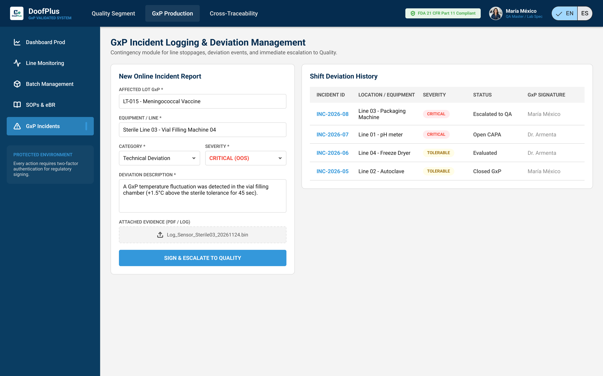

- **GxP Profile & Regulatory Credentials - DoofPlus**

Pantalla de perfil regulatorio donde los usuarios administran credenciales, firmas electrónicas y permisos asociados a los distintos contextos del sistema.

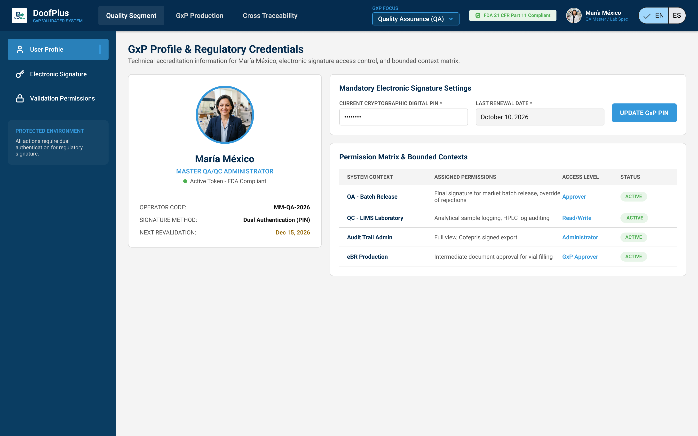

- **General Settings & GxP Policies - DoofPlus**

Módulo de configuración orientado a la administración de políticas GxP, parámetros de seguridad, auditorías internas y canales de notificación regulatoria.


### 4.4.4. Web Applications User Flow Diagrams

Los User Flow Diagrams representan la secuencia de acciones que realizan los usuarios dentro de la plataforma para alcanzar un objetivo específico. Estos diagramas permiten visualizar la navegación entre módulos, las decisiones tomadas durante el proceso y los diferentes escenarios que pueden ocurrir durante la interacción con el sistema.

#### Segmento 1 – Especialista QA/QC

**User Goal QA-1:** Ingresar a DoofPlus y acceder al entorno de calidad.

Happy path: Landing Page (portal) → Regulatory Identification (2FA) → Environment Selection Portal → QA & Lab Console (Dashboard).

Unhappy paths: ¿Credenciales y código 2FA válidos? No → Mensaje "Credenciales inválidas"; tras 5 intentos la cuenta se bloquea 15 min | ¿El rol del usuario autoriza el entorno elegido? No → Mensaje "Acceso no autorizado para este entorno"; permanece en la selección.


**User Goal QA-2:** Gestionar documentación y protocolos de validación.

Happy path: Document Management & Master SOPs → Quality Protocols & Validation → GxP Regulatory Reports & Metrics.

Unhappy paths: ¿Datos obligatorios completos? No → Se resaltan los campos faltantes; el documento no se guarda | ¿Firma electrónica válida? No → Firma rechazada; el documento permanece "In Review".


**User Goal QA-3:** Registrar una desviación y gestionar su CAPA.

Happy path: Critical Deviations & CAPA Control → Incident Registration & Deviation → Critical Deviations & CAPA Control.

Unhappy paths: ¿Se indicó el lote afectado y la severidad? No → Mensaje de validación; no se genera el código de desviación | ¿Tiene causa raíz registrada para cerrar? No → Cierre bloqueado: "Registre la causa raíz antes de cerrar".


**User Goal QA-4:** Planificar una auditoría y reunir sus evidencias.

Happy path: Process Audit Master Plan → Document Management & Master SOPs → GxP Regulatory Reports & Metrics.

Unhappy paths: ¿Todos los lotes tienen evidencia completa? No → Se listan las evidencias faltantes (p. ej., certificado de liberación).


**User Goal QA-5:** Registrar y validar resultados analíticos.

Happy path: Analytical & Microbiology Testing → Analytical Results Entry & Validation → Batch History & Traceability.

Unhappy paths: ¿El resultado está dentro de la especificación? No → Resultado marcado OOS; se exige registrar una desviación | ¿Firma electrónica válida? No → Firma rechazada; el resultado queda pendiente.


**User Goal QA-6:** Consultar la trazabilidad completa de un lote.

Happy path: Batch History & Traceability → Cross-Traceability & Audit Center.

Unhappy paths: ¿Existe el lote buscado? No → Mensaje "No se encontró el lote"; ajusta los filtros.


#### Segmento 2 – Jefe de Producción

**User Goal PR-1:** Ingresar a DoofPlus y acceder al entorno de producción.

Happy path: Landing Page (portal) → Regulatory Identification (2FA) → Environment Selection Portal → GxP Production Control Console.

Unhappy paths: ¿Credenciales y código 2FA válidos? No → Mensaje "Credenciales inválidas"; tras 5 intentos la cuenta se bloquea 15 min | ¿El rol del usuario autoriza el entorno elegido? No → Mensaje "Acceso no autorizado para este entorno"; permanece en la selección.


**User Goal PR-2:** Gestionar la ejecución de un lote y consultar su historial.

Happy path: Batch Execution & Management → Batch History & Traceability.

Unhappy paths: ¿La transición requiere aprobación de Calidad? No → Se envía una solicitud de aprobación; el paso queda bloqueado hasta la respuesta.

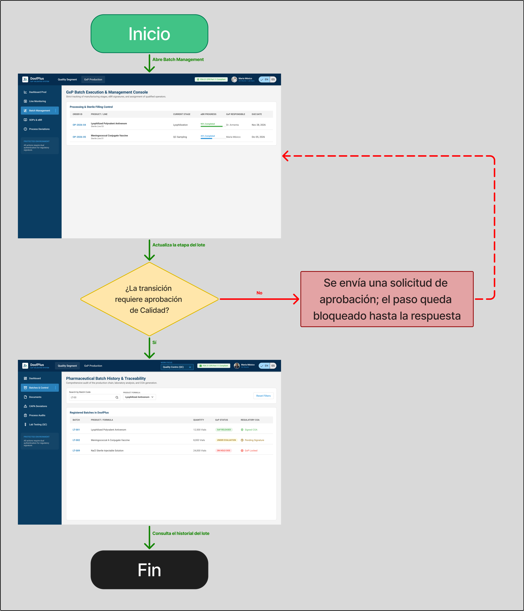

**User Goal PR-3:** Monitorear equipos y condiciones ambientales.

Happy path: Environmental & Equipment Monitoring → Batch Execution & Management.

Unhappy paths: ¿Las lecturas están dentro del rango? No → Alerta crítica; registra una incidencia y la escala a Calidad.

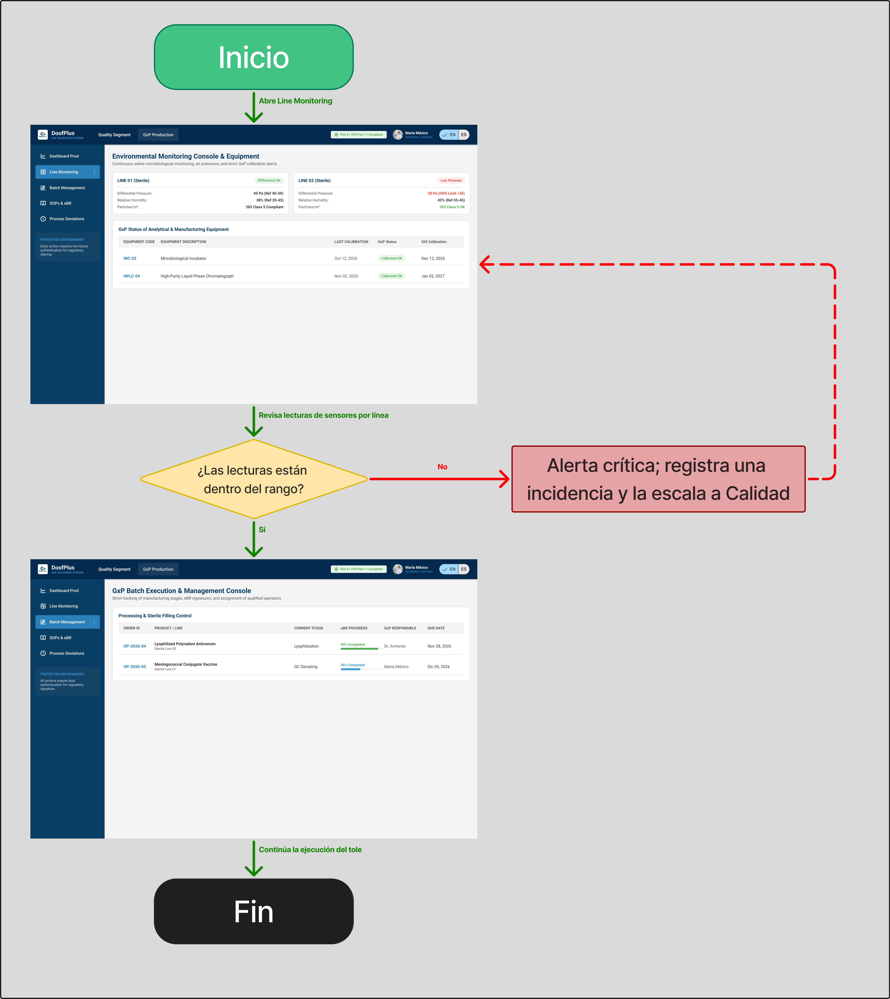

**User Goal PR-4:** Registrar una incidencia de producción.

Happy path: Incident Registration & Deviation → Critical Deviations & CAPA Control.

Unhappy paths: ¿Formulario completo y evidencia adjunta? No → Se resaltan los campos obligatorios.

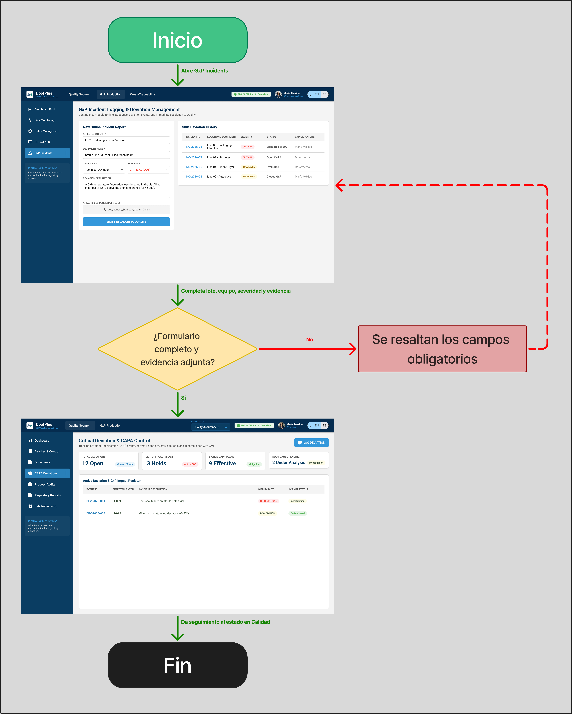

**User Goal PR-5:** Consultar la trazabilidad de un lote para investigar un evento.

Happy path: Batch History & Traceability → Cross-Traceability & Audit Center.

Unhappy paths: ¿Existe el lote buscado? No → Mensaje "No se encontró el lote"; ajusta los filtros.

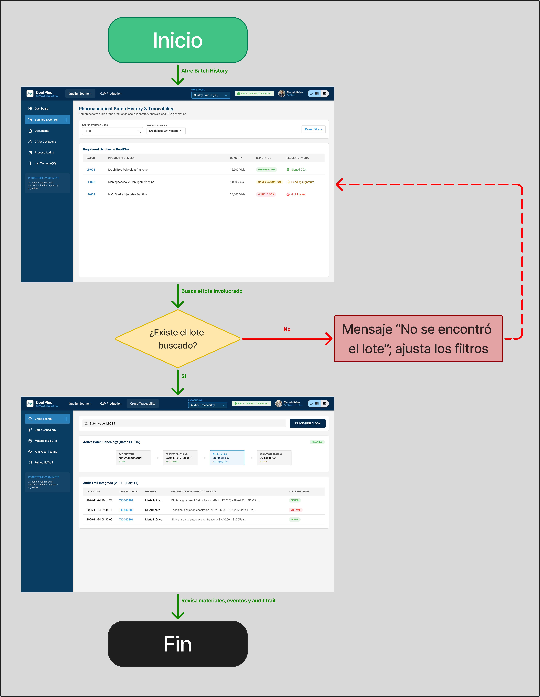

**User Goal PR-6:** Consultar reportes y métricas de producción.

Happy path: GxP Regulatory Reports & Metrics.

Unhappy paths: ¿Existen registros en el periodo? No → Mensaje "Sin datos para el periodo"; cambia el rango.

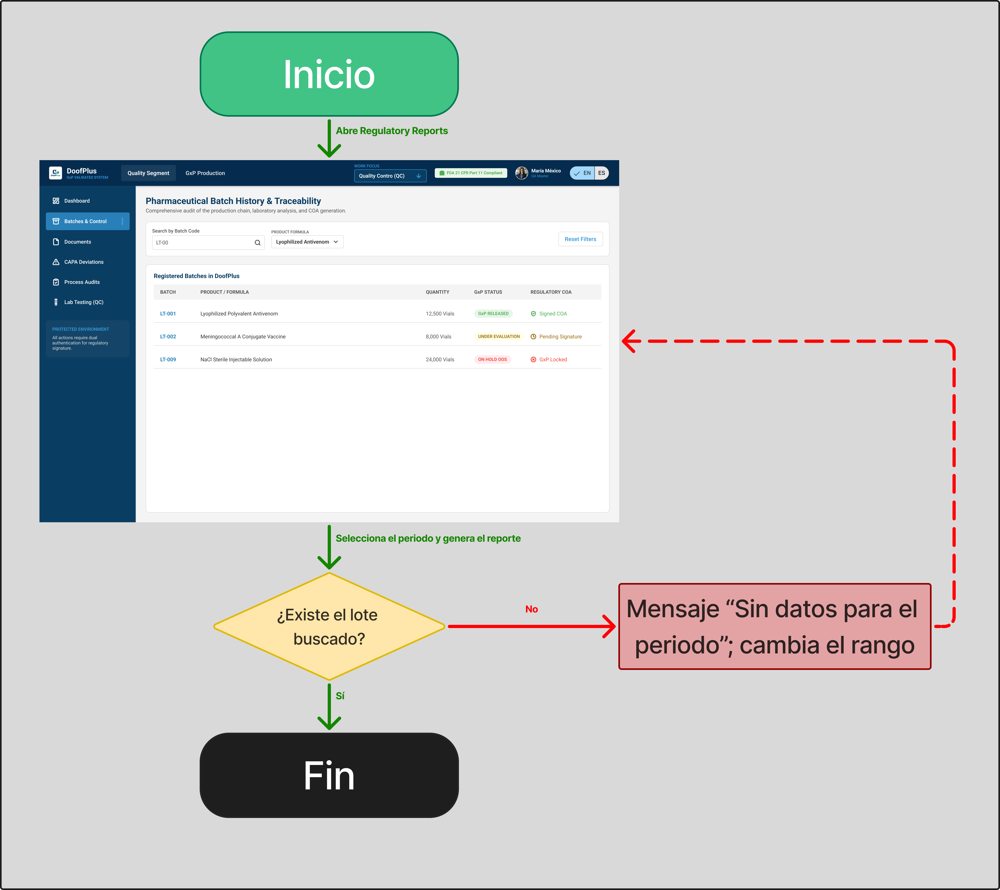

## 4.5. Web Applications Prototyping
La sección de Web Applications Prototyping presenta los prototipos interactivos desarrollados para validar los flujos operativos y regulatorios de DoofPlus antes de su implementación. Estos prototipos permiten simular la experiencia real de navegación dentro de la plataforma, evaluando la accesibilidad, usabilidad y eficiencia de las interacciones propuestas.

El diseño de los prototipos fue guiado por cuatro principios fundamentales:

- Cumplimiento regulatorio por diseño

Todas las interacciones fueron concebidas considerando requisitos de FDA 21 CFR Part 11, GMP y buenas prácticas de documentación, incorporando controles asociados a firmas electrónicas, auditoría de registros y segregación de funciones.

- Arquitectura basada en procesos farmacéuticos

La navegación se organiza alrededor de los procesos más frecuentes dentro de la industria farmacéutica:

- Gestión documental regulatoria.
- Control y liberación de lotes.
- Investigación de desviaciones.
- Gestión CAPA.
- Auditorías regulatorias.
- Validación y control analítico.
- Consistencia visual y operativa

Los prototipos mantienen una identidad visual uniforme mediante el uso consistente de colores institucionales, componentes reutilizables, tablas regulatorias y paneles de control orientados a la supervisión operativa.

- Optimización para entornos de trabajo regulados

La interfaz prioriza:

- Acceso rápido a información crítica.
- Visualización inmediata del estado de cumplimiento.
- Reducción de errores durante el ingreso de datos.
- Navegación simplificada para procesos frecuentes.
- Facilidad de auditoría e inspección regulatoria.

Los prototipos permiten validar que las tareas principales del sistema, tales como consultar documentación aprobada, investigar desviaciones, ejecutar acciones CAPA y realizar auditorías internas, puedan completarse de forma eficiente y manteniendo la trazabilidad requerida por los estándares regulatorios del sector farmacéutico.

Los prototipos de Desktop y Mobile Web Browser siguen los paths de los User Flow Diagrams de la sección 4.4.4: el sidebar implementa la navegación global, los breadcrumbs la navegación contextual y los diálogos de firma electrónica las confirmaciones críticas.

Prototipo navegable en Figma: <mark>pegar URL pública del prototipo</mark>

Video de navegación del prototipo (Microsoft Stream), upc-pre-202620-1asi0730-7742-IngesCompany-prototype-navigation-sprint-1: <mark>pegar URL, timing de inicio y duración</mark>

## 4.6. Domain-Driven Software Architecture
La arquitectura de DoofPlus se fundamenta en Domain-Driven Design (DDD). El punto de partida es el Big Picture EventStorming (sección 2.4), que dejó una línea de tiempo de eventos organizada en siete swimlanes, con sus actores, sistemas externos y problemas. En esta sección ese conocimiento se profundiza con un Design-Level EventStorming hasta identificar los bounded contexts y obtener aggregates, commands, policies, read models y sistemas externos por contexto; luego la solución se representa con el modelo C4 (contexto, contenedores y componentes). Los mismos bounded contexts y aggregates se mantienen en los diagramas de clases (sección 4.7), en la base de datos (sección 4.8), en los módulos de la Web Application en Angular y en los paquetes del RESTful API en Spring Boot.

La siguiente tabla resume la trazabilidad entre artefactos:

| Bounded context | Tipo | Swimlanes del Big Picture | Épicas | Aggregates (DLES y clases) | Módulo Angular / paquete Spring |
| --- | --- | --- | --- | --- | --- |
| Manufacturing & Batch Management | Core | Producción y almacén | EP04, EP09 (productos y fórmulas) | Product, MasterFormula, RawMaterialLot, ProductionOrder, ProductionBatch | `manufacturing` |
| Quality & Compliance | Core | Gestión documental, Control de calidad y liberación, Desviaciones y CAPA, Auditoría y cumplimiento | EP03, EP05, EP07, EP08, EP10 | QualityDocument, MaterialApproval, BatchReview, AnalyticalResult, Deviation, Audit, AuditTrailEntry, RegulatoryReport | `quality` |
| IoT Monitoring | Supporting | Monitoreo de equipos (IoT) | EP06, EP09 (equipos, calibraciones y mantenimiento) | Equipment, IoTDevice, TelemetryReading, Alert | `iot-monitoring` / `iotmonitoring` |
| Identity & Access Management | Generic | Plataforma y administración, Gestión documental | EP02 | User, ElectronicSignature | `iam` |
| Organizations & Profiles | Supporting | Plataforma y administración | EP01 (solicitud de demo), EP02 (registro de la organización) | Organization, Profile, DemoRequest | `organizations` |
| Subscriptions & Payments | Generic | Plataforma y administración | EP11 | Plan, Subscription | `subscriptions` |

Los dashboards (EP08) y las notificaciones entre áreas (EP10) no forman un contexto propio: los dashboards son read models que cada contexto expone y las notificaciones son policies que reaccionan a domain events.

### 4.6.1. Design-Level Event Storming

El equipo realizó el Design-Level EventStorming en Miro siguiendo la agenda propuesta en "The best agenda for Design-Level Event Storming" (EventStorming Journal) y la guía del statement (https://bit.ly/dles-guide). Se trabajó un bounded context a la vez, tomando como punto de partida los eventos del Big Picture que pertenecen a ese contexto. Quality & Compliance, el contexto más grande, se modeló en un solo frame con dos swimlanes: liberación de lotes (documentos, insumos, resultados analíticos y liberación) y desviaciones y auditoría (desviaciones, CAPA, auditorías y reportes regulatorios).

Tablero de Miro: https://miro.com/app/board/uXjVHkhKOXE=/

La agenda de la guía tiene 11 fases. El equipo las aplicó agrupadas en los pasos que ya usaba, y decidió qué fases son opcionales para el proyecto:

| Fase de la guía | Paso en DoofPlus | Cómo se aplicó |
| --- | --- | --- |
| 1. The target design | Paso 0: Target design | Se presentó la gramática del Design-Level (actor, read model, command, business rule o external system, domain event y policy). |
| 2. Domain Events | Paso 1: Timelines | Se copiaron los eventos del Big Picture que pertenecen a cada contexto y se ordenaron en el tiempo. |
| 3. Commands | Paso 2: Commands | Se escribió, antes de cada evento, la intención que lo provoca. |
| 4. Actors or policies | Paso 3: Actors and policies | Cada command se antecedió por el actor que lo ejecuta o por la policy que lo dispara automáticamente. |
| 5 y 6. Blank stickies / Read models and UX mock-ups | Paso 4: Read models | Se registró la información que el actor necesita ver para decidir. Los mock-ups en post-its blancos se omitieron porque las pantallas ya se diseñaron en Figma (sección 4.4); cada read model corresponde a una vista de la Web Application. |
| 7. External systems | Paso 5: External systems | Se ubicaron los sistemas externos entre el command y el evento. |
| 8 a 11. Business rules, aggregates of business rules y aggregate names | Paso 6: Business rules y aggregates | Donde no interviene un sistema externo se escribió la regla de negocio que protege el command (tomada de los criterios de aceptación de la User Story correspondiente); las reglas relacionadas se apilaron y el grupo recibió el nombre del aggregate. |
| Opcional después del taller: Bounded Context Canvas y Example Mapping | Paso 7: Bounded contexts | Se agruparon los aggregates en bounded contexts y se trazó el context map. El Bounded Context Canvas no se elaboró (es opcional) y el Example Mapping se reemplazó por los escenarios Gherkin de la sección 3.1. |

Notación usada en el tablero: domain events en naranja, commands en azul, actores en amarillo pequeño, policies en lila, read models en verde, sistemas externos en rosado, business rules en amarillo y aggregates como bloques amarillos que agrupan sus reglas.

#### Paso 0: Target design

Antes de modelar, se acordó la "imagen que lo explica todo": un actor consulta un read model, decide y ejecuta un command; el command se valida con las business rules del aggregate o invoca a un sistema externo; el resultado es un domain event, que puede disparar una policy y con ella un nuevo command.

Frame en Miro: https://miro.com/app/board/uXjVHkhKOXE=/?moveToWidget=3458764685756367551


#### Paso 1: Timelines

Se organizaron en una línea de tiempo vertical los eventos de cada contexto, con los resultados alternativos en la columna "Alternativa" (por ejemplo, "Documento aprobado" o "Documento rechazado"). Al revisar qué dispara cada evento, en este nivel se agregaron eventos que faltaban en el Big Picture: "Demostración solicitada", "Plan de suscripción seleccionado", "Firma electrónica registrada", "Equipo registrado", "Sensor IoT registrado", "Aprobación de insumos solicitada a Calidad", "Mantenimiento preventivo realizado", "Lote puesto en espera" y "Acción CAPA vencida"; además, "Usuario registrado" se renombró como "Usuario dado de alta en la organización". También aparecen eventos de detalle que no eran relevantes en la vista general, como "Usuario autenticado", "Inicio de sesión fallido", "Cuenta bloqueada", "Planta agregada", "Perfil actualizado" y "Alerta reconocida".

**Identity & Access Management**


**Organizations & Profiles**


**Subscriptions & Payments**


**Manufacturing & Batch Management**


**IoT Monitoring**


**Quality & Compliance** (swimlane 1: liberación de lotes; swimlane 2: desviaciones y auditoría)


#### Paso 2: Commands

Cada evento se antecedió por el command que lo provoca, redactado en imperativo (por ejemplo, "Crear lote" produce "Lote creado"). Un mismo command puede terminar en dos eventos alternativos, como "Aprobar orden de producción", que produce "Orden de producción aprobada" u "Orden de producción rechazada".

**Identity & Access Management**


**Organizations & Profiles**


**Subscriptions & Payments**


**Manufacturing & Batch Management**


**IoT Monitoring**


**Quality & Compliance** (swimlane 1: liberación de lotes; swimlane 2: desviaciones y auditoría)


#### Paso 3: Actors and policies

Se identificó quién ejecuta cada command: Administrador del laboratorio, Especialista QA/QC, Jefe de Calidad, Jefe de Producción, Auditor interno, Responsable de la acción CAPA y, para las tareas programadas, el sistema. Cuando un command se ejecuta automáticamente, el actor se reemplazó por una policy. Las principales policies son:

| Bounded context | Policy (cuando ocurre…, entonces…) |
| --- | --- |
| IAM | Cuando ocurren 5 intentos fallidos de inicio de sesión, bloquear la cuenta 15 minutos. |
| Organizations | Cuando se registra la organización, crear la cuenta del administrador en IAM. |
| Subscriptions | Cuando se activa la suscripción, habilitar los límites del plan (usuarios y sensores). |
| Manufacturing | Cuando se recibe materia prima, solicitar su aprobación a Calidad. |
| Manufacturing | Cuando se aprueba la orden, planificar la producción. |
| Manufacturing | Cuando la incidencia es crítica, poner el lote en espera; cuando se escala, registrar una desviación en Quality. |
| Manufacturing | Cuando se solicita la liberación, poner el lote en cuarentena en Quality. |
| IoT Monitoring | Cuando llega una lectura, evaluar las reglas de alerta; cuando un parámetro sale de rango, generar una alerta. |
| IoT Monitoring | Cuando vence la calibración, marcar el equipo como no apto y notificar. |
| Quality | Cuando un resultado sale de especificación, marcarlo OOS y registrar una desviación. |
| Quality | Cuando se libera el lote, emitir el certificado y actualizar el lote en Manufacturing. |
| Quality | Cuando se cierra una desviación, reevaluar el lote afectado. |

**Identity & Access Management**


**Organizations & Profiles**


**Subscriptions & Payments**


**Manufacturing & Batch Management**


**IoT Monitoring**


**Quality & Compliance** (swimlane 1: liberación de lotes; swimlane 2: desviaciones y auditoría)


#### Paso 4: Read models

Se registró la información que cada actor consulta antes de decidir. Estos read models son la base de las vistas de la Web Application y de los dashboards: por ejemplo, "Panel de control del lote" (GxP Batch Execution & Management Console), "Tablero de desviaciones y CAPA" (Critical Deviations & CAPA Actions Control), "Panel de resultados de laboratorio" (Analytical Results Entry & Validation), "Panel de alertas" (Environmental & Equipment Monitoring) y "Audit trail" (Cross-Traceability & Audit Center).

**Identity & Access Management**


**Organizations & Profiles**


**Subscriptions & Payments**


**Manufacturing & Batch Management**


**IoT Monitoring**


**Quality & Compliance** (swimlane 1: liberación de lotes; swimlane 2: desviaciones y auditoría)


#### Paso 5: External systems

Se ubicaron los sistemas externos en el punto donde intervienen: Niubiz (pago y renovación de suscripciones), ThingsBoard (registro de sensores e ingesta de lecturas), SendGrid (invitaciones, alertas y notificaciones por correo), el Lector RFID (recepción de materias primas), la app autenticadora del usuario (códigos TOTP) y DIGEMID (inspección). Respecto del tablero original se corrigieron tres elementos: "Registro en la base de datos" no es un sistema externo (la base de datos es parte de la solución), el "Motor de alertas" es lógica propia del contexto IoT Monitoring y Google Authenticator no expone un API: solo genera el código que el usuario ingresa.

**Identity & Access Management**


**Organizations & Profiles**


**Subscriptions & Payments**


**Manufacturing & Batch Management**


**IoT Monitoring**


**Quality & Compliance** (swimlane 1: liberación de lotes; swimlane 2: desviaciones y auditoría)


#### Paso 6: Business rules y aggregates

Donde no interviene un sistema externo se escribió la business rule que el command debe cumplir. Las reglas se tomaron de los criterios de aceptación de las User Stories (el identificador aparece en el post-it), por ejemplo "Número de lote único (US14)", "Solo materia prima aprobada (US17)" o "Requiere causa raíz y CAPA verificadas (US19)". Las reglas que protegen los mismos datos se apilaron y cada grupo recibió el nombre de su aggregate:

| Bounded context | Aggregates | Ejemplo de invariante |
| --- | --- | --- |
| IAM | User, ElectronicSignature | Una cuenta se bloquea tras 5 intentos fallidos; firmar exige reingresar la contraseña. |
| Organizations & Profiles | DemoRequest, Organization, Profile | El RUC de la organización es válido y único. |
| Subscriptions & Payments | Subscription (con su Plan) | La suscripción se activa solo si Niubiz autoriza el cobro. |
| Manufacturing & Batch Management | Product, MasterFormula, RawMaterialLot, ProductionOrder, ProductionBatch | Un lote solo consume materia prima aprobada y solo Calidad puede liberarlo. |
| IoT Monitoring | Equipment, IoTDevice, TelemetryReading, Alert | Un equipo con calibración vencida no puede asignarse a un lote. |
| Quality & Compliance | QualityDocument, MaterialApproval, BatchReview, AnalyticalResult, Deviation, Audit, RegulatoryReport | Un lote con un resultado OOS sin desviación cerrada no puede liberarse. |

Frames en Miro por bounded context. Debajo de los frames finales, el tablero tiene la sección "DLES paso a paso por bounded context", con una fila por contexto y un frame por paso (Pasos 1 a 6); el enlace lleva al Paso 1 de cada fila:

| Bounded context | Frame final | Pasos 1 a 6 |
| --- | --- | --- |
| Identity & Access Management | https://miro.com/app/board/uXjVHkhKOXE=/?moveToWidget=3458764685754766070 | https://miro.com/app/board/uXjVHkhKOXE=/?moveToWidget=3458764685853215191 |
| Organizations & Profiles | https://miro.com/app/board/uXjVHkhKOXE=/?moveToWidget=3458764685754766071 | https://miro.com/app/board/uXjVHkhKOXE=/?moveToWidget=3458764685853215761 |
| Subscriptions & Payments | https://miro.com/app/board/uXjVHkhKOXE=/?moveToWidget=3458764685754766072 | https://miro.com/app/board/uXjVHkhKOXE=/?moveToWidget=3458764685853249317 |
| Manufacturing & Batch Management | https://miro.com/app/board/uXjVHkhKOXE=/?moveToWidget=3458764685754766787 | https://miro.com/app/board/uXjVHkhKOXE=/?moveToWidget=3458764685853302296 |
| IoT Monitoring | https://miro.com/app/board/uXjVHkhKOXE=/?moveToWidget=3458764685754766073 | https://miro.com/app/board/uXjVHkhKOXE=/?moveToWidget=3458764685853335403 |
| Quality & Compliance | https://miro.com/app/board/uXjVHkhKOXE=/?moveToWidget=3458764686149839907 | https://miro.com/app/board/uXjVHkhKOXE=/?moveToWidget=3458764686150007814 |

**Identity & Access Management**


**Organizations & Profiles**


**Subscriptions & Payments**


**Manufacturing & Batch Management**


**IoT Monitoring**


**Quality & Compliance** (swimlane 1: liberación de lotes; swimlane 2: desviaciones y auditoría)


#### Paso 7: Bounded contexts

Los aggregates se agruparon en seis bounded contexts, siguiendo los swimlanes del Big Picture y el lenguaje que comparten sus eventos, con nombres en inglés alineados al Ubiquitous Language y al código. Respecto del Design-Level original del equipo se mantuvieron los seis contextos y se refinaron sus aggregates: "Módulo de Credenciales y Sesión" pasó a User (la sesión se maneja con JWT y no se persiste), la matriz de roles pasó de Organizations a IAM, "Perfil Corporativo y Tenant" se dividió en Organization y Profile, "Inventario y Materia Prima" se separó en Product, MasterFormula y RawMaterialLot, "Lote de Producción" en ProductionOrder y ProductionBatch, "Registro de Maquinaria y Telemetría" en Equipment, IoTDevice, TelemetryReading y Alert, y "Expediente de Trazabilidad y Auditoría" en MaterialApproval, BatchReview, AnalyticalResult, Audit y AuditTrailEntry. Así cada aggregate protege un conjunto pequeño de reglas y se corresponde con una clase raíz y sus tablas.

El context map muestra cómo se integran los contextos. Las consultas entre contextos pasan por un Anti-Corruption Layer (fachada `ContextFacade` del contexto proveedor y servicio `External…Service` del consumidor); las decisiones de Quality hacia Manufacturing se comunican con domain events.

Frame en Miro: https://miro.com/app/board/uXjVHkhKOXE=/?moveToWidget=3458764685756367552


| Contexto consumidor | Contexto proveedor | Integración | Motivo |
| --- | --- | --- | --- |
| Organizations & Profiles | IAM | ACL (`IamContextFacade`) | Crear la cuenta del administrador al registrar la organización. |
| Quality & Compliance | IAM | ACL (`IamContextFacade`) | Registrar firmas electrónicas en aprobaciones y liberaciones. |
| Subscriptions & Payments | Organizations & Profiles | ACL (`OrganizationsContextFacade`) | Validar la organización suscriptora. |
| IoT Monitoring | Subscriptions & Payments | ACL (`SubscriptionsContextFacade`) | Respetar el límite de sensores del plan. |
| Manufacturing | Quality & Compliance | ACL (`QualityContextFacade`) | Solicitar la aprobación de insumos y la cuarentena del lote. |
| Manufacturing | Quality & Compliance | Domain events (`MaterialApprovalDecided`, `BatchReleaseDecided`) | Actualizar el estado del insumo y del lote con el dictamen de Calidad. |
| Manufacturing e IoT Monitoring | Entre sí | ACL (`IotMonitoringContextFacade`, `ManufacturingContextFacade`) | Asignar sensores al lote y verificar que el lote esté en curso. |

### 4.6.2. Software Architecture Context Diagram

El diagrama de contexto (nivel 1 del modelo C4) muestra a DoofPlus como un único sistema rodeado por sus usuarios y los sistemas externos identificados en el EventStorming. Los usuarios son el visitante de un laboratorio (Landing Page), el Especialista QA/QC y el Jefe de Producción (segmentos objetivo) y el Administrador del laboratorio. Los sistemas externos son ThingsBoard, que envía la telemetría de los sensores; Niubiz, que autoriza los cobros de las suscripciones; y SendGrid, que entrega correos. La app autenticadora del usuario genera los códigos TOTP del segundo factor sin integración por API, por eso se muestra con línea punteada. Los diagramas C4 se elaboraron con Structurizr DSL (Diagram-as-Code) y se renderizaron con Structurizr, la herramienta de referencia del modelo C4; todas las vistas salen de un único modelo (`assets/diagrams/structurizr/workspace.dsl`), y la disposición de los elementos de cada vista se guarda en `workspace.json`, ordenada en capas de arriba hacia abajo para que las relaciones no se crucen ni atraviesen otros elementos.


### 4.6.3. Software Architecture Container Diagrams

El diagrama de contenedores (nivel 2) muestra las unidades de despliegue de la solución y cómo se comunican:

| Container | Tecnología | Despliegue | Responsabilidad |
| --- | --- | --- | --- |
| Landing Page | HTML5, CSS3, JavaScript | GitHub Pages | Presentar la propuesta de valor, planes y equipo; registrar solicitudes de demo y dirigir a cada segmento a la Web Application. |
| Web Application | Angular, Angular Material, TypeScript, ngx-translate | Firebase Hosting | SPA responsive con un módulo por bounded context; consume el RESTful API con un token JWT. |
| RESTful API | Spring Boot, Java 21, Spring Data JPA, Spring Security, springdoc-openapi | Render | Monolito modular con los seis bounded contexts; expone endpoints REST documentados con OpenAPI (Swagger), recibe la telemetría de ThingsBoard y publica notificaciones por WebSocket (STOMP). |
| Database | MySQL 8 | Railway | Persistencia relacional; las tablas se agrupan por bounded context. |

Se eligió un monolito modular en lugar de microservicios porque el statement define un único RESTful API y porque el equipo y el volumen de datos de laboratorios pequeños y medianos no justifican la complejidad operativa de varios servicios. La separación por bounded context dentro del código (paquetes independientes que solo se comunican mediante fachadas y eventos) permite extraer un contexto a un servicio propio en el futuro.


### 4.6.4. Software Architecture Components Diagrams

Los diagramas de componentes (nivel 3) descomponen la Web Application y el RESTful API. La Web Application sigue la estructura del proyecto en Angular: un módulo por bounded context con las capas `domain`, `application`, `infrastructure` y `presentation`, más los elementos compartidos de `shared`.


En el RESTful API cada bounded context es un paquete de Spring Boot con cuatro capas: `interfaces` (controladores REST y fachadas ACL), `application` (command services, query services, event handlers y servicios ACL de salida), `domain` (aggregates, entities, value objects, commands, queries y domain services) e `infrastructure` (repositorios Spring Data JPA e integraciones externas).

**Identity & Access Management.** `AuthenticationController` atiende sign-up, sign-in y la verificación 2FA; `BearerAuthorizationRequestFilter` valida el JWT en cada request; `UserCommandServiceImpl` da de alta usuarios, asigna roles y bloquea cuentas; `SignatureCommandServiceImpl` registra firmas electrónicas. `IamContextFacade` expone estas capacidades a los demás contextos.


**Organizations & Profiles.** Registra organizaciones, plantas, perfiles y solicitudes de demo desde la Landing Page; al registrar una organización pide a IAM crear su administrador mediante `ExternalIamService`.


**Subscriptions & Payments.** Gestiona planes y suscripciones; `NiubizPaymentGateway` autoriza los cobros y `SubscriptionRenewalScheduler` renueva las suscripciones vencidas.


**Manufacturing & Batch Management.** Gestiona productos, fórmulas, insumos, órdenes y lotes; solicita a Quality la aprobación de insumos y la cuarentena del lote, y actualiza sus aggregates cuando recibe los eventos `MaterialApprovalDecided` y `BatchReleaseDecided`.


**IoT Monitoring.** `TelemetryWebhookController` recibe las lecturas de ThingsBoard, `AlertRuleEvaluator` compara cada lectura con los rangos permitidos y `NotificationService` publica las alertas por WebSocket y por correo.


**Quality & Compliance.** Gestiona documentos, dictamen de insumos, revisión y liberación de lotes, resultados analíticos, desviaciones, CAPA y auditorías. `AuditTrailEntityListener` registra cada cambio de las entidades de todos los contextos y `ReportGenerationServiceImpl` genera expedientes y reportes en PDF con OpenPDF.


## 4.7. Software Object-Oriented Design

El diseño orientado a objetos traduce los aggregates del Design-Level EventStorming a clases Java del RESTful API. Se aplicaron estas convenciones:

- Cada aggregate root extiende `AuditableAbstractAggregateRoot`, que aporta el identificador `Long id` y las fechas `createdAt` y `updatedAt` (en los diagramas, `id` se muestra en cada aggregate y la clase base solo en IAM).
- Las entities internas de un aggregate se acceden solo a través de su raíz; los value objects (por ejemplo, `BatchNumber`, `Quantity`, `Money`, `Ruc`) se implementan como Java records inmutables.
- Los nombres siguen la Google Java Style Guide: clases en PascalCase, atributos y métodos en camelCase y constantes de enumeraciones en UPPER_SNAKE_CASE. Los getters se generan con Lombok y no se muestran.
- Los cambios de estado se solicitan con commands (`CreateBatchCommand`, `CloseDeviationCommand`, etc.) atendidos por command services; las consultas usan query services. Los repositorios son interfaces de Spring Data JPA.
- Las relaciones entre contextos se modelan por identificador (`batchId`, `userId`) y no por referencia directa, respetando los límites de cada bounded context.

### 4.7.1. Class Diagrams

**Identity & Access Management.** `User` es el aggregate root de la identidad: controla su estado (`INVITED`, `ACTIVE`, `LOCKED`, `DISABLED`), sus roles y los intentos fallidos de inicio de sesión. `ElectronicSignature` registra quién firmó qué registro y con qué significado. Los servicios de tokens (JWT), hashing (BCrypt) y TOTP se definen como interfaces implementadas en la capa de infraestructura.


**Organizations & Profiles.** `Organization` agrupa sus plantas y se identifica por el value object `Ruc`; `Profile` guarda los datos y preferencias de cada usuario; `DemoRequest` registra las solicitudes de demo de la Landing Page.


**Subscriptions & Payments.** `Subscription` controla el ciclo de vida de la suscripción y sus pagos; `Plan` define precios y límites. `PaymentGateway` abstrae la pasarela y `NiubizPaymentGateway` la implementa.


**Manufacturing & Batch Management.** `ProductionBatch` es el aggregate central del dominio: concentra el ciclo de vida del lote (`PLANNED` a `RELEASED` o `REJECTED`), sus consumos de insumos, parámetros de proceso, incidencias y su línea de tiempo (`BatchEvent`). `ProductionOrder`, `MasterFormula`, `Product` y `RawMaterialLot` completan el contexto.


**IoT Monitoring.** `Equipment` mantiene su historial de calibraciones y mantenimientos y define si está apto para producción; `IoTDevice` representa un sensor de ThingsBoard asignable a un lote; `TelemetryReading` guarda cada lectura y `AlertRuleEvaluator` genera las alertas.


**Quality & Compliance.** `QualityDocument` gestiona versiones y aprobación de SOP y protocolos; `MaterialApproval` registra el dictamen de cada lote de insumo; `BatchReview` controla la cuarentena, evaluación y liberación del lote y emite el `ReleaseCertificate`; `AnalyticalResult` calcula el resultado y detecta los OOS. `Deviation` controla la clasificación, investigación, causa raíz y acciones CAPA hasta su cierre; `Audit` registra hallazgos y observaciones; `AuditTrailEntry` es de solo inserción; `RegulatoryReport` guarda los reportes generados.


## 4.8. Database Design

La base de datos de DoofPlus se implementa en MySQL 8 y se genera a partir de las entidades JPA del RESTful API. Sus principales características son:

- **Organización por bounded context:** cada contexto tiene su propio conjunto de tablas, que corresponde a sus aggregates. Dentro de un contexto se usan llaves foráneas; entre contextos las referencias son lógicas (solo el identificador) y se marcan como "ref <contexto>.<tabla>" en los diagramas.
- **Convenciones:** nombres en inglés, en snake_case y en plural, aplicados con la estrategia `SnakeCaseWithPluralizedTablePhysicalNamingStrategy`; llaves primarias `bigint AUTO_INCREMENT`; restricciones `NOT NULL`, `UNIQUE` y estados como enumeraciones en texto.
- **Auditoría e integridad:** todas las tablas incluyen `created_at` y `updated_at` (omitidos en los diagramas); `audit_trail_entries` es de solo inserción y `electronic_signatures` conserva las firmas de cada registro, en línea con los principios ALCOA y 21 CFR Part 11.

### 4.8.1. Database Diagrams

Los diagramas se elaboraron con Mermaid (Diagram-as-Code), uno por bounded context:

| Bounded context | Tablas | Aggregates que persiste |
| --- | --- | --- |
| IAM | users, roles, user_roles, electronic_signatures | User, ElectronicSignature |
| Organizations & Profiles | organizations, plants, profiles, demo_requests | Organization, Profile, DemoRequest |
| Subscriptions & Payments | plans, subscriptions, payments | Plan, Subscription |
| Manufacturing & Batch Management | products, master_formulas, formula_components, raw_material_lots, production_orders, production_batches, material_consumptions, process_parameters, incidents, batch_events | Product, MasterFormula, RawMaterialLot, ProductionOrder, ProductionBatch |
| IoT Monitoring | equipment, calibration_records, maintenance_records, iot_devices, telemetry_readings, alert_rules, alerts | Equipment, IoTDevice, TelemetryReading, Alert |
| Quality & Compliance | quality_documents, document_versions, material_approvals, analytical_results, batch_reviews, evidence_attachments, release_certificates, deviations, capa_actions, audits, audit_findings, audit_trail_entries, regulatory_reports | QualityDocument, MaterialApproval, AnalyticalResult, BatchReview, Deviation, Audit, AuditTrailEntry, RegulatoryReport |

**Identity & Access Management**


**Organizations & Profiles**


**Subscriptions & Payments**


**Manufacturing & Batch Management**


**IoT Monitoring**


**Quality & Compliance (documentos, insumos, resultados, liberación, desviaciones, CAPA, auditorías y reportes)**


La fuente Structurizr DSL de los diagramas C4 se encuentra en `assets/diagrams/structurizr/workspace.dsl`, y las fuentes Mermaid de los diagramas de clases y de base de datos, en `assets/diagrams/mermaid`.


---

# Capítulo V: Product Implementation, Validation & Deployment

## 5.1. Software Configuration Management

En esta sección se describen las decisiones, convenciones y herramientas utilizadas por el equipo Inges Company para gestionar el ciclo de vida, la implementación, la validación y el despliegue de **DoofPlus**. Estas decisiones permiten mantener la consistencia y la trazabilidad de los cambios realizados en cada sprint sobre la Landing Page, la Frontend Web Application y los RESTful Web Services.

### 5.1.1. Software Development Environment Configuration

A continuación se detallan los productos de software que los miembros del equipo utilizan para colaborar en el ciclo de vida de DoofPlus, indicando su propósito y su ruta de referencia (productos SaaS) o de descarga (productos que se ejecutan en el computador de cada integrante).

* **Project Management**
    * **Jira Software:** Gestión del Product Backlog, planificación de sprints y seguimiento de tareas en el board del proyecto. (Referencia: https://www.atlassian.com/software/jira)
    * **Discord:** Canal de comunicación del equipo para las reuniones de Sprint Planning, Sprint Review y coordinación diaria. (Referencia: https://discord.com)
* **Requirements Management**
    * **Jira Software:** Registro de User Stories y Technical Stories con sus Story Points y criterios de aceptación. (Referencia: https://www.atlassian.com/software/jira)
    * **Gherkin:** Redacción de criterios de aceptación con la estructura Given-When-Then. (Referencia: https://cucumber.io/docs/gherkin/reference)
    * **Miro:** Elaboración del Big Picture Event Storming y del Design-Level Event Storming. (Referencia: https://miro.com)
* **Product UX/UI Design**
    * **Figma:** Elaboración de Wireframes, Mock-ups y Prototypes de la Landing Page y la Web Application. (Referencia: https://www.figma.com)
    * **UXPressia:** Elaboración de User Personas, Empathy Maps, Journey Maps e Impact Maps. (Referencia: https://uxpressia.com)
    * **Lucidchart:** Elaboración de Wireflows, User Flows y diagramas técnicos. (Referencia: https://www.lucidchart.com)
* **Software Development**
    * **Git:** Sistema de control de versiones distribuido utilizado en todos los repositorios. (Descarga: https://git-scm.com/downloads)
    * **GitHub:** Plataforma de alojamiento de los repositorios de la organización y de colaboración mediante ramas y Pull Requests. (Referencia: https://github.com/IngesCompany-7742)
    * **WebStorm:** IDE para el desarrollo de la Landing Page (HTML5, CSS3 y JavaScript) y de la Frontend Web Application en Angular. (Descarga: https://www.jetbrains.com/webstorm/download)
    * **IntelliJ IDEA:** IDE para el desarrollo de los RESTful Web Services en Java con Spring Boot. (Descarga: https://www.jetbrains.com/idea/download)
    * **Node.js y npm:** Entorno de ejecución y gestor de paquetes requeridos por Angular CLI. (Descarga: https://nodejs.org/en/download)
    * **Angular CLI:** Herramienta para generar, ejecutar y compilar la Frontend Web Application, integrando **Angular Material** como biblioteca de componentes y **ngx-translate** para la internacionalización. (Referencia: https://angular.dev/tools/cli)
    * **Spring Boot y Spring Data JPA:** Frameworks de Java para el desarrollo de los RESTful Web Services. (Referencia: https://spring.io/projects/spring-boot)
    * **PostgreSQL:** Sistema gestor de base de datos relacional. (Descarga: https://www.postgresql.org/download)
* **Software Testing**
    * **Chrome DevTools:** Inspección del diseño responsive y depuración de la Landing Page y la Web Application. (Referencia: https://developer.chrome.com/docs/devtools)
    * **json-server:** Fake API para simular los endpoints REST desde la Web Application mientras se implementan los Web Services. (Referencia: https://github.com/typicode/json-server)
    * **Swagger UI:** Ejecución de pruebas sobre los endpoints documentados de los RESTful Web Services. (Referencia: https://swagger.io/tools/swagger-ui)
* **Software Documentation**
    * **Markdown en GitHub:** Redacción del informe del proyecto bajo el enfoque Docs-as-Code en el repositorio del informe. (Referencia: https://www.markdownguide.org)
    * **OpenAPI (Swagger):** Documentación de los RESTful Web Services. (Referencia: https://swagger.io/specification)
* **Software Deployment**
    * **GitHub Pages:** Publicación de la Landing Page. (Referencia: https://pages.github.com)
    * **Firebase Hosting:** Publicación de la Frontend Web Application. (Referencia: https://firebase.google.com/docs/hosting)
    * **Render:** Publicación de los RESTful Web Services. (Referencia: https://render.com)
    * **Railway:** Base de datos PostgreSQL gestionada en la nube. (Referencia: https://railway.com)

### 5.1.2. Source Code Management

El equipo utiliza **GitHub** como plataforma y **Git** como sistema de control de versiones. Todos los repositorios pertenecen a la organización [IngesCompany-7742](https://github.com/IngesCompany-7742):

| Producto | Repositorio |
|----------|-------------|
| Landing Page | https://github.com/IngesCompany-7742/IngesCompany-LandingPage |
| Frontend Web Application | https://github.com/IngesCompany-7742/IngesCompany-Frontend |
| RESTful Web Services | Se creará en el Sprint 3. |
| Informe del proyecto | https://github.com/IngesCompany-7742/IngesCompany-Project-Report |

**GitFlow Workflow**

El equipo aplica el modelo GitFlow propuesto por Vincent Driessen en *A successful Git branching model*:

* **`main`:** Contiene únicamente versiones estables listas para producción. Solo recibe merges desde ramas `release/*` y `hotfix/*`, y cada merge se etiqueta con su versión (por ejemplo, `v1.0.0`).
* **`develop`:** Rama de integración. Consolida las funcionalidades terminadas antes de preparar una nueva versión.
* **Feature branches:** Nacen de `develop` y regresan a `develop` mediante Pull Request. Convención: `feature/<nombre-en-kebab-case>`, nombrando el bounded context o la funcionalidad (por ejemplo, `feature/shared`, `feature/manufacturing`, `feature/project-configuration`). En el repositorio del informe se usa `feature/chapter<n>`.
* **Release branches:** Nacen de `develop` cuando un incremento está listo para entregarse y se fusionan con `main` y `develop`. Convención: `release/v<MAJOR>.<MINOR>.<PATCH>`, admitiendo el sufijo de pre-release `-rc.<n>` (por ejemplo, `release/v1.0.0-rc.1`, usada en la Landing Page).
* **Hotfix branches:** Nacen de `main` para corregir errores críticos en producción y se fusionan con `main` y `develop`. Convención: `hotfix/v<MAJOR>.<MINOR>.<PATCH>` (por ejemplo, `hotfix/v1.0.1`).

**Semantic Versioning**

Las releases se nombran según **Semantic Versioning 2.0.0** con el formato `MAJOR.MINOR.PATCH`:

* **MAJOR:** Cambios incompatibles con versiones anteriores (por ejemplo, `v2.0.0`).
* **MINOR:** Nuevas funcionalidades compatibles con la versión anterior (por ejemplo, `v1.1.0`).
* **PATCH:** Correcciones de errores compatibles (por ejemplo, `v1.0.1`).

**Conventional Commits**

Los mensajes de commit siguen la especificación **Conventional Commits 1.0.0**:

```
<type>(<optional scope>): <description>

<optional body>

<optional footer(s)>
```

* **type:** `feat` (nueva funcionalidad), `fix` (corrección de errores), `docs` (documentación), `style` (formato sin cambios de lógica), `refactor` (reestructuración sin cambio de comportamiento), `test` (pruebas), `build` (sistema de build o dependencias), `ci` (integración continua), `chore` (tareas de mantenimiento).
* **scope:** Módulo o bounded context afectado, por ejemplo `feat(lots): ...` o `docs(chapter5): ...`.
* **description:** Resumen breve en inglés, en modo imperativo y en minúsculas.
* **body y footer:** Detalle del cambio y referencias a tareas; los cambios incompatibles se marcan con `BREAKING CHANGE:` o con `!` después del type.

### 5.1.3. Source Code Style Guide & Coding Conventions

Toda la nomenclatura del código fuente (archivos, clases, variables, métodos y comentarios) se escribe en **inglés**, respetando el Ubiquitous Language del dominio de calidad farmacéutica (por ejemplo, `Batch`, `Deviation`, `QualityEvent`). Las convenciones adoptadas por lenguaje son las siguientes:

* **HTML:** [HTML Style Guide and Coding Conventions (W3Schools)](https://www.w3schools.com/html/html5_syntax.asp) y [Google HTML/CSS Style Guide](https://google.github.io/styleguide/htmlcssguide.html). Etiquetas y atributos en minúsculas, valores de atributos entre comillas dobles, uso de etiquetas semánticas (`header`, `main`, `section`, `footer`) y atributo `alt` en todas las imágenes.
* **CSS:** [Google HTML/CSS Style Guide](https://google.github.io/styleguide/htmlcssguide.html). Indentación de 2 espacios, nombres de clases en kebab-case y selectores cortos; los ids no se usan para estilos.
* **JavaScript:** [Google JavaScript Style Guide](https://google.github.io/styleguide/jsguide.html). Uso de `const`/`let`, lowerCamelCase para variables y funciones y punto y coma al final de cada sentencia.
* **TypeScript:** [Google TypeScript Style Guide](https://google.github.io/styleguide/tsguide.html). UpperCamelCase para clases e interfaces, lowerCamelCase para propiedades y métodos, tipado explícito y sin uso de `any`.
* **Angular:** [Angular coding style guide](https://angular.dev/style-guide). Nombres de archivos en kebab-case, un componente por archivo, selectores con el prefijo `app-`, inyección de dependencias en servicios y organización del código por bounded context (`domain`, `infrastructure`, `application`, `presentation`).
* **Java:** [Google Java Style Guide](https://google.github.io/styleguide/javaguide.html). UpperCamelCase para clases, lowerCamelCase para métodos y variables, CONSTANT_CASE para constantes y llaves obligatorias en todas las estructuras de control.
* **Spring Boot:** [Spring Boot Features](https://docs.spring.io/spring-boot/reference/features/index.html). Clase principal en el paquete raíz, configuración externalizada en `application.properties` y variables de entorno, y controladores RESTful con rutas en plural y kebab-case (por ejemplo, `/api/v1/batches`).
* **Gherkin:** [Gherkin Conventions for Readable Specifications](https://specflow.org/gherkin/gherkin-conventions-for-readable-specifications). Palabras clave `Feature`, `Scenario`, `Given`, `When`, `Then` en inglés, un comportamiento por escenario y uso de `Scenario Outline` con `Examples` para casos basados en datos.

### 5.1.4. Software Deployment Configuration

A continuación se describen los pasos para desplegar cada producto de la solución a partir de su repositorio de código fuente:

1. **Landing Page (GitHub Pages)**
    1. Fusionar la rama en `main` y etiquetar la versión.
    2. En el repositorio `IngesCompany-LandingPage`, ingresar a *Settings > Pages* y seleccionar *Deploy from a branch* con la rama `main` y la carpeta `/ (root)`.
    3. GitHub Pages publica el sitio en https://ingescompany-7742.github.io/IngesCompany-LandingPage/ y lo vuelve a publicar con cada push a `main`.
2. **Frontend Web Application (Firebase Hosting)**
    1. Instalar Firebase CLI (`npm install -g firebase-tools`) e iniciar sesión con `firebase login`.
    2. Ejecutar `firebase init` en la raíz del proyecto Angular, indicando como carpeta pública `dist/<project-name>/browser` y configurándolo como Single Page Application.
    3. Compilar la versión de producción con `ng build --configuration production`.
    4. Publicar con `firebase deploy`.
3. **RESTful Web Services (Render y Railway)**
    1. Crear la base de datos PostgreSQL en Railway y obtener la URL de conexión y las credenciales.
    2. Crear un Web Service en Render vinculado a la rama `main` del repositorio de Web Services, con el Dockerfile del proyecto Spring Boot.
    3. Registrar en Render las variables de entorno de producción (URL y credenciales de la base de datos, secreto JWT y credenciales de la pasarela de pagos Niubiz).
    4. Render compila y publica el servicio con cada push a `main`; la documentación OpenAPI queda disponible en la ruta `/swagger-ui/index.html` del servicio.

## 5.2. Landing Page, Services & Applications Implementation

En esta sección se explica y evidencia el proceso de implementación, pruebas, documentación y despliegue de **DoofPlus**, incluyendo la Landing Page, la Frontend Web Application y los RESTful Web Services. El avance se presenta organizado por Sprints a partir del Product Backlog.

### 5.2.1. Sprint 1

En esta sección se registra y explica el avance en términos de producto y trabajo colaborativo para el **Sprint 1**, cuyo enfoque principal fue la construcción y el despliegue de la primera versión de la Landing Page de DoofPlus, así como la configuración inicial de los repositorios.

#### 5.2.1.1. Sprint Planning 1

El Sprint Planning Meeting sirvió para definir los objetivos iniciales, asignar responsabilidades y seleccionar las User Stories prioritarias orientadas a la presentación comercial de DoofPlus. A continuación, se presenta el resumen de la reunión de planificación:

| Sprint # | Sprint 1 |
|----------|----------|
| **Sprint Planning Background** | |
| **Date** | 2026-09-20 |
| **Time** | 10:00 AM |
| **Location** | Reunión virtual vía Discord |
| **Prepared By** | Cobades Zamora, Yhoshua Hebert |
| **Attendees (to planning meeting)** | Angulo Ramírez, Marcelo Martín / Cobades Zamora, Yhoshua Hebert / Flores Martinez, Ricardo Andres / Rojas Ambicho, Nestor Daniel / Zavaleta Gutierrez, Rodolfo Martin |
| **Sprint 0 Review Summary** | No aplica por ser el primer Sprint del proyecto. |
| **Sprint 0 Retrospective Summary** | No aplica por ser el primer Sprint del proyecto. |
| **Sprint Goal & User Stories** | |
| **Sprint 1 Goal** | **Our focus is on** delivering a responsive and bilingual Landing Page for DoofPlus.<br>**We believe it delivers** a clear understanding of DoofPlus' value proposition, plans and team to quality managers and production supervisors of pharmaceutical laboratories.<br>**This will be confirmed when** visitors can navigate through the features, plans and team sections, switch between Spanish and English, and reach the contact form on both desktop and mobile devices. |
| **Sprint 1 Velocity** | 16 Story Points |
| **Sum of Story Points** | 16 Story Points (US44: 3, US03: 2, US45: 1, US04: 1, TS01: 3, US46: 5, US47: 1) |

#### 5.2.1.2. Aspect Leaders and Collaborators

En el Sprint 1 se consideraron cuatro aspectos: el diseño de la Landing Page, su implementación, la configuración de repositorios y despliegue, y la documentación del sprint. A continuación se presenta el Leadership-and-Collaboration Matrix (LACX), que indica quién es el líder (L) y quiénes son los colaboradores (C) en cada aspecto:

| Team Member (Last Name, First Name) | GitHub Username | Landing Page UI/UX | Landing Page Implementation | Repositories & Deployment | Documentation |
|-------------------------------------|-----------------|:------------------:|:---------------------------:|:-------------------------:|:-------------:|
| Angulo Ramírez, Marcelo Martín | Zock2005 | L | C | | C |
| Cobades Zamora, Yhoshua Hebert | YhoshuaCZ | C | C | L | C |
| Flores Martinez, Ricardo Andres | Nitoryu28 / Nitoryu2801 | C | C | | C |
| Rojas Ambicho, Nestor Daniel | danRO-20 | C | C | | |
| Zavaleta Gutierrez, Rodolfo Martin | gutierrezrodolfo360-bit | C | L | C | L |

#### 5.2.1.3. Sprint Backlog 1

El objetivo principal de este Sprint fue implementar y publicar la Landing Page de DoofPlus para dar a conocer a Inges Company y su propuesta de valor. La siguiente imagen muestra el board del Sprint 1 en Jira:

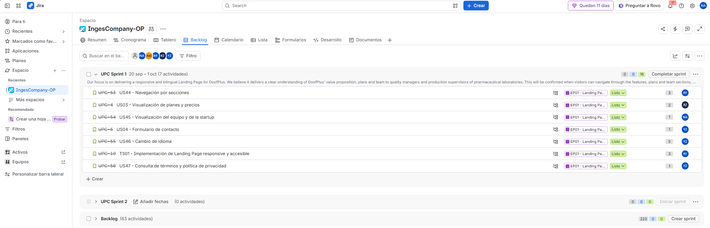

*Figura: Board del Sprint 1 en Jira Software.*

**Enlace al board en Jira:** [click aquí](https://doofplus.atlassian.net/jira/software/projects/UPC/boards/3/backlog?jql=parent+IN+%28UPC-2%2C+UPC-9%2C+UPC-20%29&atlOrigin=eyJpIjoiOWZkY2NhNGFkYzdlNGFmNGJlZTE4MTY1OGVjNjAyZDciLCJwIjoiaiJ9)

| Sprint # | Sprint 1 | | | | | | |
|----------|----------|---|---|---|---|---|---|
| **User Story** | | **Work-Item / Task** | | | | | |
| **Id** | **Title** | **Id** | **Title** | **Description** | **Estimation (Hours)** | **Assigned To** | **Status (To-do / In-Process / To-Review / Done)** |
| US44 | Navegación por secciones | T001 | Implementar navbar responsivo | Estructurar el menú de navegación con los enlaces a Home, Features, Benefits, Plans y Contact. | 2 | Zavaleta Gutierrez, Rodolfo Martin | Done |
| US44 | Navegación por secciones | T002 | Estilos y menú hamburguesa | Aplicar estilos CSS al menú y añadir el comportamiento responsive con menú hamburguesa para móvil. | 2 | Angulo Ramírez, Marcelo Martín | Done |
| US03 | Visualización de planes y precios | T003 | Diseñar tarjetas de planes | Crear las tarjetas de los planes Standard Lab ($199/mes) y Enterprise ($599/mes) con sus características. | 3 | Flores Martinez, Ricardo Andres | Done |
| US03 | Visualización de planes y precios | T004 | Toggle mensual/anual | Implementar el cambio entre precios mensuales y anuales con descuento del 15%. | 2 | Cobades Zamora, Yhoshua Hebert | Done |
| US45 | Visualización del equipo y de la startup | T005 | Maquetar sección Our Team | Implementar las tarjetas de los 5 integrantes del equipo Inges Company con foto, nombre y descripción. | 2 | Rojas Ambicho, Nestor Daniel | Done |
| US45 | Visualización del equipo y de la startup | T006 | Correcciones sección Our Team | Corregir la estructura y el contenido de la sección del equipo tras la revisión de pares. | 1 | Angulo Ramírez, Marcelo Martín | Done |
| US04 | Formulario de contacto | T007 | Implementar footer y formulario | Desarrollar el footer con el formulario de suscripción por email, datos de contacto y enlaces legales. | 3 | Zavaleta Gutierrez, Rodolfo Martin | Done |
| TS01 | Implementación de Landing Page responsive y accesible | T008 | Correcciones de estructura index | Corregir la estructura general de `index.html` para asegurar la consistencia semántica y la accesibilidad. | 2 | Flores Martinez, Ricardo Andres | Done |
| US46 | Cambio de idioma | T009 | Lógica i18n y toggle de idioma | Implementar el selector de idioma ES/EN con archivos de traducción y lógica JavaScript de i18n. | 3 | Cobades Zamora, Yhoshua Hebert | Done |
| US47 | Consulta de términos y política de privacidad | T010 | Agregar Terms of Service | Redactar e implementar la página de Términos de Servicio de DoofPlus. | 2 | Rojas Ambicho, Nestor Daniel | Done |
| US47 | Consulta de términos y política de privacidad | T011 | Agregar Privacy Policy | Redactar e implementar la Política de Privacidad conforme a la Ley N.° 29733. | 2 | Angulo Ramírez, Marcelo Martín | Done |

#### 5.2.1.4. Development Evidence for Sprint Review

Durante el Sprint 1 se implementó la Landing Page con HTML5, CSS3 y JavaScript: estructura semántica de las secciones, hoja de estilos responsive, recursos gráficos, footer con formulario de contacto y cambio de idioma ES/EN mediante archivos de traducción. La versión estable se integró a `main` a través de la rama `release/v1.0.0-rc.1`. La siguiente tabla presenta los commits del repositorio:

| Repository | Branch | Commit Id | Commit Message | Commit Message Body | Committed on (Date) |
|------------|--------|-----------|----------------|---------------------|---------------------|
| IngesCompany-7742/IngesCompany-LandingPage | main | `b93c547` | fix: refactor index.html | Refactorización de la estructura de `index.html`. | 20/09/2026 |
| IngesCompany-7742/IngesCompany-LandingPage | main | `1f1a22f` | Merge branch 'release/v1.0.0-rc.1' into main | Integración de la rama de release a producción. | 20/09/2026 |
| IngesCompany-7742/IngesCompany-LandingPage | develop | `e530153` | fix: change the defect language | Corrección del idioma predeterminado. | 20/09/2026 |
| IngesCompany-7742/IngesCompany-LandingPage | develop | `7eded14` | build: add the option to change the language in main.js | Lógica para alternar idiomas en el script principal. | 20/09/2026 |
| IngesCompany-7742/IngesCompany-LandingPage | develop | `432fb64` | fix: update links of the images in index.html | Actualización de las rutas de las imágenes. | 20/09/2026 |
| IngesCompany-7742/IngesCompany-LandingPage | develop | `46b51b6` | build: add styles | Incorporación de la hoja de estilos CSS. | 20/09/2026 |
| IngesCompany-7742/IngesCompany-LandingPage | develop | `86d4578` | chore: add images | Inclusión de los recursos gráficos del sitio. | 20/09/2026 |
| IngesCompany-7742/IngesCompany-LandingPage | develop | `06bd5ef` | build: Add footer | Creación de la sección del pie de página. | 20/09/2026 |
| IngesCompany-7742/IngesCompany-LandingPage | develop | `be8e428` | build: add body | Estructura y contenido del cuerpo principal. | 20/09/2026 |
| IngesCompany-7742/IngesCompany-LandingPage | develop | `9b082a5` | feat: add language switching functionality in main.js | Funcionalidad de cambio de idioma. | 20/09/2026 |
| IngesCompany-7742/IngesCompany-LandingPage | develop | `b9ff9e6` | ci: add translations | Archivos de traducción ES/EN. | 20/09/2026 |
| IngesCompany-7742/IngesCompany-LandingPage | develop | `6a1377f` | docs: update README.md | Actualización de la documentación del repositorio. | 20/09/2026 |
| IngesCompany-7742/IngesCompany-LandingPage | develop | `0de92b6` | fix: refactor README.md | Corrección del formato del README. | 20/09/2026 |
| IngesCompany-7742/IngesCompany-LandingPage | develop | `6e6efc0` | docs: add README.md | Creación del README del repositorio. | 20/09/2026 |
| IngesCompany-7742/IngesCompany-LandingPage | develop | `8dca66b` | Merge remote-tracking branch 'origin/develop' into develop | Sincronización de la rama `develop`. | 20/09/2026 |
| IngesCompany-7742/IngesCompany-LandingPage | develop | `a8c7448` | chore: Create template | Creación de la plantilla base del proyecto. | 20/09/2026 |
| IngesCompany-7742/IngesCompany-LandingPage | develop | `e68b54e` | feat: init commit | Commit inicial del repositorio. | 20/09/2026 |

#### 5.2.1.5. Execution Evidence for Sprint Review

En este Sprint se logró una Landing Page funcional, responsive y bilingüe (español e inglés), con navegación por secciones, propuesta de valor, características, planes y precios con toggle mensual/anual, sección del equipo, formulario de contacto y páginas de Términos de Servicio y Política de Privacidad. A continuación se presentan las capturas de las principales secciones implementadas:

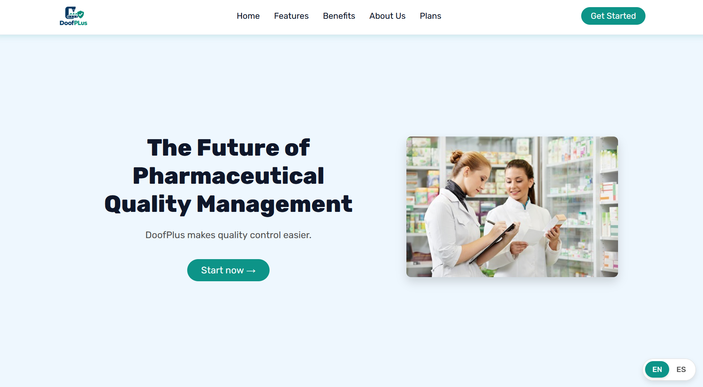

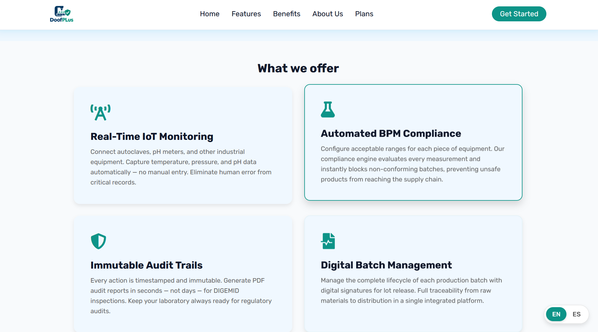


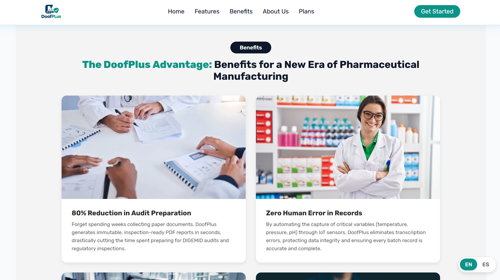


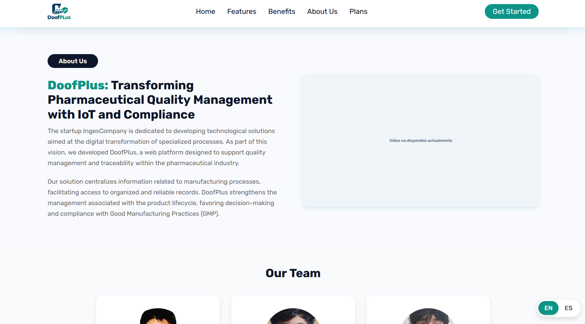

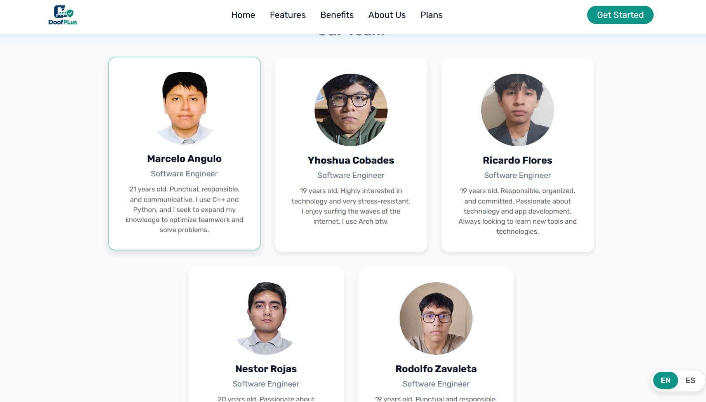


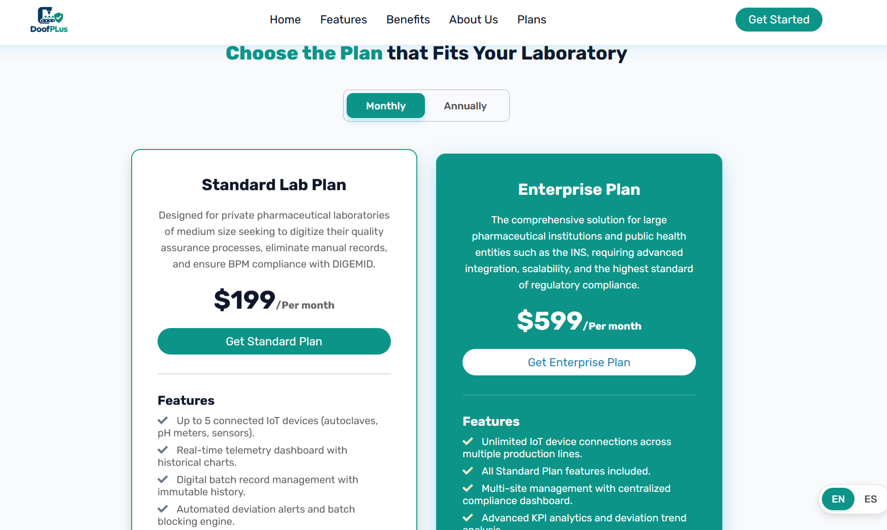

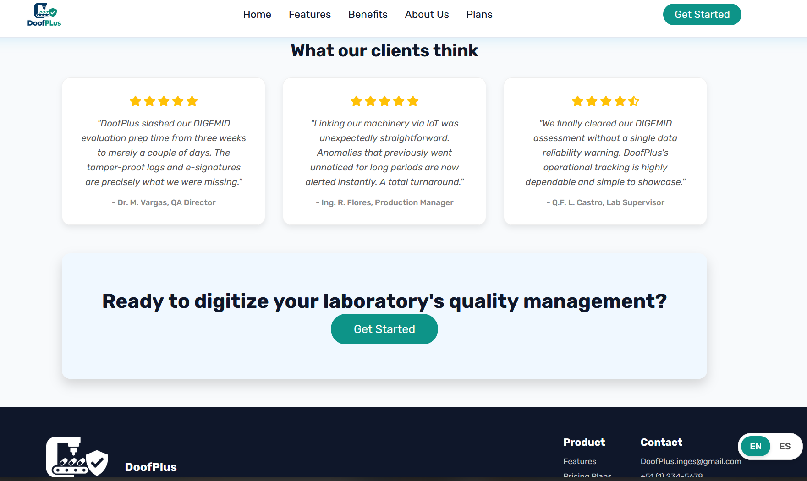


**Landing Page desplegada:** https://ingescompany-7742.github.io/IngesCompany-LandingPage/

#### 5.2.1.6. Services Documentation Evidence for Sprint Review

El alcance del Sprint 1 se limitó a la Landing Page, por lo que no se implementaron ni documentaron endpoints. La documentación de los RESTful Web Services con OpenAPI se elaborará en el sprint en que se implementen dichos servicios.

#### 5.2.1.7. Software Deployment Evidence for Sprint Review

Durante este Sprint, el equipo publicó la Landing Page en **GitHub Pages**. Para ello se configuró, en *Settings > Pages* del repositorio `IngesCompany-LandingPage`, la publicación desde la rama `main` y la carpeta raíz, de modo que cada cambio integrado en `main` se publica automáticamente.


*Figura: Configuración de GitHub Pages en el repositorio de la Landing Page.*

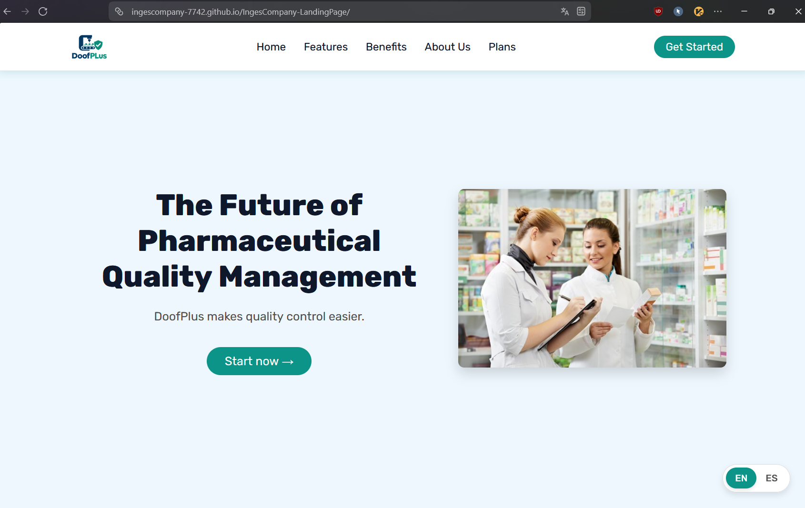

*Figura: Landing Page publicada en GitHub Pages.*

#### 5.2.1.8. Team Collaboration Insights during Sprint

Todos los miembros del equipo participaron en la implementación de la Landing Page. Los cambios se integraron en la rama `develop` y, desde ella, se preparó la rama `release/v1.0.0-rc.1`, que se fusionó con `main` para su publicación. La siguiente imagen muestra los analíticos de commits del repositorio en GitHub:

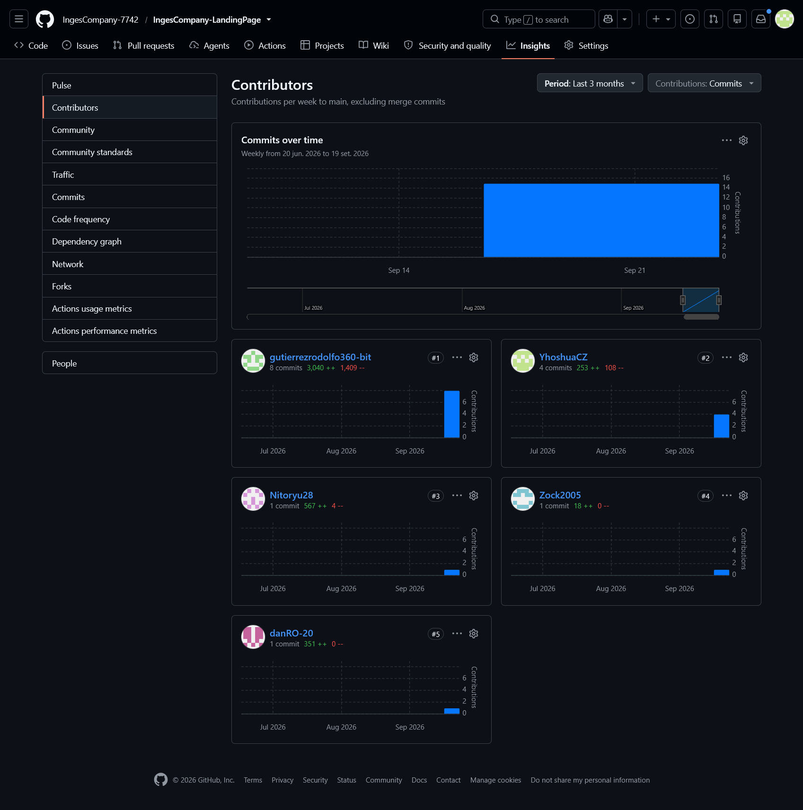

*Figura: Analíticos de colaboración del repositorio de la Landing Page en GitHub.*

### 5.2.2. Sprint 2

En esta sección se registra y explica el avance en términos de producto y trabajo colaborativo para el **Sprint 2**, cuyo enfoque es la primera versión de la Frontend Web Application de DoofPlus: la configuración base del proyecto Angular y las vistas de gestión de lotes, desviaciones y dashboards. El Sprint 2 se encuentra en curso, por lo que en esta sección se presenta su avance.

#### 5.2.2.1. Sprint Planning 2

El Sprint Planning Meeting sirvió para definir los objetivos del desarrollo frontend, asignar responsabilidades y seleccionar las User Stories prioritarias orientadas a la gestión de lotes farmacéuticos, el registro de desviaciones de calidad y el monitoreo mediante dashboards. A continuación, se presenta el resumen de la reunión de planificación:

| Sprint # | Sprint 2 |
|----------|----------|
| **Sprint Planning Background** | |
| **Date** | 2026-10-02 |
| **Time** | 09:00 AM |
| **Location** | Reunión virtual vía Discord |
| **Prepared By** | Cobades Zamora, Yhoshua Hebert |
| **Attendees (to planning meeting)** | Angulo Ramírez, Marcelo Martín / Cobades Zamora, Yhoshua Hebert / Flores Martinez, Ricardo Andres / Rojas Ambicho, Nestor Daniel / Zavaleta Gutierrez, Rodolfo Martin |
| **Sprint 1 Review Summary** | Se entregó la Landing Page de DoofPlus publicada en GitHub Pages, con navegación por secciones, planes y precios, sección del equipo, formulario de contacto, cambio de idioma ES/EN y páginas legales, completando los 16 Story Points comprometidos (US44, US03, US45, US04, TS01, US46 y US47). |
| **Sprint 1 Retrospective Summary** | Como acierto, el equipo integró la versión estable mediante una rama de release siguiendo GitFlow. Como oportunidades de mejora, se acordó trabajar en feature branches que nazcan de `develop`, distribuir los commits a lo largo del sprint en lugar de concentrarlos al final y usar los types de Conventional Commits según su significado (`feat` para funcionalidades en lugar de `build` o `ci`). |
| **Sprint Goal & User Stories** | |
| **Sprint 2 Goal** | **Our focus is on** delivering the first version of the DoofPlus Web Application for batch registration, deviation tracking and quality and production dashboards.<br>**We believe it delivers** a centralized view of batch traceability and quality events to quality specialists and production supervisors of pharmaceutical laboratories.<br>**This will be confirmed when** users can register a batch, review its details, record a deviation by severity and filter batches and deviations in real time from the web application. |
| **Sprint 2 Velocity** | 17 Story Points |
| **Sum of Story Points** | 17 Story Points (US14: 3, US15: 5, US18: 3, US31: 3, US32: 3) |

#### 5.2.2.2. Aspect Leaders and Collaborators

En el Sprint 2 se consideraron cinco aspectos de la Frontend Web Application: la configuración del proyecto y los componentes compartidos (shared), la gestión de lotes, la gestión de desviaciones, los dashboards de calidad y producción, y la documentación del sprint. A continuación se presenta el Leadership-and-Collaboration Matrix (LACX):

| Team Member (Last Name, First Name) | GitHub Username | Project Setup & Shared | Batch Management | Deviation Management | Dashboards | Documentation |
|-------------------------------------|-----------------|:----------------------:|:----------------:|:--------------------:|:----------:|:-------------:|
| Angulo Ramírez, Marcelo Martín | Zock2005 | C | | C | C | |
| Cobades Zamora, Yhoshua Hebert | YhoshuaCZ | C | C | | L | L |
| Flores Martinez, Ricardo Andres | Nitoryu28 / Nitoryu2801 | | L | L | | C |
| Rojas Ambicho, Nestor Daniel | danRO-20 | | C | | | C |
| Zavaleta Gutierrez, Rodolfo Martin | gutierrezrodolfo360-bit | L | C | | | C |

#### 5.2.2.3. Sprint Backlog 2

El objetivo principal de este Sprint es implementar la primera versión de la Frontend Web Application de DoofPlus para la gestión de lotes y desviaciones y el monitoreo mediante dashboards. La siguiente imagen muestra el board del Sprint 2 en Jira:

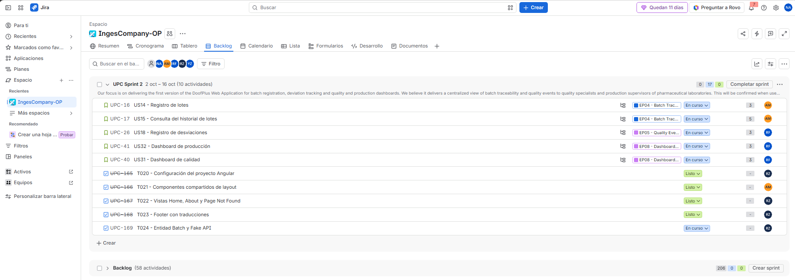

*Figura: Board del Sprint 2 en Jira Software.*

**Enlace al board en Jira:** [click aquí](https://doofplus.atlassian.net/jira/software/projects/UPC/boards/3/backlog?jql=parent+IN+%28UPC-2%2C+UPC-9%2C+UPC-20%29&atlOrigin=eyJpIjoiOWZkY2NhNGFkYzdlNGFmNGJlZTE4MTY1OGVjNjAyZDciLCJwIjoiaiJ9)

| Sprint # | Sprint 2 | | | | | | |
|----------|----------|---|---|---|---|---|---|
| **User Story** | | **Work-Item / Task** | | | | | |
| **Id** | **Title** | **Id** | **Title** | **Description** | **Estimation (Hours)** | **Assigned To** | **Status (To-do / In-Process / To-Review / Done)** |
| US14 | Registro de lotes | T012 | Componente de registro de lotes | Diseñar el formulario para capturar código de producto, nombre, cantidad y fecha de expiración del lote. | 4 | Flores Martinez, Ricardo Andres | In-Process |
| US14 | Registro de lotes | T013 | Servicio de lotes | Implementar el manejo de estado con signals en el servicio de lotes para registrar y consultar lotes. | 3 | Cobades Zamora, Yhoshua Hebert | In-Process |
| US15 | Consulta del historial de lotes | T014 | Componente de lista y detalle de lotes | Diseñar la tabla de lotes con badges de color según el estado y la vista de detalle de cada lote. | 4 | Zavaleta Gutierrez, Rodolfo Martin | In-Process |
| US15 | Consulta del historial de lotes | T015 | Filtros y buscador en tiempo real | Incorporar el campo de búsqueda y el selector por estado con `ngModel`. | 3 | Rojas Ambicho, Nestor Daniel | In-Process |
| US18 | Registro de desviaciones | T016 | Componente de registro de desviaciones | Construir el formulario para registrar hallazgos clasificados por nivel de severidad. | 4 | Flores Martinez, Ricardo Andres | In-Process |
| US18 | Registro de desviaciones | T017 | Componente de lista de desviaciones | Desarrollar la vista tabular para la consulta y el filtrado de desviaciones. | 3 | Angulo Ramírez, Marcelo Martín | In-Process |
| US31 | Dashboard de calidad | T018 | Tarjetas de indicadores KPI | Diseñar e integrar las tarjetas de indicadores de lotes y desviaciones en el dashboard. | 3 | Cobades Zamora, Yhoshua Hebert | In-Process |
| US32 | Dashboard de producción | T019 | Tabla y widgets de monitoreo | Desarrollar la tabla de seguimiento de lotes y los widgets de alertas de calidad recientes. | 3 | Angulo Ramírez, Marcelo Martín | In-Process |
| — | Tareas técnicas de la Frontend Web Application | T020 | Configuración del proyecto Angular | Configurar i18n con ngx-translate, Angular Material y los environments de desarrollo y producción. | 3 | Zavaleta Gutierrez, Rodolfo Martin | Done |
| — | Tareas técnicas de la Frontend Web Application | T021 | Componentes compartidos de layout | Implementar el toolbar responsive, el layout y el selector de idioma del bounded context shared. | 3 | Angulo Ramírez, Marcelo Martín | Done |
| — | Tareas técnicas de la Frontend Web Application | T022 | Vistas Home, About y Page Not Found | Implementar las vistas públicas, sus rutas y los value objects `DateTime` y `Url`. | 3 | Zavaleta Gutierrez, Rodolfo Martin | Done |
| — | Tareas técnicas de la Frontend Web Application | T023 | Footer con traducciones | Implementar el footer y mostrar el toolbar en todas las vistas públicas. | 2 | Zavaleta Gutierrez, Rodolfo Martin | Done |
| — | Tareas técnicas de la Frontend Web Application | T024 | Entidad Batch y Fake API | Crear la entidad `Batch` del bounded context manufacturing y el `db.json` inicial para json-server. | 2 | Zavaleta Gutierrez, Rodolfo Martin | In-Process |

#### 5.2.2.4. Development Evidence for Sprint Review

Hasta el momento, en el repositorio `IngesCompany-Frontend` se configuró el proyecto Angular (i18n, Angular Material y environments) y se implementaron los componentes compartidos (toolbar, layout, selector de idioma, footer) y las vistas Home, About y Page Not Found, siguiendo GitFlow con las ramas `feature/project-configuration`, `feature/shared` y `feature/manufacturing`. Además, se inició el bounded context manufacturing con la entidad `Batch` y la Fake API. La siguiente tabla presenta los commits del repositorio:

| Repository | Branch | Commit Id | Commit Message | Commit Message Body | Committed on (Date) |
|------------|--------|-----------|----------------|---------------------|---------------------|
| IngesCompany-7742/IngesCompany-Frontend | develop | `16247a9` | chore: initial commit | Creación del proyecto Angular. | 29/09/2026 |
| IngesCompany-7742/IngesCompany-Frontend | develop | `58f3404` | chore: add git ignore | Configuración de archivos ignorados por Git. | 29/09/2026 |
| IngesCompany-7742/IngesCompany-Frontend | feature/project-configuration | `89336d3` | feat(i18n): add i18n support for English and Spanish translation | Configuración de ngx-translate con los archivos de traducción ES/EN. | 29/09/2026 |
| IngesCompany-7742/IngesCompany-Frontend | feature/project-configuration | `84282bf` | feat(ui): add Material Design UI Library | Instalación y configuración de Angular Material. | 29/09/2026 |
| IngesCompany-7742/IngesCompany-Frontend | feature/project-configuration | `cb6376e` | feat(environment): add Environment configuration for development and production modes | Configuración de los environments de desarrollo y producción. | 29/09/2026 |
| IngesCompany-7742/IngesCompany-Frontend | develop | `3ea5890` | Merge branch 'feature/project-configuration' into develop | Integración de la configuración del proyecto en `develop`. | 29/09/2026 |
| IngesCompany-7742/IngesCompany-Frontend | feature/shared | `b066a80` | feat(home): add Home view with title and content, including route definition and style | Vista Home con su ruta y estilos. | 29/09/2026 |
| IngesCompany-7742/IngesCompany-Frontend | feature/shared | `6d386d5` | feat(home): add DateTime and URL value objects for handing dates and URLs | Value objects `DateTime` y `Url` del bounded context shared. | 29/09/2026 |
| IngesCompany-7742/IngesCompany-Frontend | feature/shared | `574db0d` | feat(base-entity): add BaseEntity interface for domain entities with UUID identifier | Interfaz `BaseEntity` para las entidades de dominio. | 29/09/2026 |
| IngesCompany-7742/IngesCompany-Frontend | feature/shared | `b1906c4` | feat(toolbar): add responsive toolbar component | Toolbar responsive de la aplicación. | 29/09/2026 |
| IngesCompany-7742/IngesCompany-Frontend | feature/shared | `c701062` | feat(layout): add layout component | Componente de layout general. | 29/09/2026 |
| IngesCompany-7742/IngesCompany-Frontend | feature/shared | `f5ed375` | feat(language-switcher): add language switcher component for UI language selection | Selector de idioma de la interfaz. | 29/09/2026 |
| IngesCompany-7742/IngesCompany-Frontend | feature/shared | `c0bcedc` | feat(about): add About page with layout, styles, and content for product overview | Vista About con la descripción del producto. | 29/09/2026 |
| IngesCompany-7742/IngesCompany-Frontend | feature/shared | `78a850c` | feat(page-not-found): add Page Not Found component with template and navigation | Vista Page Not Found con navegación de retorno. | 29/09/2026 |
| IngesCompany-7742/IngesCompany-Frontend | feature/shared | `9df65b3` | chore(index): update index.html structure for semantic consistency | Ajuste semántico de `index.html`. | 29/09/2026 |
| IngesCompany-7742/IngesCompany-Frontend | feature/shared | `8ebbec3` | style(layout): add tittle | Título del layout. | 29/09/2026 |
| IngesCompany-7742/IngesCompany-Frontend | feature/shared | `9840b0b` | feat(routes): add the route definition of the view About and PageNotFound | Rutas de las vistas About y Page Not Found. | 29/09/2026 |
| IngesCompany-7742/IngesCompany-Frontend | feature/shared | `485f392` | feat(footer): add footer component and translation | Footer con sus traducciones. | 30/09/2026 |
| IngesCompany-7742/IngesCompany-Frontend | feature/shared | `46a135e` | fix(layout): render toolbar globally across public views and add translations | Toolbar visible en todas las vistas públicas. | 30/09/2026 |
| IngesCompany-7742/IngesCompany-Frontend | develop | `e7ec1ba` | Merge branch 'feature/shared' into develop | Integración de los componentes compartidos en `develop`. | 05/10/2026 |
| IngesCompany-7742/IngesCompany-Frontend | feature/manufacturing | `c5951a6` | feat(database): add initial db.json with vaccine batch data | Datos iniciales de lotes para la Fake API. | 05/10/2026 |
| IngesCompany-7742/IngesCompany-Frontend | feature/manufacturing | `dd30869` | feat(batch): add Batch entity to represent product batches | Entidad `Batch` del bounded context manufacturing. | 05/10/2026 |

#### 5.2.2.5. Execution Evidence for Sprint Review

Al momento, la Frontend Web Application cuenta con la estructura base del proyecto Angular, el toolbar con navegación y selector de idioma ES/EN, el footer y las vistas Home, About y Page Not Found. Las vistas de gestión de lotes, registro de desviaciones y dashboards de calidad y producción se encuentran en implementación y se presentarán al cierre del Sprint 2.

#### 5.2.2.6. Services Documentation Evidence for Sprint Review

En el Sprint 2 no se implementaron RESTful Web Services, por lo que aún no hay endpoints documentados con OpenAPI. En `IngesCompany-Frontend` se inició la Fake API con json-server (`src/server/db.json`), que se usará para consumir los recursos de lotes mediante HTTP mientras se implementan los Web Services. La documentación con OpenAPI se elaborará en el Sprint 3, junto con la implementación de los endpoints en Spring Boot.

#### 5.2.2.7. Software Deployment Evidence for Sprint Review

En el Sprint 2, la Landing Page se mantuvo publicada en GitHub Pages. La Web Application se ejecuta y valida localmente con `ng serve` durante el sprint; su publicación en Firebase Hosting, según los pasos descritos en la sección 5.1.4, se realizará al cierre del Sprint 2.

#### 5.2.2.8. Team Collaboration Insights during Sprint

La implementación del Sprint 2 se realiza en el repositorio `IngesCompany-Frontend` siguiendo GitFlow. Hasta el momento, Rodolfo Zavaleta configuró el proyecto e implementó las vistas públicas y el footer; Marcelo Angulo implementó el toolbar, el layout, el selector de idioma y las vistas About y Page Not Found; y Yhoshua Cobades ajustó el layout, trabajando en feature branches integradas en `develop`.

Las capturas necesarias y obligatorias se subirán al final del sprint 2.

## 5.3. Validation Interviews

### 5.3.1. Diseño de Entrevistas

### 5.3.2. Registro de Entrevistas

### 5.3.3. Evaluaciones según heurísticas

## 5.4. Video About-the-Product

# Conclusiones

## Conclusiones y recomendaciones

## Video About-the-Team

# Bibliografía

# Anexos
